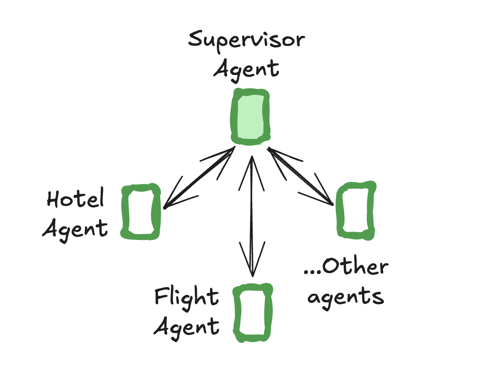
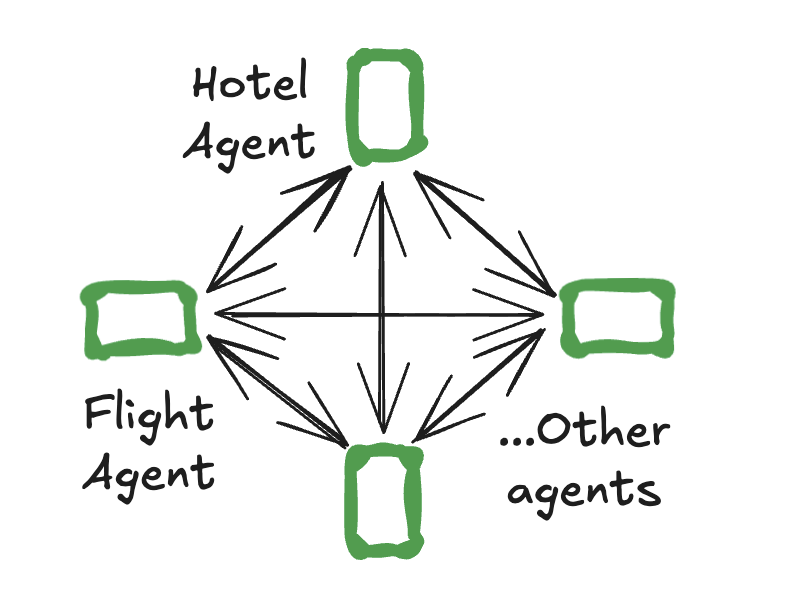

# 多智能体

单个智能体可能难以处理需要专攻多个领域或管理大量工具的情况。为了解决这个问题，您可以将智能体拆分为更小、独立的智能体，并将它们组合成一个[多智能体系统](../concepts/multi_agent.md)。

在多智能体系统中，智能体需要相互通信。它们通过[交接](#handoffs)来实现——这是一种原语，描述将控制权移交给哪个智能体以及要发送给该智能体的有效负载。

两种最流行的多智能体架构是：

- [supervisor](#supervisor) —— 各个智能体由中央监督智能体协调。监督者控制所有通信流和任务委派，根据当前上下文和任务要求决定调用哪个智能体。
- [swarm](#swarm) —— 智能体根据其专长在彼此之间动态交接控制权。系统记住哪个智能体最后处于活动状态，确保在后续交互时与该智能体恢复对话。

## Supervisor



使用 [`langgraph-supervisor`](https://github.com/langchain-ai/langgraphjs/tree/main/libs/langgraph-supervisor) 库创建监督者多智能体系统：

```bash
npm install @langchain/langgraph-supervisor
```

```ts
import { ChatOpenAI } from "@langchain/openai";
// highlight-next-line
import { createSupervisor } from "@langchain/langgraph-supervisor";
import { createReactAgent } from "@langchain/langgraph/prebuilt";
import { tool } from "@langchain/core/tools";
import { z } from "zod";

const bookHotel = tool(
  async (input: { hotel_name: string }) => {
    return `Successfully booked a stay at ${input.hotel_name}.`;
  },
  {
    name: "book_hotel",
    description: "Book a hotel",
    schema: z.object({
      hotel_name: z.string().describe("The name of the hotel to book"),
    }),
  }
);

const bookFlight = tool(
  async (input: { from_airport: string; to_airport: string }) => {
    return `Successfully booked a flight from ${input.from_airport} to ${input.to_airport}.`;
  },
  {
    name: "book_flight",
    description: "Book a flight",
    schema: z.object({
      from_airport: z.string().describe("The departure airport code"),
      to_airport: z.string().describe("The arrival airport code"),
    }),
  }
);

const llm = new ChatOpenAI({ modelName: "gpt-4o" });

// 创建专业智能体
const flightAssistant = createReactAgent({
  llm,
  tools: [bookFlight],
  prompt: "You are a flight booking assistant",
  // highlight-next-line
  name: "flight_assistant",
});

const hotelAssistant = createReactAgent({
  llm,
  tools: [bookHotel],
  prompt: "You are a hotel booking assistant",
  // highlight-next-line
  name: "hotel_assistant",
});

// highlight-next-line
const supervisor = createSupervisor({
  agents: [flightAssistant, hotelAssistant],
  llm,
  prompt: "You manage a hotel booking assistant and a flight booking assistant. Assign work to them, one at a time.",
}).compile();

const stream = await supervisor.stream({
  messages: [{
    role: "user",
    content: "first book a flight from BOS to JFK and then book a stay at McKittrick Hotel"
  }]
});

for await (const chunk of stream) {
  console.log(chunk);
  console.log("\n");
}
```

## Swarm



使用 [`langgraph-swarm`](https://github.com/langchain-ai/langgraphjs/tree/main/libs/langgraph-swarm) 库创建蜂群多智能体系统：

```bash
npm install @langchain/langgraph-swarm
```

```ts
import { createReactAgent } from "@langchain/langgraph/prebuilt";
import { ChatAnthropic } from "@langchain/anthropic";
// highlight-next-line
import { createSwarm, createHandoffTool } from "@langchain/langgraph-swarm";

const transferToHotelAssistant = createHandoffTool({
  agentName: "hotel_assistant",
  description: "Transfer user to the hotel-booking assistant.",
});

const transferToFlightAssistant = createHandoffTool({
  agentName: "flight_assistant",
  description: "Transfer user to the flight-booking assistant.",
});


const llm = new ChatAnthropic({ modelName: "claude-3-5-sonnet-latest" });

const flightAssistant = createReactAgent({
  llm,
  tools: [bookFlight, transferToHotelAssistant],
  prompt: "You are a flight booking assistant",
  name: "flight_assistant",
});

const hotelAssistant = createReactAgent({
  llm,
  tools: [bookHotel, transferToFlightAssistant],
  prompt: "You are a hotel booking assistant",
  name: "hotel_assistant",
});

// highlight-next-line
const swarm = createSwarm({
  agents: [flightAssistant, hotelAssistant],
  defaultActiveAgent: "flight_assistant",
}).compile();

const stream = await swarm.stream({
  messages: [{
    role: "user",
    content: "first book a flight from BOS to JFK and then book a stay at McKittrick Hotel"
  }]
});

for await (const chunk of stream) {
  console.log(chunk);
  console.log("\n");
}
```

## Handoffs

多智能体交互中的常见模式是**交接**，其中一个智能体将控制权移交给另一个智能体。交接允许您指定：

- **目标**：要导航到的目标智能体
- **有效负载**：要传递给该智能体的信息

这被 `langgraph-supervisor`（监督者向各个智能体交接）和 `langgraph-swarm`（单个智能体可以向其他智能体交接）使用。

要使用 `createReactAgent` 实现交接，您需要：

1. 创建一个可以将控制权转移到不同智能体的特殊工具

    ```ts
    const transferToBob = tool(
      async (_) => {
        return new Command({
          // 要前往的智能体（节点）名称
          // highlight-next-line
          goto: "bob",
          // 发送给智能体的数据
          // highlight-next-line
          update: { messages: ... },
          // 向 LangGraph 指示我们需要导航到
          // 父图中的智能体节点
          // highlight-next-line
          graph: Command.PARENT,
        });
      },
      {
        name: ...,
        schema: ...,
        description: ...
      }
    );
    ```

1. 创建具有交接工具访问权限的单个智能体：

    ```ts
    const flightAssistant = createReactAgent(
      ..., tools: [bookFlight, transferToHotelAssistant]
    )
    const hotelAssistant = createReactAgent(
      ..., tools=[bookHotel, transferToFlightAssistant]
    )
    ```

1. 定义一个包含单个智能体作为节点的父图：

    ```ts
    import { StateGraph, MessagesAnnotation } from "@langchain/langgraph";

    const multiAgentGraph = new StateGraph(MessagesAnnotation)
      .addNode("flight_assistant", flightAssistant)
      .addNode("hotel_assistant", hotelAssistant)
      ...
    ```

将这些组合在一起，以下是如何实现一个简单的多智能体系统，包含两个智能体——航班预订助手和酒店预订助手：

```ts
import { ChatAnthropic } from "@langchain/anthropic";
import { createReactAgent } from "@langchain/langgraph/prebuilt";
import { StateGraph, MessagesAnnotation, Command, START, getCurrentTaskInput, END } from "@langchain/langgraph";
import { tool } from "@langchain/core/tools";
import { z } from "zod";
import { ToolMessage } from "@langchain/core/messages";

interface CreateHandoffToolParams {
  agentName: string;
  description?: string;
}

const createHandoffTool = ({
  agentName,
  description,
}: CreateHandoffToolParams) => {
  const toolName = `transfer_to_${agentName}`;
  const toolDescription = description || `Ask agent '${agentName}' for help`;

  const handoffTool = tool(
    async (_, config) => {
      const toolMessage = new ToolMessage({
        content: `Successfully transferred to ${agentName}`,
        name: toolName,
        tool_call_id: config.toolCall.id,
      });

      // 注入当前智能体状态
      const state =
        // highlight-next-line
        getCurrentTaskInput() as (typeof MessagesAnnotation)["State"];  // (1)!
      return new Command({  // (2)!
        // highlight-next-line
        goto: agentName,  // (3)!
        // highlight-next-line
        update: { messages: state.messages.concat(toolMessage) },  // (4)!
        // highlight-next-line
        graph: Command.PARENT,  // (5)!
      });
    },
    {
      name: toolName,
      schema: z.object({}),
      description: toolDescription,
    }
  );

  return handoffTool;
};

const bookHotel = tool(
  async (input: { hotel_name: string }) => {
    return `Successfully booked a stay at ${input.hotel_name}.`;
  },
  {
    name: "book_hotel",
    description: "Book a hotel",
    schema: z.object({
      hotel_name: z.string().describe("The name of the hotel to book"),
    }),
  }
);

const bookFlight = tool(
  async (input: { from_airport: string; to_airport: string }) => {
    return `Successfully booked a flight from ${input.from_airport} to ${input.to_airport}.`;
  },
  {
    name: "book_flight",
    description: "Book a flight",
    schema: z.object({
      from_airport: z.string().describe("The departure airport code"),
      to_airport: z.string().describe("The arrival airport code"),
    }),
  }
);

const transferToHotelAssistant = createHandoffTool({
  agentName: "hotel_assistant",
  description: "Transfer user to the hotel-booking assistant.",
});

const transferToFlightAssistant = createHandoffTool({
  agentName: "flight_assistant",
  description: "Transfer user to the flight-booking assistant.",
});

const llm = new ChatAnthropic({ modelName: "claude-3-5-sonnet-latest" });

const flightAssistant = createReactAgent({
  llm,
  // highlight-next-line
  tools: [bookFlight, transferToHotelAssistant],
  prompt: "You are a flight booking assistant",
  // highlight-next-line
  name: "flight_assistant",
});

const hotelAssistant = createReactAgent({
  llm,
  // highlight-next-line
  tools: [bookHotel, transferToFlightAssistant],
  prompt: "You are a hotel booking assistant",
  // highlight-next-line
  name: "hotel_assistant",
});

const multiAgentGraph = new StateGraph(MessagesAnnotation)
  .addNode("flight_assistant", flightAssistant, { ends: ["hotel_assistant", END] })
  .addNode("hotel_assistant", hotelAssistant, { ends: ["flight_assistant", END] })
  .addEdge(START, "flight_assistant")
  .compile();

const stream = await multiAgentGraph.stream({
  messages: [{
    role: "user",
    content: "book a flight from BOS to JFK and a stay at McKittrick Hotel"
  }]
});

for await (const chunk of stream) {
  console.log(chunk);
  console.log("\n");
}
```

1. 访问智能体状态
2. `Command` 原语允许将状态更新和节点转换指定为单个操作，使其可用于实现交接。
3. 要交接到的智能体或节点名称。
4. 获取智能体的消息并作为交接的一部分**添加**到父**状态**中。下一个智能体将看到父状态。
5. 向 LangGraph 指示我们需要导航到**父**多智能体图中的智能体节点。

!!! 注意
    此交接实现假设：

    - 每个智能体接收多智能体系统中的整体消息历史（跨所有智能体）作为其输入
    - 每个智能体将其内部消息历史输出到多智能体系统的整体消息历史

    查看 LangGraph [supervisor](https://github.com/langchain-ai/langgraph-supervisor-py#customizing-handoff-tools) 和 [swarm](https://github.com/langchain-ai/langgraph-swarm-py#customizing-handoff-tools) 文档以了解如何自定义交接。
