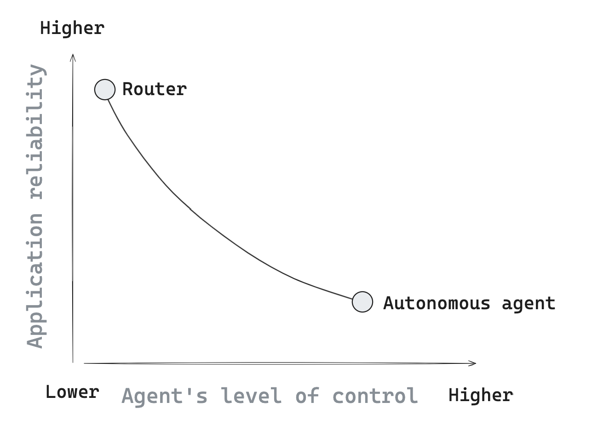
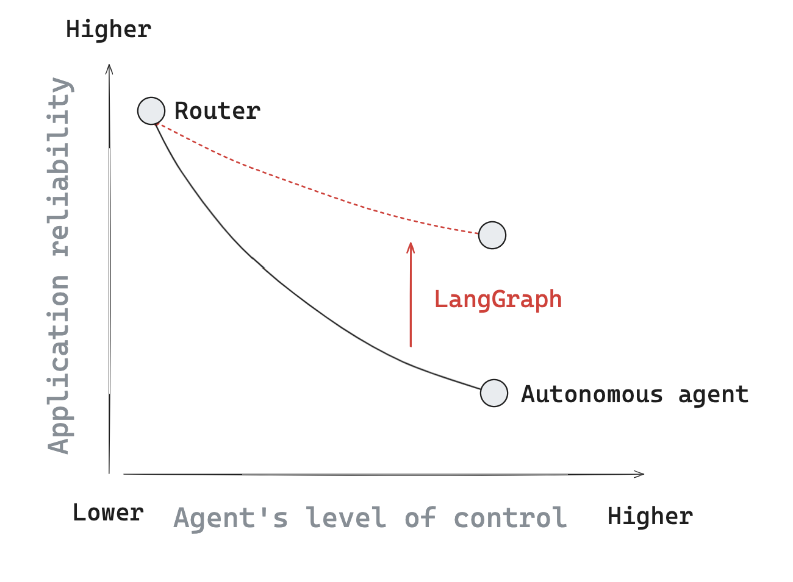

# 为什么选择 LangGraph？

LLM 非常强大，特别是当连接到其他系统（如检索器或 API）时。这就是为什么许多 LLM 应用程序在 LLM 调用之前和/或之后使用步骤控制流。例如，[RAG](https://github.com/langchain-ai/rag-from-scratch) 检索与问题相关的文档，并将这些文档传递给 LLM 以使响应更加可靠。通常在 LLM 之前和/或之后调用控制流被称为"链"。链是使用 LLM 编程的流行范式，并提供高度的可靠性；每次链调用都运行相同的一组步骤。

然而，我们通常希望 LLM 系统能够选择自己的控制流！这是 [agent](https://blog.langchain.dev/what-is-an-agent/) 的一个定义：agent 是一个使用 LLM 来决定应用程序控制流的系统。与链不同，agent 赋予 LLM 对应用程序中步骤序列的一定程度的控制权。使用 LLM 决定应用程序控制的示例：

- 使用 LLM 在两个潜在路径之间进行路由
- 使用 LLM 决定调用众多工具中的哪一个
- 使用 LLM 决定生成的答案是否足够或是否需要更多工作

有许多不同类型的 [agent 架构](https://blog.langchain.dev/what-is-a-cognitive-architecture/) 可供考虑，它们赋予 LLM 不同程度的控制权。在一个极端，Router 允许 LLM 从指定的选项集中选择单个步骤，而在另一个极端，完全自主的长期运行的 agent 可能对给定问题拥有选择任何步骤序列的完全自由。

许多 agent 架构中使用了几个概念：

- [工具调用](agentic_concepts.md#tool-calling)：这通常是 LLM 做出决策的方式
- 行动执行：通常，LLM 的输出被用作行动的输入
- [记忆](agentic_concepts.md#memory)：可靠的系统需要了解发生的事情
- [规划](agentic_concepts.md#planning)：规划步骤（显式或隐式）对于确保 LLM 在做决策时以最高保真度做出决策非常有用。

## 挑战

在实践中，控制和可靠性之间通常存在权衡。随着我们赋予 LLM 更多的控制权，应用程序通常会变得不那么可靠。这可能是由于 LLM 非确定性等因素，以及 agent 使用的工具选择（或采取的步骤）中的错误。

## 核心原则

LangGraph 的动机是帮助扭转这一趋势，在赋予 agent 对应用程序更多控制权的同时保持更高的可靠性。我们将概述 LangGraph 使其非常适合构建可靠 agent 的几个具体支柱。

**可控性**

LangGraph 通过将应用程序的流程表示为一组节点和边，为开发人员提供高度的[控制](/langgraphjs/how-tos#controllability)。所有节点都可以访问和修改公共状态（记忆）。可以使用连接节点的边来设置应用程序的控制流，可以是确定性的，也可以是通过条件逻辑。

**持久化**

LangGraph 为开发人员提供多种[持久化](/langgraphjs/how-tos#persistence)图状态的选项，使用短期或长期（例如，通过数据库）记忆。

**人机协同**

持久层支持与 agent 进行几种不同的[人机协同](/langgraphjs/how-tos#human-in-the-loop)交互模式；例如，可以暂停 agent、查看其状态、编辑其状态，并批准后续步骤。

**流式传输**

LangGraph 内置一流的[流式传输](/langgraphjs/how-tos#streaming)支持，可以在 agent 执行过程中向用户（或开发人员）公开状态。LangGraph 支持事件（[如正在执行的工具调用](/langgraphjs/how-tos/stream-updates.ipynb)）以及 [LLM 可能发出的令牌](/langgraphjs/how-tos/streaming-tokens)的流式传输。

## 调试

构建图后，你通常希望测试和调试它。[LangGraph Studio](https://github.com/langchain-ai/langgraph-studio?tab=readme-ov-file) 是一个专门的 IDE，用于可视化和调试 LangGraph 应用程序。

## 部署

一旦你对 LangGraph 应用程序有信心，许多开发人员都希望有一条简单的部署路径。[LangGraph Cloud](/langgraphjs/cloud) 是 LangChain 团队部署 LangGraph 对象的一种自以为是的简单方式。当然，你也可以使用 [Express.js](https://expressjs.com/) 等服务，并根据需要从 Express.js 服务器内部调用你的图。
