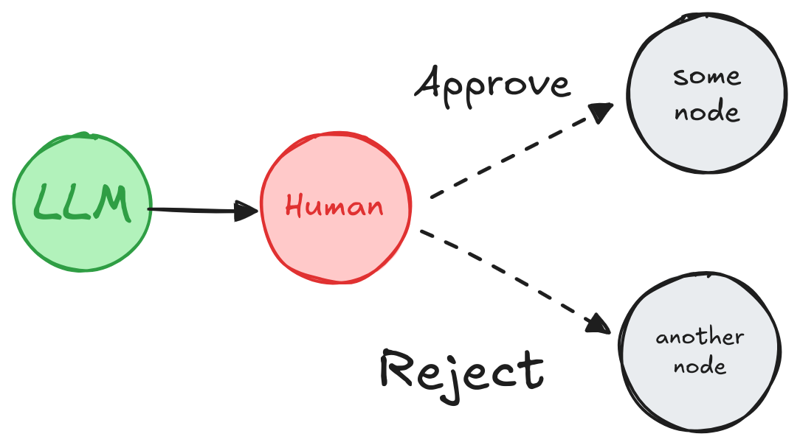
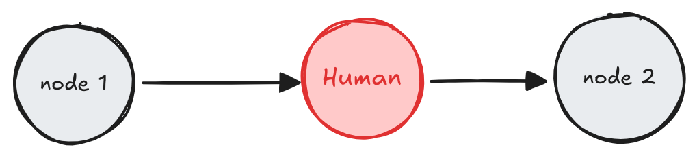
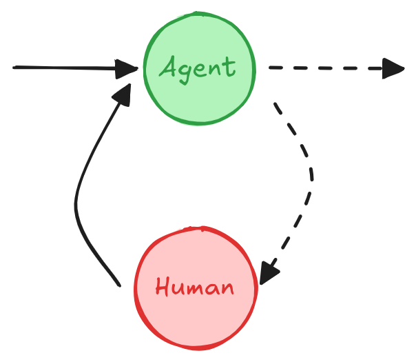

# 人机协同

!!! tip "本指南使用新的 `interrupt` 函数。"

    从 LangGraph 0.2.31 开始，设置断点的推荐方式是使用 [`interrupt` 函数](/langgraphjs/reference/functions/langgraph.interrupt-1.html)，因为它简化了 **人机协同** 模式。

    如果你正在寻找此概念指南的先前版本，它依赖于静态断点和 `NodeInterrupt` 异常，可在[此处](v0-human-in-the-loop.md)获取。

**人机协同**（或 "人在回路中"）工作流将人工输入集成到自动化流程中，允许在关键阶段进行决策、验证或纠正。这在**基于 LLM 的应用程序**中特别有用，因为底层模型可能会偶尔产生不准确的信息。在错误容忍度低的场景中，如合规性、决策制定或内容生成，人工参与通过支持审查、纠正或覆盖模型输出来确保可靠性。

## 用例

**人机协同**工作流在基于 LLM 的应用程序中的关键用例包括：

1. [**🛠️ 审查工具调用**](#review-tool-calls)：人工可以在工具执行前审查、编辑或批准 LLM 请求的工具调用。

2. **✅ 验证 LLM 输出**：人工可以审查、编辑或批准 LLM 生成的内容。

3. **💡 提供上下文**：使 LLM 能够明确请求人工输入以进行澄清或提供额外详细信息，或支持多轮对话。

## `interrupt`

LangGraph 中的 [`interrupt` 函数](/langgraphjs/reference/functions/langgraph.interrupt-1.html) 通过在特定节点暂停图、向人工呈现信息，然后使用其输入恢复图来启用人机协同工作流。此函数对于审批、编辑或收集额外输入等任务很有用。[`interrupt` 函数](/langgraphjs/reference/functions/langgraph.interrupt-1.html) 与 [`Command`](/langgraphjs/reference/classes/langgraph.Command.html) 对象一起使用，以使用人工提供的值恢复图。

```typescript
import { interrupt } from "@langchain/langgraph";

function humanNode(state: typeof GraphAnnotation.State) {
  const value = interrupt(
    // 任何要呈现给人工的 JSON 可序列化值。
    // 例如，一个问题或一段文本或状态中的一组键
    {
      text_to_revise: state.some_text,
    }
  );
  // 使用人工的输入更新状态或基于输入路由图
  return {
    some_text: value,
  };
}

const graph = workflow.compile({
  checkpointer, // `interrupt` 工作必需
});

// 运行图直到中断
const threadConfig = { configurable: { thread_id: "some_id" } };
await graph.invoke(someInput, threadConfig);

// 下面的代码可以在一段时间之后和/或在不同的进程中运行

// 人工输入
const valueFromHuman = "...";

// 使用人工的输入恢复图
await graph.invoke(new Command({ resume: valueFromHuman }), threadConfig);
```

```typescript
{
  some_text: "Edited text";
}
```

??? "完整代码"

      如果你想看实际代码，这里有一个关于如何在图中使用 `interrupt` 的完整示例。

      ```typescript
      import { MemorySaver, Annotation, interrupt, Command, StateGraph } from "@langchain/langgraph";

      // 定义图状态
      const StateAnnotation = Annotation.Root({
        some_text: Annotation<string>()
      });

      function humanNode(state: typeof StateAnnotation.State) {
         const value = interrupt(
            // 任何要呈现给人工的 JSON 可序列化值。
            // 例如，一个问题或一段文本或状态中的一组键
            {
               text_to_revise: state.some_text
            }
         );
         return {
            // 使用人工的输入更新状态
            some_text: value
         };
      }

      // 构建图
      const workflow = new StateGraph(StateAnnotation)
      // 将人工节点添加到图中
        .addNode("human_node", humanNode)
        .addEdge("__start__", "human_node")

      // `interrupt` 工作必需 checkpointer。
      const checkpointer = new MemorySaver();
      const graph = workflow.compile({
         checkpointer
      });

      // 使用 stream() 直接显示 `__interrupt__` 信息。
      for await (const chunk of await graph.stream(
         { some_text: "Original text" },
         threadConfig
      )) {
         console.log(chunk);
      }

      // 使用 Command 恢复
      for await (const chunk of await graph.stream(
         new Command({ resume: "Edited text" }),
         threadConfig
      )) {
         console.log(chunk);
      }
      ```

      ```typescript
      {
         __interrupt__: [
            {
               value: { question: 'Please revise the text', some_text: 'Original text' },
               resumable: true,
               ns: ['human_node:10fe492f-3688-c8c6-0d0a-ec61a43fecd6'],
               when: 'during'
            }
         ]
      }
      { human_node: { some_text: 'Edited text' } }
      ```

## 要求

要在图中使用 `interrupt`，你需要：

1. [**指定 checkpointer**](persistence.md#checkpoints) 以在每个步骤后保存图状态。

2. 在适当的位置**调用 `interrupt()`**。有关示例，请参阅[设计模式](#design-patterns)部分。

3. 使用 [**thread ID**](./persistence.md#threads) **运行图** 直到触及 `interrupt`。

4. 使用 `invoke`/`stream` **恢复执行**（参见 [**`Command` 原语**](#the-command-primitive)）。

## 设计模式

在人机协同工作流中，你通常可以执行三种不同的**操作**：

1. **批准或拒绝**：在关键步骤（例如 API 调用）之前暂停图，以审查和批准操作。如果操作被拒绝，你可以阻止图执行该步骤，并可能采取替代操作。此模式通常涉及基于人工输入**路由**图。

2. **编辑图状态**：暂停图以审查和编辑图状态。这对于纠正错误或更新具有额外信息的状态很有用。此模式通常涉及使用人工的输入**更新**状态。

3. **获取输入**：在图中的特定步骤明确请求人工输入。这对于收集额外信息或上下文以告知 agent 的决策过程，或支持**多轮对话**很有用。

下面我们展示使用这些**操作**可以实现的不同设计模式。

**注意：** `interrupt` 函数通过抛出特殊的 `GraphInterrupt` 错误来传播。因此，你应该避免在 `interrupt` 函数周围使用 `try/catch` 块 —— 或者如果你这样做，请确保在你的 `catch` 块中再次抛出 `GraphInterrupt` 错误。

### 批准或拒绝

<figure markdown="1">

{: style="max-height:400px"}

<figcaption>根据人工的批准或拒绝，图可以继续执行操作或采取替代路径。</figcaption>

</figure>

在关键步骤（例如 API 调用）之前暂停图，以审查和批准操作。如果操作被拒绝，你可以阻止图执行该步骤，并可能采取替代操作。

```typescript
import { interrupt, Command } from "@langchain/langgraph";

function humanApproval(state: typeof GraphAnnotation.State): Command {
  const isApproved = interrupt({
    question: "Is this correct?",
    // 呈现应该由人工审查和批准的输出。
    llm_output: state.llm_output,
  });

  if (isApproved) {
    return new Command({ goto: "some_node" });
  } else {
    return new Command({ goto: "another_node" });
  }
}

// 在适当的位置将节点添加到图中
// 并将其连接到相关节点。
const graph = graphBuilder
  .addNode("human_approval", humanApproval)
  .compile({ checkpointer });

// 运行图并触及中断后，图将暂停。
// 使用批准或拒绝恢复它。
const threadConfig = { configurable: { thread_id: "some_id" } };
await graph.invoke(new Command({ resume: true }), threadConfig);
```

有关更详细的示例，请参阅[如何审查工具调用](/langgraphjs/how-tos/review-tool-calls)。

### 审查和编辑状态

<figure markdown="1">

{: style="max-height:400px"}

<figcaption>人工可以审查和编辑图的状态。这对于纠正错误或更新具有额外信息的状态很有用。

</figcaption>

</figure>

```typescript
import { interrupt } from "@langchain/langgraph";

function humanEditing(state: typeof GraphAnnotation.State): Command {
  const result = interrupt({
    // 呈现给客户端的中断信息。
    // 可以是任何 JSON 可序列化的值。
    task: "Review the output from the LLM and make any necessary edits.",
    llm_generated_summary: state.llm_generated_summary,
  });

  // 使用编辑后的文本更新状态
  return {
    llm_generated_summary: result.edited_text,
  };
}

// 在适当的位置将节点添加到图中
// 并将其连接到相关节点。
const graph = graphBuilder
  .addNode("human_editing", humanEditing)
  .compile({ checkpointer });

// 运行图并触及中断后，图将暂停。
// 使用编辑后的文本恢复它。
const threadConfig = { configurable: { thread_id: "some_id" } };
await graph.invoke(
  new Command({ resume: { edited_text: "The edited text" } }),
  threadConfig
);
```

有关更详细的示例，请参阅[如何使用中断等待用户输入](/langgraphjs/how-tos/wait-user-input)。

### 审查工具调用

<figure markdown="1">

{: style="max-height:400px"}

<figcaption>人工可以在继续之前审查和编辑来自 LLM 的输出。这在 LLM 请求的工具调用可能敏感或需要人工监督的应用程序中特别关键。

</figcaption>

</figure>

```typescript
import { interrupt, Command } from "@langchain/langgraph";

function humanReviewNode(state: typeof GraphAnnotation.State): Command {
  // 这是我们将通过 Command.resume(<human_review>) 提供的值
  const humanReview = interrupt({
    question: "Is this correct?",
    // 呈现要审查的工具调用
    tool_call: toolCall,
  });

  const [reviewAction, reviewData] = humanReview;

  // 批准工具调用并继续
  if (reviewAction === "continue") {
    return new Command({ goto: "run_tool" });
  }
  // 手动修改工具调用然后继续
  else if (reviewAction === "update") {
    const updatedMsg = getUpdatedMsg(reviewData);
    // 请记住，要修改现有消息，你需要
    // 传递具有匹配 ID 的消息。
    return new Command({
      goto: "run_tool",
      update: { messages: [updatedMsg] },
    });
  }
  // 提供自然语言反馈，然后将其传递回 agent
  else if (reviewAction === "feedback") {
    const feedbackMsg = getFeedbackMsg(reviewData);
    return new Command({
      goto: "call_llm",
      update: { messages: [feedbackMsg] },
    });
  }
}
```

有关更详细的示例，请参阅[如何审查工具调用](/langgraphjs/how-tos/review-tool-calls)。

### 多轮对话

<figure markdown="1">

{: style="max-height:400px"}

<figcaption>**多轮对话**架构，其中 **agent** 和 **人工节点** 来回循环，直到 agent 决定将对话移交给另一个 agent 或系统的另一部分。

</figcaption>

</figure>

**多轮对话**涉及 agent 与人工之间的多次来回交互，这可以允许 agent 以对话方式从人工收集额外信息。

此设计模式在由[多个 agent](./multi_agent.md) 组成的 LLM 应用程序中很有用。一个或多个 agent 可能需要与人工进行多轮对话，其中人工在对话的不同阶段提供输入或反馈。为简单起见，下面的 agent 实现被说明为单个节点，但实际上它可能是由多个节点组成的更大图的一部分，并包括条件边。

=== "每个 agent 使用一个人工节点"

    在此模式中，每个 agent 都有自己的人工节点来收集用户输入。

    这可以通过使用唯一名称命名人工节点（例如，"human for agent 1"、"human for agent 2"）或通过
    使用子图来实现，其中子图包含人工节点和 agent 节点。

    ```typescript
    import { interrupt } from "@langchain/langgraph";

    function humanInput(state: typeof GraphAnnotation.State) {
      const humanMessage = interrupt("human_input");

      return {
        messages: [
          {
            role: "human",
            content: humanMessage
          }
        ]
      };
    }

    function agent(state: typeof GraphAnnotation.State) {
      // Agent 逻辑
      // ...
    }

    const graph = graphBuilder
      .addNode("human_input", humanInput)
      .addEdge("human_input", "agent")
      .compile({ checkpointer });

    // 运行图并触及中断后，图将暂停。
    // 使用人工的输入恢复它。
    await graph.invoke(
      new Command({ resume: "hello!" }),
      threadConfig
    );
    ```

=== "跨多个 agent 共享人工节点"

    在此模式中，使用单个人工节点为多个 agent 收集用户输入。活动 agent 从状态中确定，因此在收集人工输入后，图可以路由到正确的 agent。

    ```typescript
    import { interrupt, Command, MessagesAnnotation } from "@langchain/langgraph";

    function humanNode(state: typeof MessagesAnnotation.State): Command {
      /**
       * 用于收集用户输入的节点。
       */
      const userInput = interrupt("Ready for user input.");

      // 从状态中确定**活动 agent**，以便
      // 我们可以在收集输入后路由到正确的 agent。
      // 例如，向状态添加一个字段或使用最后活动的 agent。
      // 或填写 agent 生成的 AI 消息的 `name` 属性。
      const activeAgent = ...;

      return new Command({
        goto: activeAgent,
        update: {
          messages: [{
            role: "human",
            content: userInput,
          }]
        }
      });
    }
    ```

有关更详细的示例，请参阅[如何实现多轮对话](/langgraphjs/how-tos/multi-agent-multi-turn-convo)。

### 验证人工输入

如果你需要在图本身内部验证人工提供的输入（而不是在客户端），你可以通过在单个节点中使用多个中断调用来实现。

```typescript
import { interrupt } from "@langchain/langgraph";

function humanNode(state: typeof GraphAnnotation.State) {
  /**
   * 带验证的人工节点。
   */
  let question = "What is your age?";

  while (true) {
    const answer = interrupt(question);

    // 验证答案，如果答案无效则再次请求输入。
    if (typeof answer !== "number" || answer < 0) {
      question = `'${answer}' is not a valid age. What is your age?`;
      continue;
    } else {
      // 如果答案有效，我们可以继续。
      break;
    }
  }

  console.log(`The human in the loop is ${answer} years old.`);

  return {
    age: answer,
  };
}
```

## `Command` 原语

使用 `interrupt` 函数时，图将在中断处暂停并等待用户输入。

可以使用 [Command](/langgraphjs/reference/classes/langgraph.Command.html) 原语恢复图执行，该原语可以通过 `invoke` 或 `stream` 方法传递。

`Command` 原语提供多个选项来在恢复期间控制和修改图的状态：

1. **向 `interrupt` 传递值**：使用 `new Command({ resume: value })` 向图提供数据，例如用户的响应。执行从使用 `interrupt` 的节点开头恢复，但是，这次 `interrupt(...)` 调用将返回传递给 `new Command({ resume: value })` 的值，而不是暂停图。

   ```typescript
   // 使用用户的输入恢复图执行。
   await graph.invoke(new Command({ resume: { age: "25" } }), threadConfig);
   ```

2. **更新图状态**：使用 `Command({ goto: ..., update: ... })` 修改图状态。请注意，恢复从使用 `interrupt` 的节点开头开始。执行从使用 `interrupt` 的节点开头恢复，但使用更新的状态。

   ```typescript
   // 更新图状态并恢复。
   // 如果使用 `interrupt`，你必须提供 `resume` 值。
   await graph.invoke(
     new Command({ resume: "Let's go!!!", update: { foo: "bar" } }),
     threadConfig
   );
   ```

通过利用 `Command`，你可以恢复图执行、处理用户输入并动态调整图的状态。

## 与 `invoke` 一起使用

当你使用 `stream` 运行图时，你将收到一个 `Interrupt` 事件，让你知道 `interrupt` 已被触发。

`invoke` 不会返回中断信息。要访问此信息，你必须使用 [getState](/langgraphjs/reference/classes/langgraph.CompiledStateGraph.html#getState) 方法在调用 `invoke` 后检索图状态。

```typescript
// 运行图直到中断
const result = await graph.invoke(inputs, threadConfig);

// 获取图状态以获取中断信息。
const state = await graph.getState(threadConfig);

// 打印状态值
console.log(state.values);

// 打印待处理任务
console.log(state.tasks);

// 使用用户的输入恢复图。
await graph.invoke(new Command({ resume: { age: "25" } }), threadConfig);
```

```typescript
{
  foo: "bar";
} // 状态值

[
  {
    id: "5d8ffc92-8011-0c9b-8b59-9d3545b7e553",
    name: "node_foo",
    path: ["__pregel_pull", "node_foo"],
    error: null,
    interrupts: [
      {
        value: "value_in_interrupt",
        resumable: true,
        ns: ["node_foo:5d8ffc92-8011-0c9b-8b59-9d3545b7e553"],
        when: "during",
      },
    ],
    state: null,
    result: null,
  },
]; // 待处理任务。中断
```

## 从中断恢复如何工作？

使用 `interrupt` 的一个关键方面是了解恢复如何工作。当你在中断后恢复执行时，图执行从触发最后一个 `interrupt` 的**图节点**的**开头**开始。

从节点开头到 `interrupt` 的**所有**代码都将重新执行。

```typescript
let counter = 0;

function node(state: State) {
  // 从节点开头到中断的所有代码都将在图恢复时重新执行
  counter += 1;

  console.log(`> Entered the node: ${counter} # of times`);

  // 暂停图并等待用户输入。
  const answer = interrupt();

  console.log("The value of counter is:", counter);
  // ...
}
```

**恢复**图时，计数器将第二次递增，产生以下输出：

```typescript
> Entered the node: 2 # of times
The value of counter is: 2
```

## 常见陷阱

### 副作用

将具有副作用的代码（如 API 调用）放在 `interrupt`**之后**，以避免重复，因为这些代码在每次恢复节点时都会重新触发。

=== "中断前的副作用（不好）"

    此代码将在从 `interrupt` 恢复节点时重新执行 API 调用
    另一次。
    如果 API 调用不是幂等的，或者只是昂贵的，这可能会有问题。

    ```typescript
    import { interrupt } from "@langchain/langgraph";

    function humanNode(state: typeof GraphAnnotation.State) {
      /**
       * 带验证的人工节点。
       */
      apiCall(); // 此代码将在恢复节点时重新执行。

      const answer = interrupt(question);
    }
    ```

=== "中断后的副作用（好）"

    ```typescript
    import { interrupt } from "@langchain/langgraph";

    function humanNode(state: typeof GraphAnnotation.State) {
      /**
       * 带验证的人工节点。
       */

      const answer = interrupt(question);

      apiCall(answer); // 好，因为它在中断之后
    }
    ```

=== "单独节点中的副作用（好）"

    ```typescript
    import { interrupt } from "@langchain/langgraph";

    function humanNode(state: typeof GraphAnnotation.State) {
      /**
       * 带验证的人工节点。
       */

      const answer = interrupt(question);

      return {
        answer
      };
    }

    function apiCallNode(state: typeof GraphAnnotation.State) {
      apiCall(); // 好，因为它在单独的节点中
    }
    ```

### 作为函数调用的子图

当[作为函数](low_level.md#as-a-function)调用子图时，**父图**将从调用子图的节点开头（以及触发 `interrupt` 的节点）恢复执行。同样，**子图**将从调用 `interrupt()` 函数的节点开头恢复。

例如，

```typescript
async function nodeInParentGraph(state: typeof GraphAnnotation.State) {
    someCode();  // <-- 当子图恢复时，这将重新执行。
    // 以函数形式调用子图。
    // 子图包含 `interrupt` 调用。
    const subgraphResult = await subgraph.invoke(someInput);
    ...
}
```

??? "**示例：父图和子图执行流程**"

      假设我们有一个包含 3 个节点的父图：

      **父图**: `node_1` → `node_2` (子图调用) → `node_3`

      子图有 3 个节点，其中第二个节点包含 `interrupt`：

      **子图**: `sub_node_1` → `sub_node_2` (`interrupt`) → `sub_node_3`

      恢复图时，执行将按如下方式进行：

      1. **跳过父图中的 `node_1`**（已执行，图状态保存在快照中）。
      2. **从开头重新执行父图中的 `node_2`**。
      3. **跳过子图中的 `sub_node_1`**（已执行，图状态保存在快照中）。
      4. **从开头重新执行子图中的 `sub_node_2`**。
      5. 继续执行 `sub_node_3` 和后续节点。

      这里有一个简化的示例代码，你可以用来了解子图如何与中断一起工作。
      它计算每个节点进入的次数并打印计数。

      ```typescript
      import {
        StateGraph,
        START,
        interrupt,
        Command,
        MemorySaver,
        Annotation
      } from "@langchain/langgraph";

      const GraphAnnotation = Annotation.Root({
        stateCounter: Annotation<number>({
          reducer: (a, b) => a + b,
          default: () => 0
        })
      })

      let counterNodeInSubgraph = 0;

      function nodeInSubgraph(state: typeof GraphAnnotation.State) {
        counterNodeInSubgraph += 1;  // 此代码将**不会**再次运行！
        console.log(`Entered 'nodeInSubgraph' a total of ${counterNodeInSubgraph} times`);
        return {};
      }

      let counterHumanNode = 0;

      async function humanNode(state: typeof GraphAnnotation.State) {
        counterHumanNode += 1; // 此代码将再次运行！
        console.log(`Entered humanNode in sub-graph a total of ${counterHumanNode} times`);
        const answer = await interrupt("what is your name?");
        console.log(`Got an answer of ${answer}`);
        return {};
      }

      const checkpointer = new MemorySaver();

      const subgraphBuilder = new StateGraph(GraphAnnotation)
        .addNode("some_node", nodeInSubgraph)
        .addNode("human_node", humanNode)
        .addEdge(START, "some_node")
        .addEdge("some_node", "human_node")
      const subgraph = subgraphBuilder.compile({ checkpointer });

      let counterParentNode = 0;

      async function parentNode(state: typeof GraphAnnotation.State) {
        counterParentNode += 1; // 此代码将在恢复时再次运行！
        console.log(`Entered 'parentNode' a total of ${counterParentNode} times`);

        // 请注意，我们故意在图状态中递增状态计数器
        // 以演示子图更新不会与父图冲突（直到
        const subgraphState = await subgraph.invoke(state);
        return subgraphState;
      }

      const builder = new StateGraph(GraphAnnotation)
        .addNode("parent_node", parentNode)
        .addEdge(START, "parent_node")

      // 必须启用 checkpointer 才能使中断工作！
      const graph = builder.compile({ checkpointer });

      const config = {
        configurable: {
          thread_id: crypto.randomUUID(),
        }
      };

      for await (const chunk of await graph.stream({ stateCounter: 1 }, config)) {
        console.log(chunk);
      }

      console.log('--- Resuming ---');

      for await (const chunk of await graph.stream(new Command({ resume: "35" }), config)) {
        console.log(chunk);
      }
      ```

      这将打印出

      ```typescript
      --- First invocation ---
      In parent node: { foo: 'bar' }
      Entered 'parentNode' a total of 1 times
      Entered 'nodeInSubgraph' a total of 1 times
      Entered humanNode in sub-graph a total of 1 times
      { __interrupt__: [{ value: 'what is your name?', resumable: true, ns: ['parent_node:0b23d72f-aaba-0329-1a59-ca4f3c8bad3b', 'human_node:25df717c-cb80-57b0-7410-44e20aac8f3c'], when: 'during' }] }

      --- Resuming ---
      In parent node: { foo: 'bar' }
      Entered 'parentNode' a total of 2 times
      Entered humanNode in sub-graph a total of 2 times
      Got an answer of 35
      { parent_node: null }
      ```

### 使用多个中断

在**单个**节点中使用多个中断对于[验证人工输入](#validating-human-input)等模式很有帮助。但是，如果处理不当，在同一节点中使用多个中断可能会导致意外行为。

当节点包含多个中断调用时，LangGraph 保留特定于执行节点的任务的恢复值列表。每当执行恢复时，它从节点开头开始。对于遇到的每个中断，LangGraph 检查任务的恢复列表中是否存在匹配的值。匹配严格是**基于索引的**，因此节点内中断调用的顺序至关重要。

为避免问题，请避免在执行之间动态更改节点的结构。这包括添加、删除或重新排序中断调用，因为此类更改可能导致索引不匹配。这些问题通常源于非常规模式，例如通过 `Command.resume(...).update(SOME_STATE_MUTATION)` 改变状态或依赖全局变量来动态修改节点结构。

??? "错误代码示例"

    ```typescript
    import { v4 as uuidv4 } from "uuid";
    import {
      StateGraph,
      MemorySaver,
      START,
      interrupt,
      Command,
      Annotation
    } from "@langchain/langgraph";

    const GraphAnnotation = Annotation.Root({
      name: Annotation<string>(),
      age: Annotation<string>()
    });

    function humanNode(state: typeof GraphAnnotation.State) {
      let name;
      if (!state.name) {
        name = interrupt("what is your name?");
      } else {
        name = "N/A";
      }

      let age;
      if (!state.age) {
        age = interrupt("what is your age?");
      } else {
        age = "N/A";
      }

      console.log(`Name: ${name}. Age: ${age}`);

      return {
        age,
        name,
      };
    }

    const builder = new StateGraph(GraphAnnotation)
      .addNode("human_node", humanNode);
      .addEdge(START, "human_node");

    // 必须启用 checkpointer 才能使中断工作！
    const checkpointer = new MemorySaver();

    const graph = builder.compile({ checkpointer });

    const config = {
      configurable: {
        thread_id: uuidv4(),
      }
    };

    for await (const chunk of await graph.stream({ age: undefined, name: undefined }, config)) {
      console.log(chunk);
    }

    for await (const chunk of await graph.stream(
      new Command({ resume: "John", update: { name: "foo" } }),
      config
    )) {
      console.log(chunk);
    }
    ```

    ```typescript
    { __interrupt__: [{
      value: 'what is your name?',
      resumable: true,
      ns: ['human_node:3a007ef9-c30d-c357-1ec1-86a1a70d8fba'],
      when: 'during'
    }]}
    Name: N/A. Age: John
    { human_node: { age: 'John', name: 'N/A' } }
    ```

## 其他资源 📚

- [**概念指南：持久化**](persistence.md#replay)：阅读持久化指南以获取更多关于重放的上下文。

- [**操作指南：人机协同**](/langgraphjs/how-tos/#human-in-the-loop)：了解如何在 LangGraph 中实现人机协同工作流。

- [**如何实现多轮对话**](/langgraphjs/how-tos/multi-agent-multi-turn-convo)：了解如何在 LangGraph 中实现多轮对话。
