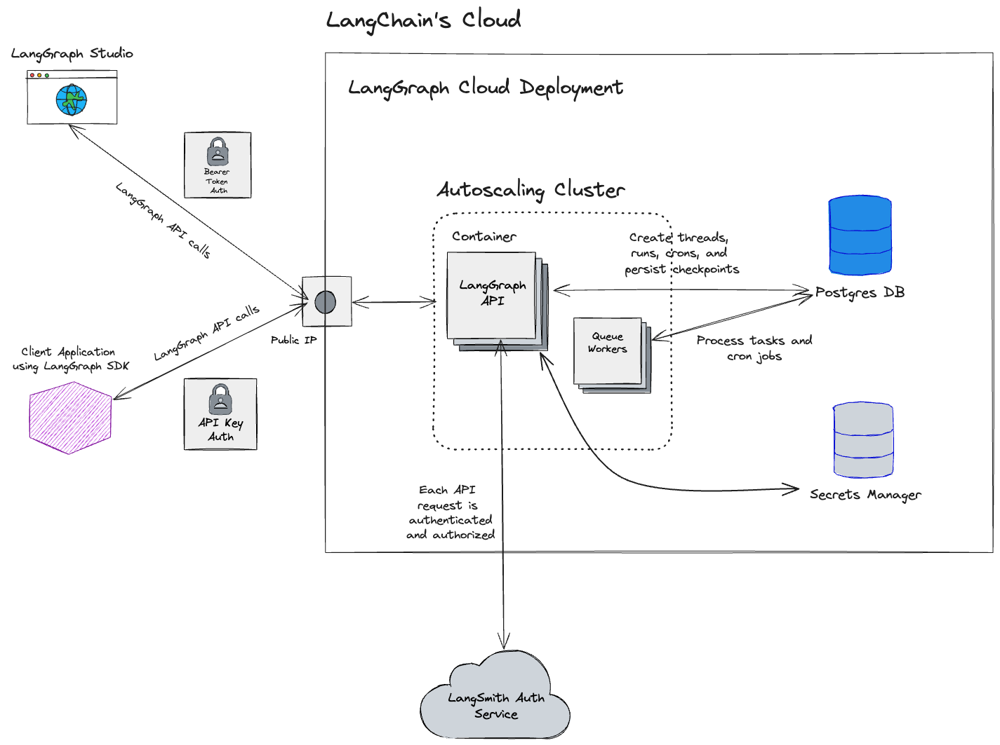

# 云 SaaS

!!! info "先决条件"
    - [LangGraph Platform](./langgraph_platform.md)
    - [LangGraph Server](./langgraph_server.md)

## 概述

LangGraph 的云 SaaS 是一项托管服务，为部署 LangGraph API 提供可扩展且安全的环境。它旨在与你无论如何定义的 LangGraph API 无缝协作，无论它使用什么工具或任何依赖项。云 SaaS 提供了一种在云中部署和管理 LangGraph API 的简单方式。

## 部署

**部署** 是 LangGraph API 的实例。单个部署可以有多个[修订版本](#revision)。创建部署时，所有必要的基础设施（例如数据库、容器、密钥存储）都会自动配置。有关更多详细信息，请参阅下面的[架构图](#architecture)。

请参阅[操作指南](/langgraphjs/cloud/deployment/cloud.md#create-new-deployment)以创建新的部署。

## 修订版本

修订版本是[部署](#deployment)的迭代。创建新部署时，会自动创建初始修订版本。要部署新代码更改或更新部署的环境变量配置，必须创建新的修订版本。创建修订版本时，会自动构建新的容器镜像。

请参阅[操作指南](/langgraphjs/cloud/deployment/cloud.md#create-new-revision)以创建新的修订版本。

## 异步部署

[部署](#deployment)和[修订版本](#revision)的基础设施是异步配置和部署的。它们在提交后不会立即部署。目前，部署可能需要几分钟时间。

## 架构

!!! warning "可能会更改"
云 SaaS 部署架构将来可能会更改。

云 SaaS 部署的高级示意图。

## 相关

- [部署选项](./deployment_options.md)
