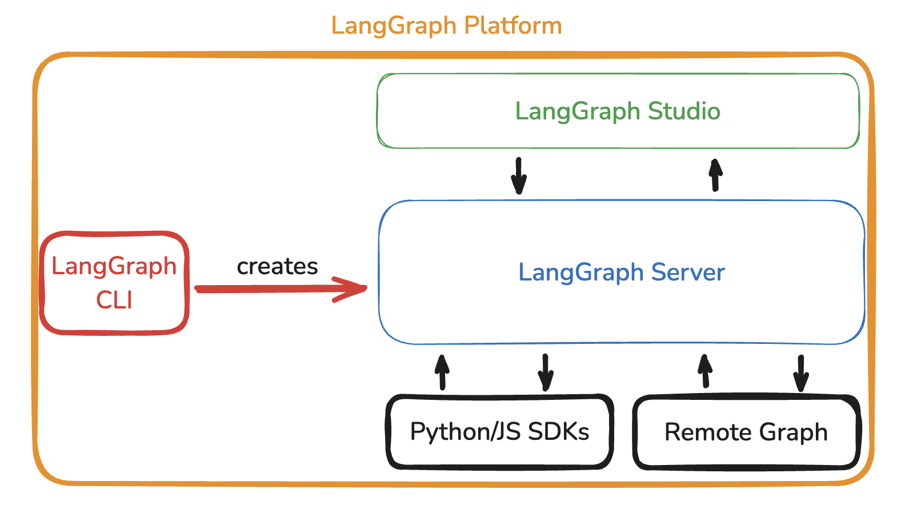

# LangGraph Platform

## 概述

LangGraph Platform 是一个用于将 agentic 应用程序部署到生产环境的商业解决方案，构建在开源 [LangGraph 框架](./high_level.md)之上。

LangGraph Platform 由几个组件组成，它们协同工作以支持 LangGraph 应用程序的开发、部署、调试和监控：

- [LangGraph Server](./langgraph_server.md)：服务器定义了一个自以为是的 API 和架构，结合了部署 agentic 应用程序的最佳实践，让你可以专注于构建 agent 逻辑，而不是开发服务器基础设施。
- [LangGraph Studio](./langgraph_studio.md)：LangGraph Studio 是一个专门的 IDE，可以连接到 LangGraph Server，以在本地实现应用程序的可视化、交互和调试。
- [LangGraph CLI](./langgraph_cli.md)：LangGraph CLI 是一个命令行界面，有助于与本地 LangGraph 交互
- [Python/JS SDK](./sdk.md)：Python/JS SDK 提供与已部署的 LangGraph 应用程序交互的编程方式。
- [远程图](../how-tos/use-remote-graph.md)：RemoteGraph 允许你与任何已部署的 LangGraph 应用程序交互，就像它在本地运行一样。



LangGraph Platform 提供几种不同的部署选项，如[部署选项指南](./deployment_options.md)中所述。

## 为什么使用 LangGraph Platform？

LangGraph Platform 旨在使部署 agentic 应用程序变得无缝且生产就绪。

对于更简单的应用程序，部署 LangGraph agent 可以像使用你自己的服务器逻辑一样简单 —— 例如，设置 FastAPI 端点并直接调用 LangGraph。

### 选项 1：使用自定义服务器逻辑部署

对于基本的 LangGraph 应用程序，你可以选择使用自定义服务器基础设施处理部署。使用 [Hono](https://hono.dev/) 等框架设置端点，允许你像部署任何其他 JavaScript 应用程序一样快速部署和运行 LangGraph：

```ts
// index.ts

import { Hono } from "hono";
import { StateGraph } from "@langchain/langgraph";

const graph = new StateGraph(...)

const app = new Hono();

app.get("/foo", (c) => {
  const res = await graph.invoke(...);
  return c.json(res);
});
```

这种方法适用于具有简单需求的简单应用程序，并让你完全控制部署设置。例如，你可以将其用于不需要长期会话或持久记忆的单一 assistant 应用程序。

### 选项 2：利用 LangGraph Platform 进行复杂部署

随着应用程序的扩展或添加复杂功能，部署需求通常会发展。运行具有更多节点、更长处理时间或需要持久记忆的应用程序可能会带来挑战，这些挑战很快会变得耗时且难以手动管理。[LangGraph Platform](./langgraph_platform.md) 旨在无缝处理这些挑战，让你可以专注于 agent 逻辑，而不是服务器基础设施。

以下是复杂部署中出现的一些常见问题，LangGraph Platform 可以解决这些问题：

- **[流式传输支持](streaming.md)**：随着 agent 变得更加复杂，它们通常受益于将令牌输出和中间状态流式传输回用户。如果没有这一点，用户可能会在等待可能长时间运行的操作时得不到任何反馈。LangGraph Server 提供针对各种应用程序需求优化的[多种流式传输模式](streaming.md)。

- **后台运行**：对于需要更长时间处理的 agent（例如，数小时），保持打开连接可能不切实际。LangGraph Server 支持在后台启动 agent 运行，并提供轮询端点和 webhooks 以有效监控运行状态。

- **支持长时间运行**：普通服务器设置在长时间处理请求时经常会遇到超时或中断。LangGraph Server 的 API 通过发送常规心跳信号为这些任务提供强大的支持，防止在长时间处理期间意外关闭连接。

- **处理突发流量**：某些应用程序，特别是具有实时用户交互的应用程序，可能会经历"突发"请求负载，其中大量请求同时命中服务器。LangGraph Server 包含任务队列，确保即使在重负载下也能一致地处理请求而不会丢失。

- **[双重发送](double_texting.md)**：在用户驱动的应用程序中，用户快速发送多条消息是很常见的。如果处理不当，这种"双重发送"可能会扰乱 agent 流程。LangGraph Server 提供内置策略来解决和管理此类交互。

- **[Checkpointers 和记忆管理](persistence.md#checkpoints)**：对于需要持久化（例如，对话记忆）的 agent，部署强大的存储解决方案可能很复杂。LangGraph Platform 包括优化的 [checkpointers](persistence.md#checkpoints) 和[记忆存储](persistence.md#memory-store)，管理跨会话的状态，无需自定义解决方案。

- **[人机协同支持](human_in_the_loop.md)**：在许多应用程序中，用户需要一种干预 agent 过程的方式。LangGraph Server 提供专门用于人机协同场景的端点，简化将人工监督集成到 agent 工作流中。

通过使用 LangGraph Platform，你可以获得一个强大、可扩展的部署解决方案，缓解这些挑战，节省你手动实现和维护它们的精力。这使你能够更多地关注构建有效的 agent 行为，而不是解决部署基础设施问题。
