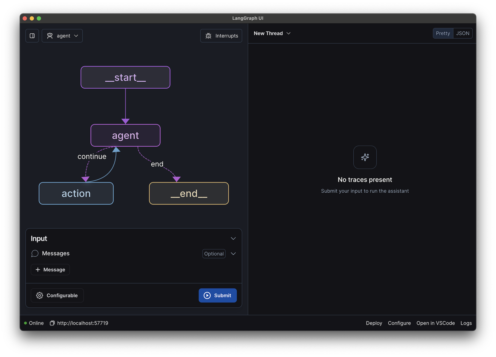

# LangGraph Studio

!!! info "先决条件"

    - [LangGraph Platform](./langgraph_platform.md)
    - [LangGraph Server](./langgraph_server.md)

LangGraph Studio 通过提供专门的 agent IDE，为开发 LLM 应用程序提供了一种新方式，该 IDE 支持复杂 agentic 应用程序的可视化、交互和调试。

凭借可视化图和编辑状态的能力，你可以更好地理解 agent 工作流并更快地迭代。LangGraph Studio 与 LangSmith 集成，允许你与队友协作调试故障模式。



## 功能

LangGraph Studio 的主要功能是：

- 可视化你的图
- 通过从 UI 运行来测试你的图
- 通过[修改其状态并重新运行](human_in_the_loop.md)来调试你的 agent
- 创建和管理 [assistants](assistants.md)
- 查看和管理 [线程](persistence.md#threads)
- 查看和管理 [长期记忆](memory.md)
- 将节点输入/输出添加到 [LangSmith](https://smith.langchain.com/) 数据集以进行测试

## 类型

### 桌面应用程序

LangGraph Studio 作为 [桌面应用程序](https://studio.langchain.com/) 提供给 MacOS 用户。

在测试版期间，LangGraph Studio 免费提供给任何计划层级的所有 [LangSmith](https://smith.langchain.com/) 用户。

### Cloud Studio

如果你已在 LangGraph Platform (Cloud) 上部署 LangGraph 应用程序，你可以作为其中的一部分访问 studio

## Studio 常见问题

### 为什么我的项目无法启动？

你的项目可能无法启动有几个原因，以下是一些最常见的原因。

#### Docker 问题（仅限桌面版）

LangGraph Studio（桌面版）需要 Docker Desktop 4.24 或更高版本。请确保你安装的 Docker 版本满足该要求，并确保在尝试使用 LangGraph Studio 之前 Docker Desktop 应用程序已启动并运行。此外，确保将 docker-compose 更新到 2.22.0 或更高版本。

#### 配置或环境问题

你的项目可能无法启动的另一个原因是你的配置文件定义不正确，或者你缺少必需的环境变量。

### 中断如何工作？

当你选择 `Interrupts` 下拉菜单并选择一个节点以在图运行之前和之后（除非该节点直接进入 `END`）中断图时，图将暂停执行。这意味着你将能够在节点运行之前和节点运行之后编辑状态。这是为了让开发人员能够对节点的行为进行更细粒度的控制，并使其更容易观察节点的行为。如果节点是图中的最终节点，你将无法在节点运行之后编辑状态。

### 如何重新加载应用程序？（仅限桌面版）

如果你想重新加载应用程序，请不要像平常那样使用 Command+R。相反，关闭并重新打开应用程序以进行完全刷新。

### 自动重建如何工作？（仅限桌面版）

LangGraph Studio 的一个关键功能是，当你更改源代码时，它会自动重建你的镜像。这允许超快速的开发和测试周期，使你可以轻松地在图上进行迭代。LangGraph 重建镜像有两种不同的方式：要么通过编辑镜像，要么完全重建它。

#### 源代码更改的重建

如果你只修改了源代码（没有配置或依赖项更改！），则镜像不需要完全重建，LangGraph Studio 只会更新相关部分。当镜像被编辑时，左下角的 UI 状态将暂时从 `Online` 切换到 `Stopping`。日志将在此过程发生时显示，镜像被编辑后，状态将更改回 `Online`，你将能够使用修改后的代码运行你的图！


#### 配置或依赖项更改的重建

如果你编辑图配置文件 (`langgraph.json`) 或依赖项（`pyproject.toml` 或 `requirements.txt`），则整个镜像将重建。这将导致 UI 从图视图切换开，并开始显示新镜像构建过程的日志。这可能需要一两分钟，完成后，你更新的镜像就可以使用了！

### 为什么我的图启动需要这么长时间？（仅限桌面版）

LangGraph Studio 与本地 LangGraph API 服务器交互。为了与持续更新保持一致，LangGraph API 需要定期重建。因此，你在启动项目时可能会偶尔遇到轻微的延迟。

## 为什么我的图中显示额外的边？

如果你不小心定义条件边，你可能会注意到图中出现额外的边。这是因为如果没有正确定义，LangGraph Studio 假定条件边可以访问所有其他节点。为了避免这种情况，你需要明确说明你定义条件边路由到的节点。有两种方法可以做到这一点：

### 解决方案 1：包含路径映射

解决这个问题的第一种方法是向条件边添加路径映射。路径映射只是一个字典或数组，将你的路由器函数的可能输出映射到每个输出对应的节点名称。路径映射作为第三个参数传递给 `add_conditional_edges` 函数，如下所示：

=== "Python"

    ```python
    graph.add_conditional_edges("node_a", routing_function, {True: "node_b", False: "node_c"})
    ```

=== "Javascript"

    ```ts
    graph.addConditionalEdges("node_a", routingFunction, { foo: "node_b", bar: "node_c" });
    ```

在这种情况下，路由函数返回 True 或 False，分别映射到 `node_b` 和 `node_c`。

### 解决方案 2：更新路由器的类型（仅限 Python）

除了传递路径映射外，你还可以通过使用 `Literal` Python 定义指定路由函数可以映射到的节点来明确说明路由函数的类型。以下是如何以这种方式定义路由函数的示例：

```python
def routing_function(state: GraphState) -> Literal["node_b","node_c"]:
    if state['some_condition'] == True:
        return "node_b"
    else:
        return "node_c"
```


## 相关

有关更多信息，请参阅以下内容：

*  [LangGraph Studio 操作指南](../how-tos/index.md#langgraph-studio)
