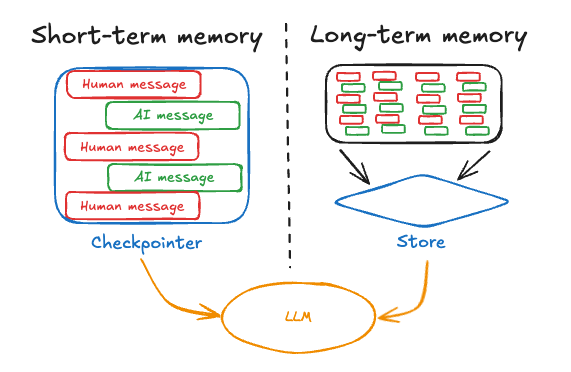
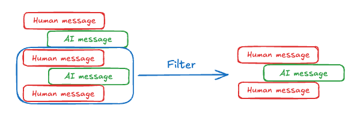
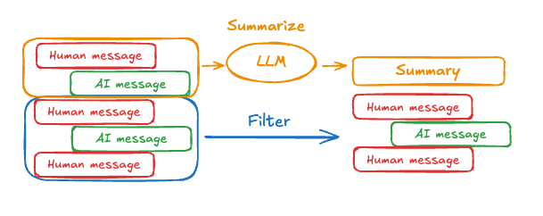

# 记忆

## 什么是记忆？

AI 应用程序中的记忆是指处理、存储和有效回忆过去交互信息的能力。借助记忆，你的 agent 可以从反馈中学习并适应用户的偏好。本指南根据记忆回忆的范围分为两个部分：短期记忆和长期记忆。

**短期记忆**，或 [线程](persistence.md#threads) 范围的记忆，可以在与用户的单个对话线程内的任何时间**从内部**回忆。LangGraph 将短期记忆作为 agent [状态](low_level.md#state) 的一部分进行管理。状态使用 [checkpointer](persistence.md#checkpoints) 持久化到数据库，以便线程可以随时恢复。短期记忆在图被调用或步骤完成时更新，并在每个步骤开始时读取状态。

**长期记忆**在不同的对话线程之间共享。它可以在_任何时间_和**任何线程**中回忆。记忆的范围是任何自定义命名空间，而不仅仅是单个线程 ID 内。LangGraph 提供 [存储](persistence.md#memory-store) ([参考文档](https://langchain-ai.github.io/langgraphjs/reference/classes/checkpoint.BaseStore.html)) 来让你保存和回忆长期记忆。

两者对于理解和实现你的应用程序都很重要。



## 短期记忆

短期记忆让你的应用程序能够在单个 [线程](persistence.md#threads) 或对话中记住先前的交互。[线程](persistence.md#threads) 在会话中组织多次交互，类似于电子邮件将消息分组到单个对话中的方式。

LangGraph 通过线程范围的检查点将短期记忆作为 agent 状态的一部分进行管理。此状态通常可以包括对话历史以及有状态数据，如上传的文件、检索的文档或生成的工件。通过将这些存储在图状态中，机器人可以访问给定对话的完整上下文，同时保持不同线程之间的分离。

由于对话历史是表示短期记忆的最常见形式，在下一节中，我们将介绍当消息列表变得**很长**时管理对话历史的技术。如果你想坚持高级概念，请继续阅读 [长期记忆](#long-term-memory) 部分。

### 管理长对话历史

长对话对当今的 LLM 构成挑战。完整的历史甚至可能无法放入 LLM 的上下文窗口，导致无法恢复的错误。即使_如果_你的 LLM 技术上支持完整的上下文长度，大多数 LLM 在长上下文上仍然表现不佳。它们会被陈旧或离题的内容"分散注意力"，同时响应时间变慢，成本更高。

管理短期记忆是平衡[精确度和召回率](https://en.wikipedia.org/wiki/Precision_and_recall#:~:text=Precision%20can%20be%20seen%20as,irrelevant%20ones%20are%20also%20returned)与应用程序其他性能要求（延迟和成本）的练习。与往常一样，批判性地思考如何为 LLM 表示信息并查看你的数据非常重要。我们在下面介绍了一些管理消息列表的常见技术，并希望为你提供足够的上下文，以便为你的应用程序选择最佳的权衡：

- [编辑消息列表](#editing-message-lists)：如何在将语言模型传递给语言模型之前考虑修剪和过滤消息列表。
- [总结过去的对话](#summarizing-past-conversations)：当你不想仅仅过滤消息列表时使用的一种常见技术。

### 编辑消息列表

聊天模型使用[消息](https://js.langchain.com/docs/concepts/#messages)接受上下文，这些消息包括开发者提供的指令（系统消息）和用户输入（人工消息）。在聊天应用程序中，消息在人工输入和模型响应之间交替，导致消息列表随着时间的推移变得越来越长。由于上下文窗口有限且令牌丰富的消息列表可能代价高昂，许多应用程序可以从使用技术手动删除或遗忘陈旧信息中受益。



最直接的方法是从列表中删除旧消息（类似于[最近最少使用的缓存](https://en.wikipedia.org/wiki/Page_replacement_algorithm#Least_recently_used)）。

在 LangGraph 中删除列表内容的典型技术是从节点返回一个更新，告诉系统删除列表的某些部分。你可以定义此更新的外观，但常见的方法是让你返回一个指定要保留哪些值的对象或字典。

```typescript
import { Annotation } from "@langchain/langgraph";

const StateAnnotation = Annotation.Root({
  myList: Annotation<any[]>({
    reducer: (
      existing: string[],
      updates: string[] | { type: string; from: number; to?: number }
    ) => {
      if (Array.isArray(updates)) {
        // 正常情况，添加到历史
        return [...existing, ...updates];
      } else if (typeof updates === "object" && updates.type === "keep") {
        // 你可以决定它看起来像什么。
        // 例如，你可以简化并只接受一个字符串 "DELETE"
        // 并清除整个列表。
        return existing.slice(updates.from, updates.to);
      }
      // 等等。我们定义如何解释更新
      return existing;
    },
    default: () => [],
  }),
});

type State = typeof StateAnnotation.State;

function myNode(state: State) {
  return {
    // 我们返回 "myList" 字段的更新，说明只
    // 保留从索引 -5 到末尾的值（删除其余部分）
    myList: { type: "keep", from: -5, to: undefined },
  };
}
```

每当在 "myList" 键下返回更新时，LangGraph 都会调用 "[reducer](low_level.md#reducers)" 函数。在该函数中，我们定义要接受的更新类型。通常，消息将添加到现有列表（对话将增长）；但是，我们还添加了对接受字典的支持，让你可以"保留"状态的某些部分。这让你可以以编程方式删除旧的消息上下文。

另一种常见的方法是让你返回一个 "remove" 对象列表，指定要删除的所有消息的 ID。如果你使用 LangChain 消息和 LangGraph 中的 [`messagesStateReducer`](https://langchain-ai.github.io/langgraphjs/reference/functions/langgraph.messagesStateReducer.html) reducer（或 [`MessagesAnnotation`](https://langchain-ai.github.io/langgraphjs/reference/variables/langgraph.MessagesAnnotation.html)，它使用相同的基础功能），你可以使用 `RemoveMessage` 来执行此操作。

```typescript
import { RemoveMessage, AIMessage } from "@langchain/core/messages";
import { MessagesAnnotation } from "@langchain/langgraph";

type State = typeof MessagesAnnotation.State;

function myNode1(state: State) {
  // 向状态中的 `messages` 列表添加 AI 消息
  return { messages: [new AIMessage({ content: "Hi" })] };
}

function myNode2(state: State) {
  // 从状态中的 `messages` 列表中删除除最后 2 条消息之外的所有消息
  const deleteMessages = state.messages
    .slice(0, -2)
    .map((m) => new RemoveMessage({ id: m.id }));
  return { messages: deleteMessages };
}
```

在上面的示例中，`MessagesAnnotation` 允许我们将新消息附加到 `myNode1` 中所示的 `messages` 状态键。当它看到 `RemoveMessage` 时，它将从列表中删除具有该 ID 的消息（然后 RemoveMessage 将被丢弃）。有关 LangChain 特定消息处理的更多信息，请查看[有关使用 `RemoveMessage` 的操作指南](https://langchain-ai.github.io/langgraphjs/how-tos/memory/delete-messages/)。

有关示例用法，请参阅此[指南](https://langchain-ai.github.io/langgraphjs/how-tos/manage-conversation-history/)。

### 总结过去的对话

如上所示修剪或删除消息的问题在于我们可能会丢失从消息队列剔除中丢失的信息。因此，某些应用程序受益于使用聊天模型对消息历史进行总结的更复杂方法。



可以使用简单的提示和编排逻辑来实现这一点。例如，在 LangGraph 中，我们可以扩展 [`MessagesAnnotation`](https://langchain-ai.github.io/langgraphjs/reference/variables/langgraph.MessagesAnnotation.html) 以包含 `summary` 键。

```typescript
import { MessagesAnnotation, Annotation } from "@langchain/langgraph";

const MyGraphAnnotation = Annotation.Root({
  ...MessagesAnnotation.spec,
  summary: Annotation<string>,
});
```

然后，我们可以使用任何现有摘要作为下一个摘要的上下文来生成聊天历史的摘要。此 `summarizeConversation` 节点可以在 `messages` 状态键中累积了一些消息后被调用。

```typescript
import { ChatOpenAI } from "@langchain/openai";
import { HumanMessage, RemoveMessage } from "@langchain/core/messages";

type State = typeof MyGraphAnnotation.State;

async function summarizeConversation(state: State) {
  // 首先，获取任何现有摘要
  const summary = state.summary || "";

  // 创建我们的摘要提示
  let summaryMessage: string;
  if (summary) {
    // 摘要已存在
    summaryMessage =
      `This is a summary of the conversation to date: ${summary}\n\n` +
      "Extend the summary by taking into account the new messages above:";
  } else {
    summaryMessage = "Create a summary of the conversation above:";
  }

  // 将提示添加到我们的历史
  const messages = [
    ...state.messages,
    new HumanMessage({ content: summaryMessage }),
  ];

  // 假设你有一个 ChatOpenAI 模型实例
  const model = new ChatOpenAI();
  const response = await model.invoke(messages);

  // 删除除最近的 2 条消息之外的所有消息
  const deleteMessages = state.messages
    .slice(0, -2)
    .map((m) => new RemoveMessage({ id: m.id }));

  return {
    summary: response.content,
    messages: deleteMessages,
  };
}
```

有关示例用法，请参阅此[指南](https://langchain-ai.github.io/langgraphjs/how-tos/memory/add-summary-conversation-history/)。

### 知道**何时**删除消息

大多数 LLM 都有一个最大支持的上下文窗口（以令牌为单位）。决定何时截断消息的一种简单方法是计算消息历史中的令牌数，并在接近该限制时截断。朴素的截断很容易自己实现，但有一些"陷阱"。某些模型 API 进一步限制消息类型的序列（必须以人工消息开头，不能连续有相同类型的消息等）。如果你使用 LangChain，你可以使用 [`trimMessages`](https://js.langchain.com/docs/how_to/trim_messages/#trimming-based-on-token-count) 实用程序并指定要从列表中保留的令牌数，以及用于处理边界的 `strategy`（例如，保留最后的 `maxTokens`）。

以下是一个示例。

```typescript
import { trimMessages } from "@langchain/core/messages";
import { ChatOpenAI } from "@langchain/openai";

trimMessages(messages, {
  // 保留消息的最后 <= n_count 个令牌。
  strategy: "last",
  // 记住根据你的模型调整
  // 或传递自定义的 token_encoder
  tokenCounter: new ChatOpenAI({ modelName: "gpt-4" }),
  // 记住根据所需的对话调整
  // 长度
  maxTokens: 45,
  // 大多数聊天模型期望聊天历史以以下之一开始：
  // (1) HumanMessage 或
  // (2) SystemMessage 后跟 HumanMessage
  startOn: "human",
  // 大多数聊天模型期望聊天历史以以下之一结束：
  // (1) HumanMessage 或
  // (2) ToolMessage
  endOn: ["human", "tool"],
  // 通常，如果原始历史中存在 SystemMessage，
  // 我们希望保留它。
  // SystemMessage 对模型有特殊说明。
  includeSystem: true,
});
```

## 长期记忆

LangGraph 中的长期记忆允许系统在不同的对话或会话之间保留信息。与线程范围的短期记忆不同，长期记忆保存在自定义"命名空间"中。

LangGraph 将长期记忆存储为 [存储](persistence.md#memory-store) ([参考文档](https://langchain-ai.github.io/langgraphjs/reference/classes/checkpoint.BaseStore.html)) 中的 JSON 文档。每个记忆都在自定义 `namespace`（类似于文件夹）和不同的 `key`（类似于文件名）下组织。命名空间通常包括用户或组织 ID 或其他有助于组织信息的标签。这支持记忆的分层组织。然后通过内容过滤器支持跨命名空间搜索。请参阅下面的示例。

```typescript
import { InMemoryStore } from "@langchain/langgraph";

// InMemoryStore 将数据保存到内存字典中。在生产用例中使用数据库支持的存储。
const store = new InMemoryStore();
const userId = "my-user";
const applicationContext = "chitchat";
const namespace = [userId, applicationContext];
await store.put(namespace, "a-memory", {
  rules: [
    "User likes short, direct language",
    "User only speaks English & TypeScript",
  ],
  "my-key": "my-value",
});
// 通过 ID 获取 "memory"
const item = await store.get(namespace, "a-memory");
// 在此命名空间内列出 "memories"，按内容等价过滤
const items = await store.search(namespace, {
  filter: { "my-key": "my-value" },
});
```

在将长期记忆添加到 agent 时，重要的是要考虑如何**写入记忆**，如何**存储和管理记忆更新**，以及如何**回忆和呈现记忆**以供 LLM 在你的应用程序中使用。这些问题都是相互依赖的：你如何回忆和格式化记忆给 LLM 决定了你应该存储什么以及如何管理它。此外，每种技术都有权衡。适合你的方法很大程度上取决于应用程序的需求。
LangGraph 旨在为你提供基于记忆 [存储](persistence.md#memory-store) 直接控制应用程序长期记忆的低级原语。

长期记忆远非一个已解决的问题。虽然很难提供通用建议，但我们提供了一些可靠的模式供你在实现长期记忆时考虑。

**你是想在"热路径"还是"后台"写入记忆**

记忆可以作为主要应用程序逻辑的一部分（例如，在应用程序的"热路径"中）或作为后台任务（作为基于主要应用程序状态生成记忆的单独函数或图）进行更新。我们在下面的[写入记忆部分](#writing-memories)中记录了每种方法的一些权衡。

**你是想将记忆作为单个配置文件还是文档集合来管理？**

我们提供两种管理长期记忆的主要方法：单个、持续更新的文档（称为"配置文件"或"模式"）或文档集合。每种方法都有自己的好处，取决于你需要存储的信息类型以及你打算如何访问它。

将记忆作为单个、持续更新的"配置文件"或"模式"进行管理对于存储有关用户、组织或其他实体（包括 agent 本身）的明确范围的特定信息很有用。你可以提前定义配置文件的架构，然后使用 LLM 基于交互进行更新。查询"记忆"很容易，因为它是对 JSON 文档的简单 GET 操作。我们在[记住配置文件](#manage-individual-profiles)中更详细地解释了这一点。这种技术可以在（已知信息用例上的）更高精确度下提供更高的召回率（因为你必须预测和建模你的域，并且文档的更新往往更频繁地删除或重写旧信息）。

另一方面，将长期记忆作为文档集合进行管理，允许你存储无界数量的信息。这种技术在你想在很长一段时间内反复提取和记住项目时很有用，但随时间查询和管理可能会更复杂。与"配置文件"记忆类似，你仍然为每个记忆定义模式。你不是覆盖单个文档，而是插入新文档（并可能在此过程中更新或重新上下文化现有文档）。我们在["管理记忆集合"](#manage-a-collection-of-memories)中更详细地解释了这种方法。

**你是想将记忆呈现给你的 agent 作为更新的指令还是少样本示例？**

记忆通常作为系统提示的一部分提供给 LLM。向 LLM "呈现"记忆的一些常见方式包括提供原始信息作为"来自与用户 A 之前交互的记忆"、作为系统指令或规则，或作为少样本示例。

将记忆作为"学习规则或指令"进行呈现通常意味着将系统提示的一部分专门用于 LLM 可以自己管理的指令。每次对话后，你可以提示 LLM 评估其性能并更新指令，以便在未来更好地处理此类任务。我们在[此部分](#update-own-instructions)中更详细地解释了这种方法。这种方法允许系统动态更新和改进自己的行为，可能会提高各种任务的性能。这对于事先难以指定指令的任务特别有用。

将记忆存储为少样本示例允许你将指令存储为因果关系。每个记忆存储输入或上下文和预期响应。包括推理轨迹（思维链）还可以帮助提供足够的上下文，以便记忆在以后不太可能被误用。我们在[此部分](#few-shot-examples)中更详细地阐述了这个概念。

我们将在以下部分详细说明写入、管理和回忆与格式化记忆的技术。

### 写入记忆

人类在睡觉时形成长期记忆，但我们的 agent 应该何时创建新记忆？我们看到的 agent 写入记忆的两种最常见方式是"在热路径上"和"在后台"。

#### 在热路径上写入记忆

这涉及在应用程序运行时创建记忆。为了提供一个流行的生产示例，ChatGPT 使用 "save_memories" 工具来 upsert 记忆作为内容字符串。它每次收到用户消息时都会决定是否（以及如何）使用此工具，并将记忆管理与其余用户指令多任务处理。

这有一些好处。首先，它发生在"实时"中。如果用户立即开始一个新线程，该记忆将存在。用户还可以透明地看到记忆何时被存储，因为机器人必须明确决定存储信息并将其与用户关联。

这也有几个缺点。它使 agent 必须做出的决策复杂化（要提交到记忆中的内容）。这种复杂性可能会降低其工具调用性能并降低任务完成率。它会减慢最终响应，因为它需要决定要将什么提交到记忆中。它通常还会导致更少的东西被保存到记忆中（因为 assistant 正在多任务处理），这会导致以后对话中的**召回率较低**。

#### 在后台写入记忆

这涉及将记忆更新作为概念上独立的任务，通常作为完全独立的图或函数。由于它发生在后台，因此不会产生延迟。它还将应用程序逻辑与记忆逻辑分离，使其更加模块化和易于管理。它还允许你分离记忆创建的时间，让你避免冗余工作。你的 agent 可以专注于完成其即时任务，而不必有意识地思考它需要记住什么。

然而，这种方法并非没有缺点。你必须考虑多久写入一次记忆。如果它不是实时运行的，用户在其他线程上的交互将不会受益于新上下文。你还必须考虑何时触发此作业。我们通常建议在将来的某个时间点调度记忆，如果给定线程上发生新事件，则取消并重新调度到将来。其他流行的选择是按照 cron 计划形成记忆，或让用户或应用程序逻辑手动触发记忆形成。

### 管理记忆

一旦你确定了记忆调度，重要的是要考虑**如何用新信息更新记忆**。

有两种主要方法：你可以持续更新单个文档（记忆配置文件），也可以在每次收到新信息时插入新文档。

我们将在下面概述这两种方法之间的一些权衡，了解大多数人会发现结合方法并定居在中间某个地方最合适。

#### 管理单个配置文件

配置文件通常只是一个 JSON 文档，包含你选择用来表示域的各种键值对。记住配置文件时，你要确保每次都**更新**配置文件。因此，你要传入先前的配置文件，并要求 LLM 生成新的配置文件（或一些要应用于旧配置文件的 JSON 补丁）。

文档越大，这可能变得越容易出错。如果你的文档变得**太**大，你可能需要考虑将配置文件拆分为单独的部分。你可能需要使用带有重试的生成和/或**严格**解码来生成文档，以确保记忆模式保持有效。

#### 管理记忆集合

将记忆保存为文档集合简化了一些事情。每个单独的记忆可以更 narrowly 范围，更容易生成。这也意味着你不太可能随时间**丢失**信息，因为 LLM 更容易为_新_信息生成_新_对象，而不是将其与密集配置文件中的信息协调一致。这往往会导致以后更高的召回率。

这种方法将一些复杂性转移到你如何提示 LLM 应用记忆更新。你现在必须使 LLM 能够_删除_或_更新_列表中的现有项目。提示 LLM 做到这一点可能很棘手。某些 LLM 可能默认过度插入；其他可能默认过度更新。通过 evals 调整此行为是最佳选择，你可以使用 [LangSmith](https://docs.smith.langchain.com/tutorials/Developers/evaluation) 等工具来完成。

这还将复杂性转移到记忆**搜索**（召回）。你必须考虑要使用哪些相关项目。目前我们支持按元数据过滤。我们将很快添加语义搜索。

最后，这还将复杂性转移到你如何为 LLM 表示记忆（以及你用于保存每个记忆的模式的扩展）。很容易写出在上下文中容易被误用的记忆。提示 LLM 在给定记忆中包含所有必要的上下文信息很重要，以便在以后使用它时不会误用该信息。

### 呈现记忆

保存记忆后，你检索和向 LLM 呈现记忆内容的方式可以在 LLM 将该信息纳入其响应方面发挥重要作用。
以下部分介绍了几种常见方法。请注意，这些部分也会告知你如何写入和管理记忆。记忆中的所有内容都是相互关联的！

#### 更新自己的指令

虽然指令通常是由开发者编写的静态文本，但许多 AI 应用程序受益于让用户个性化 agent 在与该用户交互时应遵循的规则和指令。理想情况下，这可以通过其与用户的交互来推断（因此用户不必在你的应用中显式更改设置）。在这个意义上，指令是一种长形式的记忆！

一种应用方法是使用"反思"或"元提示"步骤。使用当前的指令集（来自系统提示）和与用户的对话提示 LLM，并指示 LLM 优化其指令。这种方法允许系统动态更新和改进自己的行为，可能会提高各种任务的性能。这对于事先难以指定指令的任务特别有用。

元提示使用过去信息来优化提示。例如，[推文生成器](https://www.youtube.com/watch?v=Vn8A3BxfplE) 使用元提示来增强其用于 Twitter 的论文摘要提示。你可以使用 LangGraph 的记忆存储在共享命名空间中保存更新的指令来实现这一点。在这种情况下，我们将记忆命名为 "agent_instructions"，并根据 agent 对记忆进行键控。

```typescript
import { BaseStore } from "@langchain/langgraph/store";
import { State } from "@langchain/langgraph";
import { ChatOpenAI } from "@langchain/openai";

// 使用指令的节点
const callModel = async (state: State, store: BaseStore) => {
  const namespace = ["agent_instructions"];
  const instructions = await store.get(namespace, "agent_a");
  // 应用程序逻辑
  const prompt = promptTemplate.format({
    instructions: instructions[0].value.instructions,
  });
  // ... 逻辑的其余部分
};

// 更新指令的节点
const updateInstructions = async (state: State, store: BaseStore) => {
  const namespace = ["instructions"];
  const currentInstructions = await store.search(namespace);
  // 记忆逻辑
  const prompt = promptTemplate.format({
    instructions: currentInstructions[0].value.instructions,
    conversation: state.messages,
  });
  const llm = new ChatOpenAI();
  const output = await llm.invoke(prompt);
  const newInstructions = output.content; // 假设 LLM 返回新的指令
  await store.put(["agent_instructions"], "agent_a", {
    instructions: newInstructions,
  });
  // ... 逻辑的其余部分
};
```

#### 少样本示例

有时"展示"比"告诉"更容易。LLM 从示例中学习得很好。少样本学习允许你["编程"](https://x.com/karpathy/status/1627366413840322562) 你的 LLM，通过使用输入-输出示例更新提示来说明预期行为。虽然可以使用各种[最佳实践](https://js.langchain.com/docs/concepts/#1-generating-examples)来生成少样本示例，但挑战通常在于根据用户输入选择最相关的示例。

请注意，记忆存储只是存储数据作为少样本示例的一种方式。如果你想让更多的开发者参与，或者将少样本与你的评估工具更紧密地联系起来，你也可以使用 [LangSmith 数据集](https://docs.smith.langchain.com/how_to_guides/datasets)来存储你的数据。然后，动态少样本示例选择器可以开箱即用地实现相同的目标。LangSmith 将为你索引数据集，并使你能够根据关键字相似性（[使用类似 BM25 的算法](https://docs.smith.langchain.com/how_to_guides/datasets/index_datasets_for_dynamic_few_shot_example_selection) 进行基于关键字的相似性）检索与用户输入最相关的少样本示例。

有关在 LangSmith 中使用动态少样本示例选择的示例用法，请参阅此[视频](https://www.youtube.com/watch?v=37VaU7e7t5o)。此外，请参阅此[博客文章](https://blog.langchain.dev/few-shot-prompting-to-improve-tool-calling-performance/)展示少样本提示以提高工具调用性能，以及此[博客文章](https://blog.langchain.dev/aligning-llm-as-a-judge-with-human-preferences/)使用少样本示例将 LLM 与人类偏好对齐。
