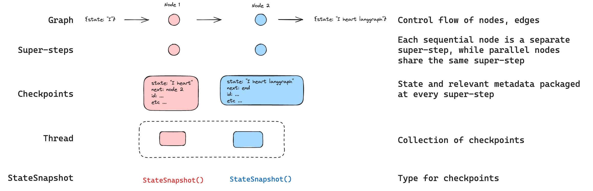
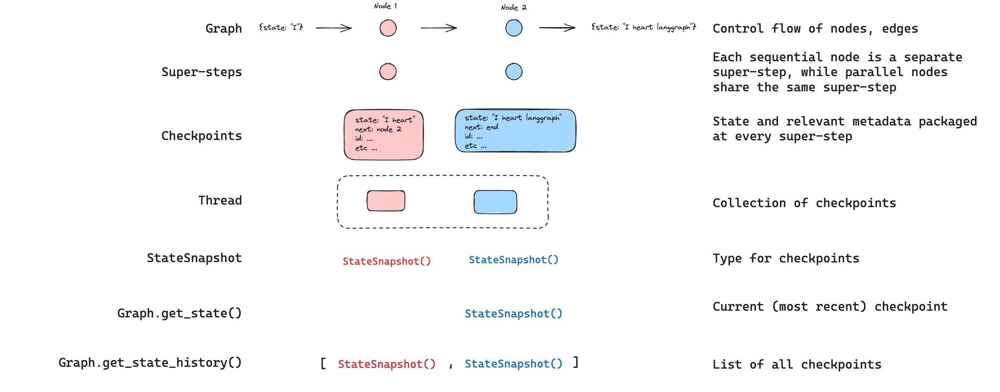
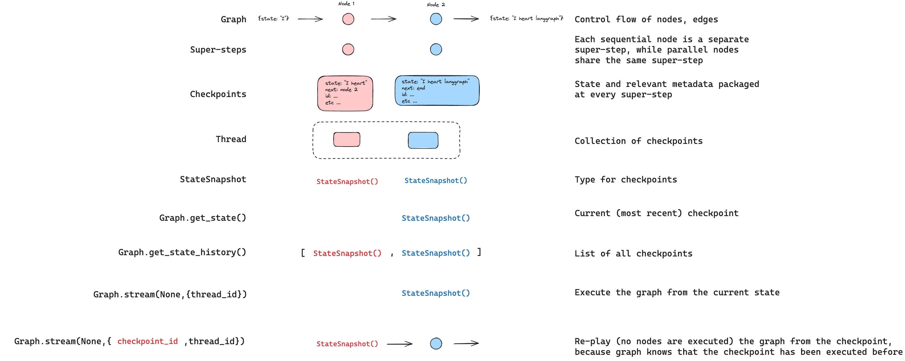
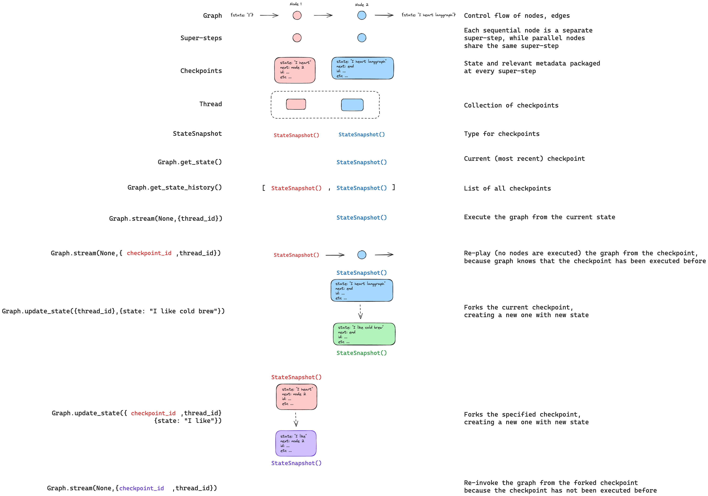
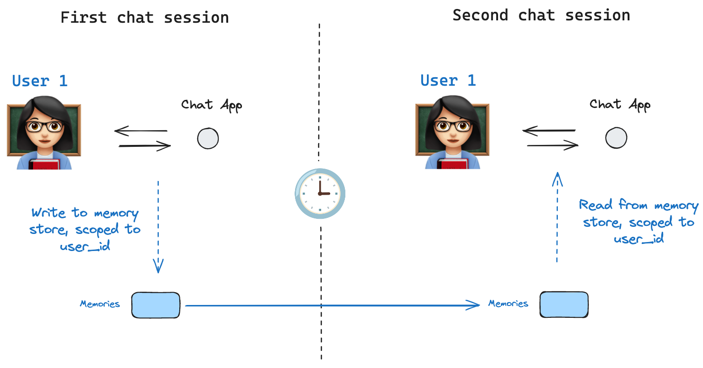

# 持久化

LangGraph 具有内置的持久层，通过 checkpointers 实现。当你使用 checkpointer 编译图时，checkpointer 会在每个超级步骤保存图状态的 `checkpoint`。这些检查点保存到 `thread`，可以在图执行后访问。由于 `threads` 允许在图执行后访问图的当前状态，因此可以实现几种强大的功能，包括人机协同、记忆、时间旅行和容错。有关如何向图中添加和使用 checkpointers 的端到端示例，请参阅[此操作指南](/langgraphjs/how-tos/persistence)。下面，我们将更详细地讨论这些概念。



## 线程

线程是由 checkpointer 保存的每个检查点分配的唯一 ID 或[线程标识符](#threads)。当使用 checkpointer 调用图时，你**必须**在 config 的 `configurable` 部分指定 `thread_id`：

```ts
{"configurable": {"thread_id": "1"}}
```

## 检查点

检查点是在每个超级步骤保存的图状态快照，由 `StateSnapshot` 对象表示，具有以下关键属性：

- `config`：与此检查点关联的配置。
- `metadata`：与此检查点关联的元数据。
- `values`：此时状态通道的值。
- `next` 要执行的图节点名称的元组。
- `tasks`：包含有关要执行的下一个任务的信息的 `PregelTask` 对象元组。如果该步骤之前已尝试，则将包括错误信息。如果图被[动态地](/langgraphjs/how-tos/dynamic_breakpoints)从节点内部中断，任务将包含与中断相关的额外数据。

让我们看看当如下调用简单图时保存了哪些检查点：

```typescript
import { StateGraph, START, END, MemorySaver, Annotation } from "@langchain/langgraph";

const GraphAnnotation = Annotation.Root({
  foo: Annotation<string>,
  bar: Annotation<string[]>({
    reducer: (a, b) => [...a, ...b],
    default: () => [],
  })
});

function nodeA(state: typeof GraphAnnotation.State) {
  return { foo: "a", bar: ["a"] };
}

function nodeB(state: typeof GraphAnnotation.State) {
  return { foo: "b", bar: ["b"] };
}

const workflow = new StateGraph(GraphAnnotation)
  .addNode("nodeA", nodeA)
  .addNode("nodeB", nodeB)
  .addEdge(START, "nodeA")
  .addEdge("nodeA", "nodeB")
  .addEdge("nodeB", END);

const checkpointer = new MemorySaver();
const graph = workflow.compile({ checkpointer });

const config = { configurable: { thread_id: "1" } };
await graph.invoke({ foo: "" }, config);
```

运行图后，我们期望看到正好 4 个检查点：

* 空检查点，`START` 作为下一个要执行的节点
* 检查点包含用户输入 `{foo: '', bar: []}` 和 `nodeA` 作为下一个要执行的节点
* 检查点包含 `nodeA` 的输出 `{foo: 'a', bar: ['a']}` 和 `nodeB` 作为下一个要执行的节点
* 检查点包含 `nodeB` 的输出 `{foo: 'b', bar: ['a', 'b']}` 且没有下一个要执行的节点

请注意，我们 `bar` 通道值包含来自两个节点的输出，因为我们有 `bar` 通道的 reducer。

### 获取状态

与保存的图状态交互时，你**必须**指定一个[线程标识符](#threads)。你可以通过调用 `await graph.getState(config)` 来查看图的*最新*状态。这将返回一个 `StateSnapshot` 对象，该对象对应于与 config 中提供的线程 ID 关联的最新检查点，或者如果提供，则对应于该线程的检查点 ID 的检查点。

```typescript
// 获取最新状态快照
const config = { configurable: { thread_id: "1" } };
const state = await graph.getState(config);

// 获取特定 checkpoint_id 的状态快照
const configWithCheckpoint = { configurable: { thread_id: "1", checkpoint_id: "1ef663ba-28fe-6528-8002-5a559208592c" } };
const stateWithCheckpoint = await graph.getState(configWithCheckpoint);
```

在我们的示例中，`getState` 的输出将如下所示：

```
{
  values: { foo: 'b', bar: ['a', 'b'] },
  next: [],
  config: { configurable: { thread_id: '1', checkpoint_ns: '', checkpoint_id: '1ef663ba-28fe-6528-8002-5a559208592c' } },
  metadata: { source: 'loop', writes: { nodeB: { foo: 'b', bar: ['b'] } }, step: 2 },
  created_at: '2024-08-29T19:19:38.821749+00:00',
  parent_config: { configurable: { thread_id: '1', checkpoint_ns: '', checkpoint_id: '1ef663ba-28f9-6ec4-8001-31981c2c39f8' } },
  tasks: []
}
```

### 获取状态历史

你可以通过调用 `await graph.getStateHistory(config)` 来获取给定线程的图执行的完整历史。这将返回一个 `StateSnapshot` 对象列表，这些对象与 config 中提供的线程 ID 关联。重要的是，检查点将按时间顺序排列，最近的检查点 / `StateSnapshot` 位于列表的第一位。

```typescript
const config = { configurable: { thread_id: "1" } };
const history = await graph.getStateHistory(config);
```

在我们的示例中，`getStateHistory` 的输出将如下所示：

```
[
  {
    values: { foo: 'b', bar: ['a', 'b'] },
    next: [],
    config: { configurable: { thread_id: '1', checkpoint_ns: '', checkpoint_id: '1ef663ba-28fe-6528-8002-5a559208592c' } },
    metadata: { source: 'loop', writes: { nodeB: { foo: 'b', bar: ['b'] } }, step: 2 },
    created_at: '2024-08-29T19:19:38.821749+00:00',
    parent_config: { configurable: { thread_id: '1', checkpoint_ns: '', checkpoint_id: '1ef663ba-28f9-6ec4-8001-31981c2c39f8' } },
    tasks: [],
  },
  {
    values: { foo: 'a', bar: ['a'] },
    next: ['nodeB'],
    config: { configurable: { thread_id: '1', checkpoint_ns: '', checkpoint_id: '1ef663ba-28f9-6ec4-8001-31981c2c39f8' } },
    metadata: { source: 'loop', writes: { nodeA: { foo: 'a', bar: ['a'] } }, step: 1 },
    created_at: '2024-08-29T19:19:38.819946+00:00',
    parent_config: { configurable: { thread_id: '1', checkpoint_ns: '', checkpoint_id: '1ef663ba-28f4-6b4a-8000-ca575a13d36a' } },
    tasks: [{ id: '6fb7314f-f114-5413-a1f3-d37dfe98ff44', name: 'nodeB', error: null, interrupts: [] }],
  },
  // ... (其他检查点)
]
```



### 重放

也可以播放过去的图执行。如果我们使用 `thread_id` 和 `checkpoint_id` 调用图，那么我们将*重放*来自对应于 `checkpoint_id` 的检查点的图。

* `thread_id` 只是线程的 ID。这始终是必需的。
* `checkpoint_id` 此标识符指代线程内的特定检查点。

在调用图时，你必须将这些作为 config 的 `configurable` 部分传递：

```typescript
// { configurable: { thread_id: "1" } }  // 有效配置
// { configurable: { thread_id: "1", checkpoint_id: "0c62ca34-ac19-445d-bbb0-5b4984975b2a" } }  // 也有效

const config = { configurable: { thread_id: "1" } };
await graph.invoke(inputs, config);
```

重要的是，LangGraph 知道特定检查点是否已先前执行过。如果是，LangGraph 只是*重放*该特定步骤而不重新执行它。有关重放的更多信息，请参阅此[时间旅行操作指南](/langgraphjs/how-tos/time-travel)。



### 更新状态

除了从特定的 `checkpoints` 重新播放图之外，我们还可以*编辑*图状态。我们使用 `graph.updateState()` 来执行此操作。此方法有三个不同的参数：

#### `config`

配置应包含 `thread_id` 以指定要更新哪个线程。当仅传递 `thread_id` 时，我们更新（或分叉）当前状态。可选地，如果我们包含 `checkpoint_id` 字段，那么我们分叉该选定的检查点。

#### `values`

这些是将用于更新状态的值。请注意，此更新被视为与来自节点的任何更新完全相同。这意味着这些值将传递给 [reducer](/langgraphjs/concepts/low_level#reducers) 函数，如果为图状态中的某些通道定义了它们。这意味着 `updateState` 不会自动覆盖每个通道的通道值，而只适用于没有 reducer 的通道。让我们通过一个示例来演示。

假设你使用以下模式（参见上面的完整示例）定义图的状态：

```typescript
import { Annotation } from "@langchain/langgraph";

const GraphAnnotation = Annotation.Root({
  foo: Annotation<string>
  bar: Annotation<string[]>({
    reducer: (a, b) => [...a, ...b],
    default: () => [],
  })
});
```

现在假设图的当前状态是

```
{ foo: "1", bar: ["a"] }
```

如果你如下更新状态：

```typescript
await graph.updateState(config, { foo: "2", bar: ["b"] });
```

那么图的新状态将是：

```
{ foo: "2", bar: ["a", "b"] }
```

`foo` 键（通道）完全更改（因为该通道没有指定 reducer，所以 `updateState` 会覆盖它）。但是，`bar` 键指定了一个 reducer，因此它将 `"b"` 附加到 `bar` 的状态。

#### As Node

调用 `updateState` 时可以指定的最后一个参数是第三个位置参数 `asNode`。如果提供，更新将如同来自节点 `asNode`。如果未提供 `asNode`，它将被设置为上次更新状态的节点，如果不明确。这很重要，因为要执行的后续步骤取决于上次给出更新的节点，因此这可用于控制接下来执行哪个节点。有关分叉状态的更多信息，请参阅此[时间旅行操作指南](/langgraphjs/how-tos/time-travel)。



## 记忆存储



[状态模式](low_level.md#state)指定在图执行时填充的一组键。如上所述，状态可以由检查点器在每个图步骤写入线程，从而启用状态持久化。

但是，如果我们想在_跨线程_中保留一些信息怎么办？考虑聊天机器人的情况，我们希望在_所有_与该用户的聊天对话（例如，线程）中保留有关用户的特定信息！

仅靠检查点器，我们无法在线程之间共享信息。这激发了对 `Store` 接口的需求。作为说明，我们可以定义一个 `InMemoryStore` 来存储有关用户的信息跨线程。
首先，让我们在不使用 LangGraph 的情况下单独展示这一点。

```ts
import { InMemoryStore } from "@langchain/langgraph";

const inMemoryStore = new InMemoryStore();
```

记忆由 `tuple` 命名空间，在此特定示例中将是 `[<user_id>, "memories"]`。命名空间可以是任何长度并代表任何东西，不一定是用户特定的。

```ts
const userId = "1";
const namespaceForMemory = [userId, "memories"];
```

我们使用 `store.put` 方法将记忆保存到存储中的命名空间。执行此操作时，我们指定命名空间（如上定义）和记忆的值对：键只是记忆的唯一标识符（`memoryId`），值（对象）是记忆本身。

```ts
import { v4 as uuid4 } from 'uuid';

const memoryId = uuid4();
const memory = { food_preference: "I like pizza" };
await inMemoryStore.put(namespaceForMemory, memoryId, memory);
```

我们可以使用 `store.search` 读出我们命名空间中的记忆，它将返回给定用户的所有记忆作为列表。最新的记忆是列表中的最后一个。

```ts
const memories = await inMemoryStore.search(namespaceForMemory);
console.log(memories.at(-1));

/*
  {
    'value': {'food_preference': 'I like pizza'},
    'key': '07e0caf4-1631-47b7-b15f-65515d4c1843',
    'namespace': ['1', 'memories'],
    'created_at': '2024-10-02T17:22:31.590602+00:00',
    'updated_at': '2024-10-02T17:22:31.590605+00:00'
  }
*/
```

检索到的记忆具有的属性：

- `value`：此记忆的值（本身是字典）
- `key`：此命名空间中此记忆的 UUID
- `namespace`：字符串列表，此记忆类型的命名空间
- `created_at`：创建此记忆时的时间戳
- `updated_at`：更新此记忆时的时间戳

将所有这些准备就绪后，我们在 LangGraph 中使用 `inMemoryStore`。`inMemoryStore` 与检查点器携手合作：检查点器将状态保存到线程，如上所述，`inMemoryStore` 允许我们存储*跨*线程的任意信息以供访问。我们使用检查点器和 `inMemoryStore` 编译图，如下所示。

```ts
import { MemorySaver } from "@langchain/langgraph";

// 我们需要这个，因为我们想要启用线程（对话）
const checkpointer = new MemorySaver();

// ... 定义图 ...

// 使用检查点器和存储编译图
const graph = builder.compile({
  checkpointer,
  store: inMemoryStore
});
```

我们像以前一样使用 `thread_id` 调用图，并且还使用 `user_id`，我们将使用它来命名空间我们的记忆给这个特定用户，如上所示。

```ts
// 调用图
const user_id = "1";
const config = { configurable: { thread_id: "1", user_id } };

// 首先让我们向 AI 打个招呼
const stream = await graph.stream(
  { messages: [{ role: "user", content: "hi" }] },
  { ...config, streamMode: "updates" },
);

for await (const update of stream) {
  console.log(update);
}
```

我们可以在*任何节点*中访问 `inMemoryStore` 和 `user_id`，方法是将 `config: LangGraphRunnableConfig` 作为节点参数传递。然后，就像我们在上面看到的那样，只需使用 `put` 方法将记忆保存到存储。

```ts
import {
  type LangGraphRunnableConfig,
  MessagesAnnotation,
} from "@langchain/langgraph";

const updateMemory = async (
  state: typeof MessagesAnnotation.State,
  config: LangGraphRunnableConfig
) => {
  // 从配置获取存储实例
  const store = config.store;

  // 从配置获取用户 ID
  const userId = config.configurable.user_id;

  // 命名空间记忆
  const namespace = [userId, "memories"];
  
  // ... 分析对话并创建新记忆
  
  // 创建新记忆 ID
  const memoryId = uuid4();

  // 我们创建一个新记忆
  await store.put(namespace, memoryId, { memory });
};
```

正如我们在上面展示的那样，我们还可以在任意节点中访问存储并使用 `search` 获取记忆。回想一下，记忆作为对象列表返回，可以转换为字典。

```ts
const memories = inMemoryStore.search(namespaceForMemory);
console.log(memories.at(-1));

/*
  {
    'value': {'food_preference': 'I like pizza'},
    'key': '07e0caf4-1631-47b7-b15f-65515d4c1843',
    'namespace': ['1', 'memories'],
    'created_at': '2024-10-02T17:22:31.590602+00:00',
    'updated_at': '2024-10-02T17:22:31.590605+00:00'
  }
*/
```

我们可以访问记忆并在我们的模型调用中使用它们。

```ts
const callModel = async (
  state: typeof StateAnnotation.State,
  config: LangGraphRunnableConfig
) => {
  const store = config.store;

  // 从配置获取用户 ID
  const userId = config.configurable.user_id;

  // 从存储中获取用户的记忆
  const memories = await store.search([userId, "memories"]);
  const info = memories.map((memory) => {
    return JSON.stringify(memory.value);
  }).join("\n");

  // ... 在模型调用中使用记忆
}
```

如果我们创建一个新线程，只要 `user_id` 相同，我们仍然可以访问相同的记忆。

```ts
// 调用图
const config = { configurable: { thread_id: "2", user_id: "1" } };

// 再次打招呼
const stream = await graph.stream(
  { messages: [{ role: "user", content: "hi, tell me about my memories" }] },
  { ...config, streamMode: "updates" },
);

for await (const update of stream) {
  console.log(update);
}
```

当我们在本地（例如，在 LangGraph Studio 中）或 LangGraph Cloud 中使用 LangGraph API 时，记忆存储默认可用，在图编译期间不需要指定。

## Checkpointer 库

在底层，检查点由符合 [BaseCheckpointSaver](/langgraphjs/reference/classes/checkpoint.BaseCheckpointSaver.html) 接口的 checkpointer 对象提供支持。LangGraph 提供多个检查点器实现，所有实现都通过独立的可安装库实现：

* `@langchain/langgraph-checkpoint`：检查点保护程序（[BaseCheckpointSaver](/langgraphjs/reference/classes/checkpoint.BaseCheckpointSaver.html)）和序列化/反序列化接口（[SerializerProtocol](/langgraphjs/reference/interfaces/checkpoint.SerializerProtocol.html)）的基本接口。包括用于实验的内存检查点器实现（[MemorySaver](/langgraphjs/reference/classes/checkpoint.MemorySaver.html)）。LangGraph 附带 `@langchain/langgraph-checkpoint`。
* `@langchain/langgraph-checkpoint-sqlite`：使用 SQLite 数据库（[SqliteSaver](/langgraphjs/reference/classes/checkpoint_sqlite.SqliteSaver.html)）的 LangGraph 检查点器的实现。非常适合实验和本地工作流。需要单独安装。
* `@langchain/langgraph-checkpoint-postgres`：使用 Postgres 数据库（[PostgresSaver](/langgraphjs/reference/classes/checkpoint_postgres.PostgresSaver.html)）的高级检查点器，用于 LangGraph Cloud。非常适合在生产中使用。需要单独安装。
* `@langchain/langgraph-checkpoint-mongodb`：使用 MongoDB 数据库（[MongoDBSaver](/langgraphjs/reference/classes/checkpoint_mongodb.MongoDBSaver.html)）的另一个高级检查点器。可以与 [MongoDB Atlas](https://www.mongodb.com/products/platform/atlas-database) 一起用于生产。需要单独安装。

### Checkpointer 接口

每个 checkpointer 都符合 [BaseCheckpointSaver](/langgraphjs/reference/classes/checkpoint.BaseCheckpointSaver.html) 接口并实现以下方法：

* `.put` - 使用其配置和元数据存储检查点。
* `.putWrites` - 存储链接到检查点的中间写入（即 [待处理写入](#pending-writes)）。
* `.getTuple` - 使用给定配置（`thread_id` 和 `checkpoint_id`）获取检查点元组。这用于填充 `graph.getState()` 中的 `StateSnapshot`。
* `.list` - 列出与给定配置和筛选条件匹配的检查点。这用于填充 `graph.getStateHistory()` 中的状态历史

### 序列化器

当 checkpointer 保存图状态时，它们需要序列化状态中的通道值。这是使用序列化器对象完成的。
`@langchain/langgraph-checkpoint` 定义了用于实现序列化器的[协议](/langgraphjs/reference/interfaces/checkpoint.SerializerProtocol.html)和一个处理各种类型（包括 LangChain 和 LangGraph 原语、日期时间、枚举等）的默认实现。

## 功能

### 人机协同

首先，checkpointer 通过允许人工检查、中断和批准图步骤来促进[人机协同工作流](/langgraphjs/concepts/agentic_concepts#human-in-the-loop)工作流。这些工作流需要 checkpointer，因为人工必须能够在任何时间点查看图的状态，并且图必须能够在人工对状态进行任何更新后恢复执行。有关具体示例，请参阅[这些操作指南](/langgraphjs/how-tos/breakpoints)。

### 记忆

其次，checkpointer 允许交互之间的["记忆"](/langgraphjs/concepts/agentic_concepts#memory)。在重复的人工交互（如对话）的情况下，任何后续消息都可以发送到保留以前消息记忆的线程。有关如何使用 checkpointer 添加和管理对话记忆的端到端示例，请参阅[此操作指南](/langgraphjs/how-tos/manage-conversation-history)。

### 时间旅行

第三，checkpointer 允许["时间旅行"](/langgraphjs/how-tos/time-travel)，允许用户重放先前的图执行以审查和/或调试特定的图步骤。此外，checkpointer 可以在任意检查点分叉图状态以探索替代轨迹。

### 容错

最后，检查点还提供容错和错误恢复：如果一个或多个节点在给定的超级步骤失败，你可以从上一个成功的步骤重新启动你的图。此外，当图节点在给定的超级步骤中执行失败时，LangGraph 存储在该超级步骤成功完成的任何其他节点的待处理检查点写入，以便每当我们从该超级步骤恢复图执行时，我们不需要重新运行成功的节点。

#### 待处理写入

此外，当图节点在给定的超级步骤中执行失败时，LangGraph 存储在该超级步骤成功完成的任何其他节点的待处理检查点写入，以便每当我们从该超级步骤恢复图执行时，我们不需要重新运行成功的节点。
