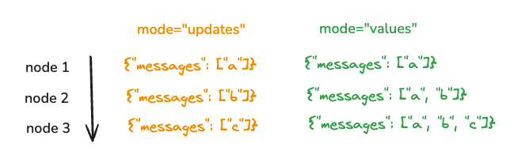

# 流式传输

LangGraph 内置一流的流式传输支持。有几种不同的方式可以从图运行中流式传输回输出

## 流式传输图输出 (`.stream`)

`.stream` 是一个用于从图运行中流式传输回输出的异步方法。
调用这些方法时可以指定几种不同的模式（例如 `await graph.stream(..., { ...config, streamMode: "values" })：

- [`"values"`](/langgraphjs/how-tos/stream-values)：这会在图的每个步骤后流式传输状态的完整值。
- [`"updates"`](/langgraphjs/how-tos/stream-updates)：这会在图的每个步骤后流式传输状态的更新。如果在同一步骤中进行多个更新（例如，运行多个节点），则这些更新将单独流式传输。
- [`"custom"`](/langgraphjs/how-tos/streaming-content)：这会在图节点内部从自定义数据进行流式传输。
- [`"messages"`](/langgraphjs/how-tos/streaming-tokens)：这会为调用 LLM 的图节点流式传输 LLM 令牌和元数据。
- `"debug"`：这会在整个图执行过程中流式传输尽可能多的信息。

下面的可视化显示了 `values` 和 `updates` 模式之间的区别：



## 流式传输 LLM 令牌和事件 (`.streamEvents`)

此外，你可以使用 [`streamEvents`](/langgraphjs/how-tos/streaming-events-from-within-tools) 方法来流式传输节点_内部_发生的事件。这对于流式传输 LLM 调用的令牌很有用。

这是所有 [LangChain 对象](https://js.langchain.com/docs/concepts/#runnable-interface) 的标准方法。这意味着随着图的执行，沿途会发出某些事件，如果你使用 `.streamEvents` 运行图，则可以看到这些事件。

所有事件都有（除其他外）`event`、`name` 和 `data` 字段。这些意味着什么？

- `event`：这是正在发出的事件类型。你可以[在此处](https://js.langchain.com/docs/concepts/#callback-events)找到所有回调事件和触发器的详细表。
- `name`：这是事件的名称。
- `data`：这是与事件关联的数据。

什么类型的事情会导致事件被发出？

- 每个节点（runnable）在启动执行时发出 `on_chain_start`，在节点执行期间发出 `on_chain_stream`，在节点完成时发出 `on_chain_end`。节点事件的事件 `name` 字段中将有节点名称
- 图将在图执行开始时发出 `on_chain_start`，在每个节点执行后发出 `on_chain_stream`，在图完成时发出 `on_chain_end`。图事件的事件 `name` 字段中将有 `LangGraph`
- 任何写入状态通道（即，每当你更新其中一个状态键的值时）都将发出 `on_chain_start` 和 `on_chain_end` 事件

此外，节点内部创建的任何事件（LLM 事件、工具事件、手动发出的事件等）也将出现在 `.streamEvents` 的输出中。

为了使其更具体并查看它是什么样子，让我们看看运行简单图时返回哪些事件：

```typescript
import { ChatOpenAI } from "@langchain/openai";
import { StateGraph, MessagesAnnotation } from "langgraph";

const model = new ChatOpenAI({ model: "gpt-4-turbo-preview" });

function callModel(state: typeof MessagesAnnotation.State) {
  const response = model.invoke(state.messages);
  return { messages: response };
}

const workflow = new StateGraph(MessagesAnnotation)
  .addNode("callModel", callModel)
  .addEdge("start", "callModel")
  .addEdge("callModel", "end");
const app = workflow.compile();

const inputs = [{ role: "user", content: "hi!" }];

for await (const event of app.streamEvents(
  { messages: inputs },
  { version: "v2" }
)) {
  const kind = event.event;
  console.log(`${kind}: ${event.name}`);
}
```

```shell
on_chain_start: LangGraph
on_chain_start: __start__
on_chain_end: __start__
on_chain_start: callModel
on_chat_model_start: ChatOpenAI
on_chat_model_stream: ChatOpenAI
on_chat_model_stream: ChatOpenAI
on_chat_model_stream: ChatOpenAI
on_chat_model_stream: ChatOpenAI
on_chat_model_stream: ChatOpenAI
on_chat_model_stream: ChatOpenAI
on_chat_model_stream: ChatOpenAI
on_chat_model_stream: ChatOpenAI
on_chat_model_stream: ChatOpenAI
on_chat_model_stream: ChatOpenAI
on_chat_model_stream: ChatOpenAI
on_chat_model_end: ChatOpenAI
on_chain_start: ChannelWrite<callModel,messages>
on_chain_end: ChannelWrite<callModel,messages>
on_chain_stream: callModel
on_chain_end: callModel
on_chain_stream: LangGraph
on_chain_end: LangGraph
```

我们从整体图开始（`on_chain_start: LangGraph`）。然后我们写入 `__start__` 节点（这是一个处理输入的特殊节点）。
然后我们启动 `callModel` 节点（`on_chain_start: callModel`）。然后我们启动聊天模型调用（`on_chat_model_start: ChatOpenAI`），
逐令牌流式传输回（`on_chat_model_stream: ChatOpenAI`），然后完成聊天模型（`on_chat_model_end: ChatOpenAI`）。从那里，
我们将结果写回通道（`ChannelWrite<callModel,messages>`），然后完成 `callModel` 节点，然后完成整个图。

这应该让你很好地了解简单图中发出哪些事件。但是这些事件包含什么数据？
每种类型的事件都以不同的格式包含数据。让我们看看 `on_chat_model_stream` 事件的样子。这是需要的事件类型
用于从 LLM 响应中流式传输令牌。

这些事件看起来像这样：

```shell
{'event': 'on_chat_model_stream',
 'name': 'ChatOpenAI',
 'run_id': '3fdbf494-acce-402e-9b50-4eab46403859',
 'tags': ['seq:step:1'],
 'metadata': {'langgraph_step': 1,
  'langgraph_node': 'callModel',
  'langgraph_triggers': ['start:callModel'],
  'langgraph_task_idx': 0,
  'checkpoint_id': '1ef657a0-0f9d-61b8-bffe-0c39e4f9ad6c',
  'checkpoint_ns': 'callModel',
  'ls_provider': 'openai',
  'ls_model_name': 'gpt-4o-mini',
  'ls_model_type': 'chat',
  'ls_temperature': 0.7},
 'data': {'chunk': AIMessageChunk({ content: 'Hello', id: 'run-3fdbf494-acce-402e-9b50-4eab46403859' })},
 'parent_ids': []}
```

我们可以看到我们有事件类型和名称（我们以前知道的）。

我们在元数据中还有很多东西。值得注意的是，`'langgraph_node': 'callModel',` 是一些非常有用的信息
它告诉我们这个模型是在哪个节点内部调用的。

最后，`data` 是一个非常重要的字段。这包含此事件的实际数据！在这种情况下
是一个 AIMessageChunk。这包含消息的 `content`，以及一个 `id`。
这是整体 AIMessage 的 ID（不仅仅是这个块），非常有用 - 它有助于
我们跟踪哪些块是同一条消息的一部分（因此我们可以将它们一起显示在 UI 中）。

此信息包含创建用于流式传输 LLM 令牌的 UI 所需的一切。
