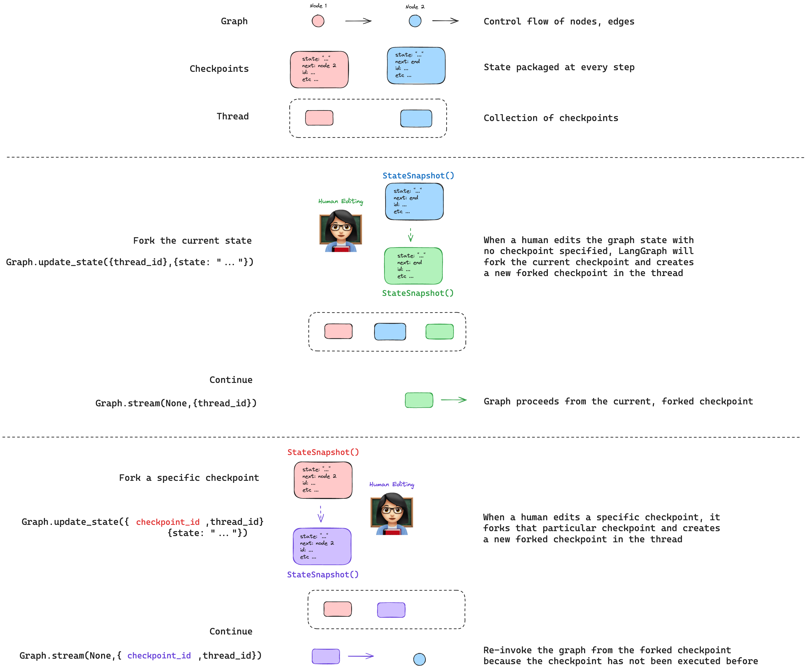

# 时间旅行 ⏱️

!!! note "先决条件"

    本指南假设你熟悉 LangGraph 的检查点和状态。如果没有，请先查看[持久化](./persistence.md)概念。

在使用基于模型做出决策的非确定性系统（例如，由 LLM 提供支持的 agent）时，详细检查它们的决策过程可能很有用：

1. 🤔 **理解推理**：分析导致成功结果的步骤。

2. 🐞 **调试错误**：识别错误发生的位置和原因。

3. 🔍 **探索替代方案**：测试不同的路径以发现更好的解决方案。

我们将这些调试技术称为**时间旅行**，由两个关键操作组成：[**重放**](#replaying) 🔁 和 [**分叉**](#forking) 🔀。

## 重放


重放允许我们重新审视和重现 agent 过去的操作。这可以从图的当前状态（或检查点）或从特定检查点完成。

要从当前状态重放，只需传递 `null` 作为输入以及 `threadConfig`：

```typescript
const threadConfig = { configurable: { thread_id: "1" }, streamMode: "values" };

for await (const event of await graph.stream(null, threadConfig)) {
    console.log(event);
}
```

要从特定检查点重放操作，首先检索线程的所有检查点：

```typescript
const allCheckpoints = [];

for await (const state of graph.getStateHistory(threadConfig)) {
    allCheckpoints.push(state);
}
```

每个检查点都有一个唯一的 ID。确定所需的检查点后，例如 `xyz`，将其 ID 包含在配置中：

```typescript
const threadConfig = { configurable: { thread_id: '1', checkpoint_id: 'xyz' }, streamMode: "values" };

for await (const event of await graph.stream(null, threadConfig)) {
    console.log(event);
}
```

图有效地重放以前执行的节点，而不是重新执行它们，利用其对先前检查点执行的了解。

## 分叉



分叉允许你重新审视 agent 过去的操作，并在图中探索替代路径。

要编辑特定检查点，例如 `xyz`，在更新图状态时提供其 `checkpoint_id`：

```typescript
const threadConfig = { configurable: { thread_id: "1", checkpoint_id: "xyz" } };

graph.updateState(threadConfig, { state: "updated state" });
```

这将创建一个新的分叉检查点 xyz-fork，你可以从中继续运行图：

```typescript
const threadConfig = { configurable: { thread_id: '1', checkpoint_id: 'xyz-fork' }, streamMode: "values" };

for await (const event of await graph.stream(null, threadConfig)) {
    console.log(event);
}
```

## 其他资源 📚

- [**概念指南：持久化**](https://langchain-ai.github.io/langgraphjs/concepts/persistence/#replay)：阅读持久化指南以获取更多关于重放的上下文。

- [**如何查看和更新过去的图状态**](/langgraphjs/how-tos/time-travel)：使用图状态的分步说明，演示**重放**和**分叉**操作。
