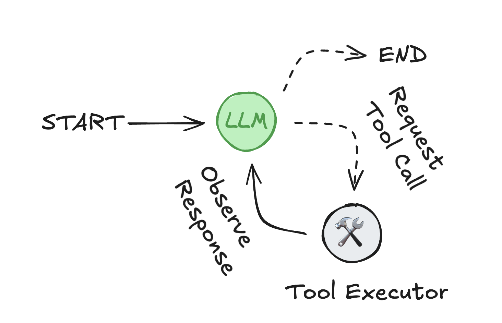

# 使用 LangGraph 开发智能体

**LangGraph** 为构建基于智能体的应用程序提供了低级别原语和高级预构建组件。本节重点介绍**预构建**、**可复用**的组件，旨在帮助您快速、可靠地构建智能体系统——无需从头开始实现编排、记忆或人工反馈处理。

## 什么是智能体？

*智能体*由三个组件组成：**大型语言模型（LLM）**、它可以使用的**工具**集，以及提供指令的**提示词**。

LLM 在循环中运行。在每次迭代中，它选择一个工具调用、提供输入、接收结果（观察），并使用该观察来通知下一个动作。循环持续进行，直到满足停止条件——通常是当智能体已收集足够的信息来响应用户。

<figure>

<figcaption>智能体循环：LLM 选择工具并使用其输出来满足用户请求。</figcaption>
</figure>

## 关键特性

LangGraph 包含构建健壮、生产就绪的智能体系统所需的几项功能：

- [**记忆集成**](./memory.md)：原生支持*短期*（基于会话）和*长期*（跨会话持久化）记忆，在聊天机器人和助手中实现有状态的行为。
- [**人在回路控制**](./human-in-the-loop.md)：执行可以*无限期*暂停以等待人工反馈——与限于实时交互的基于 websocket 的解决方案不同。这允许在工作流中的任何点进行异步批准、更正或干预。
- [**流式支持**](./streaming.md)：智能体状态、模型 token、工具输出或组合流的实时流式传输。
- [**部署工具**](./deployment.md)：包括无基础设施部署工具。[**LangGraph Platform**](https://langchain-ai.github.io/langgraph/concepts/langgraph_platform/) 支持测试、调试和部署。
  - **[Studio](https://langchain-ai.github.io/langgraph/concepts/langgraph_studio/)**：用于检查和调试工作流的可视化 IDE。
  - 支持多种[**部署选项**](https://langchain-ai.github.io/langgraph/tutorials/deployment/)用于生产。

## 创建智能体

请参阅 [createReactAgent](/langgraphjs/reference/functions/langgraph_prebuilt.createReactAgent.html) 了解如何创建智能体。

