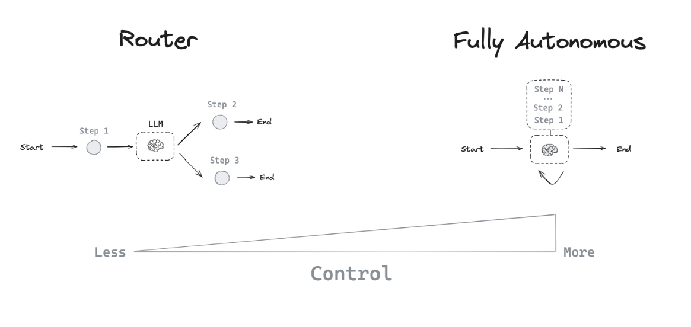
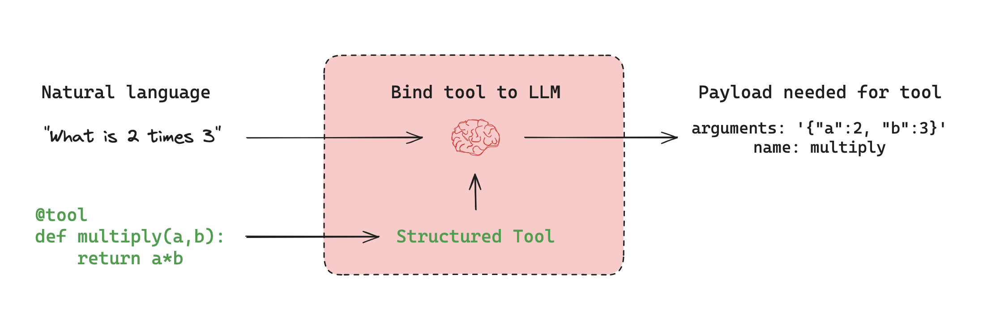

# Agent 架构

许多 LLM 应用程序在 LLM 调用之前和/或之后实现特定的步骤控制流。例如，[RAG](https://github.com/langchain-ai/rag-from-scratch) 会检索与问题相关的文档，并将这些文档传递给 LLM，以使模型的响应更加可靠。

与硬编码固定控制流不同，我们有时希望 LLM 系统能够自主选择控制流来解决更复杂的问题！这就是 [agent](https://blog.langchain.dev/what-is-an-agent/) 的一个定义：_agent 是一个使用 LLM 来决定应用程序控制流的系统_。LLM 可以通过多种方式控制应用程序：

- LLM 可以在两个潜在路径之间进行路由
- LLM 可以决定调用众多工具中的哪一个
- LLM 可以决定生成的答案是否足够，或者是否需要更多工作

因此，存在许多不同类型的 [agent 架构](https://blog.langchain.dev/what-is-a-cognitive-architecture/)，它们赋予 LLM 不同程度的控制权。

## Router

Router 允许 LLM 从指定的选项集中选择单个步骤。这是一种控制程度相对有限的 agent 架构，因为 LLM 通常只控制一个决策，并且只能返回有限的输出集。Router 通常采用几种不同的概念来实现这一点。

### 结构化输出

使用 LLM 的结构化输出通过提供特定的格式或模式来工作，LLM 应该遵循这些格式或模式进行响应。这类似于工具调用，但更通用。虽然工具调用通常涉及选择和使用预定义的函数，但结构化输出可用于任何类型的格式化响应。实现结构化输出的常见方法包括：

1. 提示工程：指示 LLM 以特定格式响应。
2. 输出解析器：使用后处理从 LLM 响应中提取结构化数据。
3. 工具调用：利用某些 LLM 的内置工具调用功能来生成结构化输出。

结构化输出对于路由至关重要，因为它们确保 LLM 的决策可以被系统可靠地解释和执行。在 [这个操作指南](https://js.langchain.com/docs/how_to/structured_output/) 中了解更多关于结构化输出的信息。

## 工具调用 agent

虽然 Router 允许 LLM 做出单个决策，但更复杂的 agent 架构通过两个关键方式扩展了 LLM 的控制权：

1. 多步决策：LLM 可以控制一系列决策，而不仅仅是一个。
2. 工具访问：LLM 可以选择并使用各种工具来完成任务。

[ReAct](https://arxiv.org/abs/2210.03629) 是一种流行的通用 agent 架构，它结合了这些扩展，整合了三个核心概念。

1. `工具调用`：允许 LLM 根据需要选择和使用各种工具。
2. `记忆`：使 agent 能够保留和使用来自前面步骤的信息。
3. `规划`：赋予 LLM 创建和遵循多步计划以实现目标的能力。

这种架构允许更复杂和灵活的 agent 行为，超越了简单的路由，实现了跨多个步骤的动态问题解决。你可以使用 [`createReactAgent`](/langgraphjs/reference/functions/langgraph_prebuilt.createReactAgent.html) 来使用它。

### 工具调用

当你希望 agent 与外部系统交互时，工具非常有用。外部系统（例如 API）通常需要特定的输入模式或负载，而不是自然语言。当我们将 API 绑定为工具时，我们让模型了解所需的输入模式。模型将根据用户的自然语言输入选择调用工具，并返回符合工具模式的输出。

[许多 LLM 提供商支持工具调用](https://js.langchain.com/docs/integrations/chat/)，LangChain 中的 [工具调用接口](https://blog.langchain.dev/improving-core-tool-interfaces-and-docs-in-langchain/) 也很简单：你可以定义一个工具模式，并将其传递给 `ChatModel.bindTools([tool])`。

### 记忆

记忆对于 agent 至关重要，使它们能够在问题解决的多个步骤中保留和利用信息。它在不同规模上运作：

1. 短期记忆：允许 agent 访问在序列中较早步骤获取的信息。
2. 长期记忆：使 agent 能够回忆之前交互中的信息，例如对话中的过往消息。

LangGraph 提供对记忆实现的完全控制：

- [`State`](./low_level.md#state)：用户定义的规范，指定要保留的记忆的确切结构。
- [`Checkpointers`](./persistence.md)：在跨不同交互的每个步骤中存储状态的机制。

这种灵活的方法允许你根据特定的 agent 架构需求定制记忆系统。有关向 graph 添加记忆的实用指南，请参阅 [这个教程](/langgraphjs/how-tos/persistence)。

有效的记忆管理增强了 agent 维持上下文、从过往经验中学习并随着时间做出更明智决策的能力。

### 规划

在 ReAct 架构中，LLM 在 while 循环中被重复调用。在每一步，agent 决定调用哪些工具以及这些工具的输入应该是什么。然后执行这些工具，并将输出反馈给 LLM 作为观察结果。当 agent 决定不再值得调用更多工具时，while 循环终止。

### ReAct 实现

此实现与预构建的 [`createReactAgent`](/langgraphjs/reference/functions/langgraph_prebuilt.createReactAgent.html) 之间存在几个差异：

- 首先，我们使用 [工具调用](#tool-calling) 来让 LLM 调用工具，而论文使用了提示 + 原始输出解析。这是因为工具调用在论文撰写时还不存在，但通常更好、更可靠。
- 其次，我们使用消息来提示 LLM，而论文使用了字符串格式化。这是因为在撰写时，LLM 甚至还没有公开基于消息的接口，而现在这是它们公开的唯一接口。
- 第三，论文要求所有工具输入都是单个字符串。这在很大程度上是由于当时 LLM 的能力不是很强，只能生成单个输入。我们的实现允许使用需要多个输入的工具。
- 第四，论文每次只关注调用单个工具，这主要是由于当时 LLM 性能的限制。我们的实现允许同时调用多个工具。
- 最后，论文要求 LLM 在决定调用哪些工具之前显式生成一个 "Thought" 步骤。这是 "ReAct" 中的 "Reasoning" 部分。我们的实现默认不这样做，主要是因为 LLM 已经变得更好了，这不再那么必要。当然，如果你愿意，你当然可以提示它这样做。

## 自定义 agent 架构

虽然 Router 和工具调用 agent（如 ReAct）很常见，但 [自定义 agent 架构](https://blog.langchain.dev/why-you-should-outsource-your-agentic-infrastructure-but-own-your-cognitive-architecture/) 通常会为特定任务带来更好的性能。LangGraph 提供了几个强大的功能来构建定制的 agent 系统：

### 人机协同 (Human-in-the-loop)

人工参与可以显著提高 agent 的可靠性，特别是对于敏感任务。这可以涉及：

- 批准特定操作
- 提供反馈以更新 agent 的状态
- 在复杂决策过程中提供指导

当完全自动化不可行或不可取时，人机协同模式至关重要。在我们的 [人机协同指南](./human_in_the_loop.md) 中了解更多信息。

### 并行化

并行处理对于高效的多 agent 系统和复杂任务至关重要。LangGraph 通过其 [Send](./low_level.md#send) API 支持并行化，实现：

- 多个状态的并发处理
- 实现类似 Map-Reduce 的操作
- 高效处理独立的子任务

有关实际实现，请参阅我们的 [map-reduce 教程](/langgraphjs/how-tos/map-reduce/)。

### 子图 (Subgraphs)

[子图](./low_level.md#subgraphs) 对于管理复杂的 agent 架构至关重要，特别是在 [多 agent 系统](./multi_agent.md) 中。它们允许：

- 为单个 agent 隔离状态管理
- agent 团队的分层组织
- agent 与主系统之间的受控通信

子图通过状态模式中重叠的键与父图通信。这实现了灵活、模块化的 agent 设计。有关实现细节，请参阅我们的 [子图操作指南](../how-tos/subgraph.ipynb)。

### 反思 (Reflection)

反思机制可以通过以下方式显著提高 agent 的可靠性：

1. 评估任务完成情况和正确性
2. 为迭代改进提供反馈
3. 实现自我纠正和学习

虽然通常基于 LLM，但反思也可以使用确定性方法。例如，在编码任务中，编译错误可以作为反馈。这种方法在 [这个使用 LangGraph 进行自我纠正代码生成的视频](https://www.youtube.com/watch?v=MvNdgmM7uyc) 中得到了演示。

通过利用这些功能，LangGraph 能够创建复杂的、针对特定任务的 agent 架构，可以处理复杂的工作流，有效协作，并持续提高其性能。
