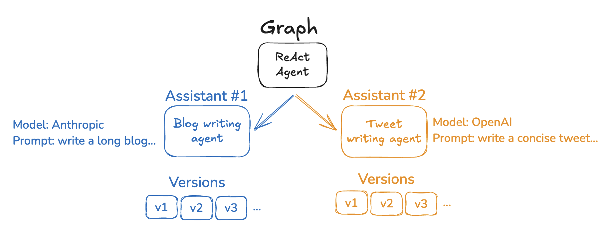

# Assistants

:::info[先决条件]

    - [LangGraph Server](./langgraph_server.md)

在构建 agent 时，进行快速更改是很常见的，这些更改*不会*改变图逻辑。例如，简单地更改提示或 LLM 选择可能会对 agent 的行为产生重大影响。Assistants 提供了一种简单的方法来保存这些类型的 agent 配置更改。这至少有两个用例：

- Assistants 为开发人员提供了一种快速简便的方法来修改和版本化 agent 以进行实验。
- Assistants 可以通过 LangGraph Studio 进行修改，为配置 agent 提供了一种无代码的方式（例如，适用于业务用户）。

Assistants 建立在["配置"](low_level.md#configuration)的概念之上。
虽然["配置"](low_level.md#configuration)在开源 LangGraph 库中也可用，但 assistants 仅在 [LangGraph Platform](langgraph_platform.md) 中存在。
这是因为 Assistants 与你的部署图紧密耦合，因此我们只能在同时部署图时提供它们。

## 配置 Assistants

实际上，assistant 只是具有特定配置的图的_实例_。因此，多个 assistants 可以引用同一个图，但可以包含不同的配置，例如提示、模型和其他图配置选项。LangGraph Cloud API 提供了多个用于创建和管理 assistants 的端点。有关如何创建 assistants 的更多详细信息，请参阅[此操作指南](/langgraphjs/cloud/how-tos/configuration_cloud)。

## Assistants 版本控制

创建 assistant 后，你可以保存并对其进行版本控制，以跟踪配置随时间的变化。你可以从三个层面来考虑：

1) 图布局一般的 agent 应用逻辑
2) agent 配置选项代表可以更改的参数
3) Assistant 版本保存并跟踪 agent 配置选项的特定设置

例如，假设你有一个通用的写作 agent。你已经创建了一个适用于写作的通用图架构。但是，有不同类型的写作，例如博客与推文。为了在每种用例中获得最佳性能，你需要对使用的模型和提示进行一些细微更改。在此设置中，你可以为每个用例创建一个 assistant —— 一个用于博客写作，一个用于发推文。这些将共享相同的图结构，但可能使用不同的模型和不同的提示。阅读[此操作指南](/langgraphjs/cloud/how-tos/assistant_versioning)以了解如何通过 [Studio](/langgraphjs/cloud/how-tos/index/#langgraph-studio) 和 SDK 使用 assistant 版本控制。

## 资源

有关 assistants 的更多信息，请参阅以下资源：

- [Assistants 操作指南](../how-tos/index.md#assistants)
