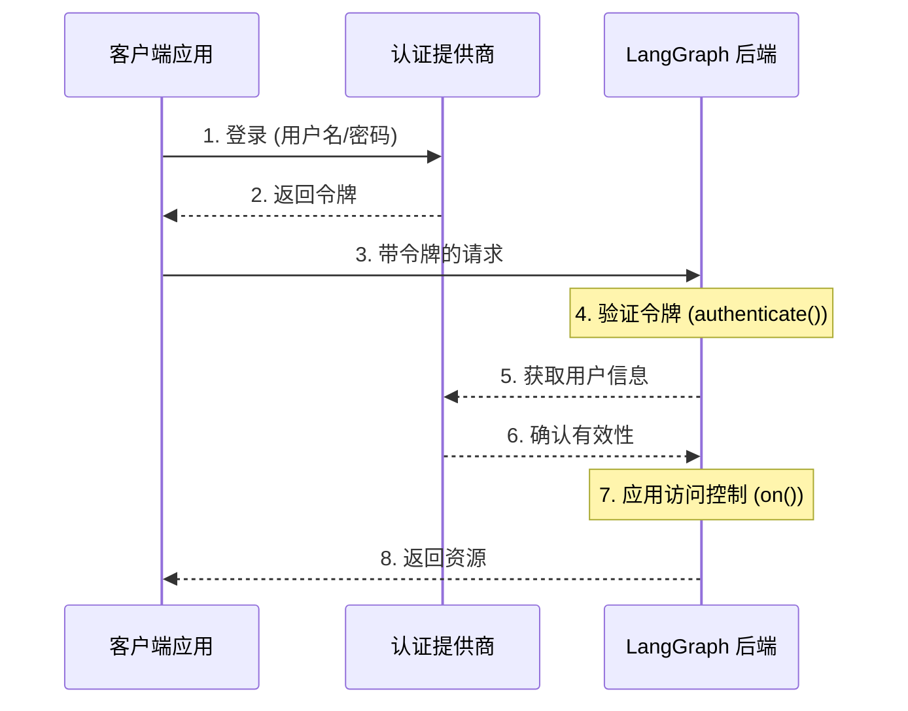

# 认证与访问控制

LangGraph Platform 提供了一个灵活的认证和授权系统，可以与大多数认证方案集成。

## 核心概念

### 认证 vs 授权

虽然这两个术语经常互换使用，但它们代表不同的安全概念：

- [**认证**](#authentication) ("AuthN") 验证_你是谁_。这作为每个请求的中间件运行。
- [**授权**](#authorization) ("AuthZ") 确定_你可以做什么_。这在每个资源的基础上验证用户的权限和角色。

在 LangGraph Platform 中，认证由你的 [`authenticate()`](https://langchain-ai.github.io/langgraph/cloud/reference/sdk/js_ts_sdk_ref/#authenticate) 处理程序处理，授权由你的 [`on()`](https://langchain-ai.github.io/langgraph/cloud/reference/sdk/js_ts_sdk_ref/#on) 处理程序处理。

### 默认安全模型

LangGraph Platform 提供不同的安全默认值：

- LangGraph Cloud
- 自托管

### LangGraph Cloud

- 默认使用 LangSmith API 密钥
- 需要在 `x-api-key` 请求头中提供有效的 API 密钥
- 可以使用你的认证处理程序进行自定义

:::note[自定义认证]

    自定义认证**支持** LangGraph Cloud 的所有计划。

### 自托管

- 无默认认证
- 完全灵活地实现你的安全模型
- 你控制认证和授权的各个方面

:::note[自定义认证]

    自定义认证支持**企业版**自托管计划。
    自托管精简版计划本身不支持自定义认证。

## 系统架构

典型的认证设置涉及三个主要组件：

1. **认证提供商** (身份提供商/IdP)

   - 管理用户身份和凭据的专用服务
   - 处理用户注册、登录、密码重置等
   - 成功认证后颁发令牌（JWT、会话令牌等）
   - 示例：Auth0、Supabase Auth、Okta 或你自己的认证服务器

2. **LangGraph 后端** (资源服务器)

   - 包含业务逻辑和受保护资源的 LangGraph 应用程序
   - 与认证提供商验证令牌
   - 基于用户身份和权限执行访问控制
   - 不直接存储用户凭据

3. **客户端应用程序** (前端)

   - Web 应用、移动应用或 API 客户端
   - 收集时效性用户凭据并发送给认证提供商
   - 从认证提供商接收令牌
   - 将这些令牌包含在对 LangGraph 后端的请求中

以下是这些组件通常交互的方式：



你在 LangGraph 中的 [`authenticate()`](https://langchain-ai.github.io/langgraph/cloud/reference/sdk/js_ts_sdk_ref/#authenticate) 处理程序处理第 4-6 步，而你的 [`on()`](https://langchain-ai.github.io/langgraph/cloud/reference/sdk/js_ts_sdk_ref/#on) 处理程序实现第 7 步。

## 认证

LangGraph 中的认证作为每个请求的中间件运行。你的 [`authenticate()`](https://langchain-ai.github.io/langgraph/cloud/reference/sdk/js_ts_sdk_ref/#authenticate) 处理程序接收请求信息，并应该：

1. 验证凭据
2. 如果有效，返回包含用户身份和信息的用户信息
3. 如果无效，抛出 [`HTTPException`](https://langchain-ai.github.io/langgraph/cloud/reference/sdk/js_ts_sdk_ref/#class-httpexception) 或错误

```typescript
import { Auth, HTTPException } from "@langchain/langgraph-sdk/auth";

// (1) 验证凭据
const isValidKey = (key: string) => {
  return true;
};

export const auth = new Auth().authenticate(async (request: Request) => {
  const apiKey = request.headers.get("x-api-key");

  if (!apiKey || !isValidKey(apiKey)) {
    // (3) 抛出 HTTPException
    throw new HTTPException(401, { message: "Invalid API key" });
  }

  // (2) 如果有效，返回包含用户身份和信息的用户信息
  return {
    // 必需，唯一的用户标识符
    identity: "user-123",
    // 必需，权限列表
    permissions: [],
    // 可选，默认假设为 `true`
    is_authenticated: true,

    // 如果你想实现其他认证模式，可以添加更多自定义字段
    role: "admin",
    org_id: "org-123",
  };
});
```

返回的用户信息可用于：

- 通过 [`on()`](https://langchain-ai.github.io/langgraph/cloud/reference/sdk/js_ts_sdk_ref/#on) 回调中的 `user` 属性访问你的授权处理程序。
- 在你的应用程序中通过 `config["configuration"]["langgraph_auth_user"]` 访问

:::info[`Request` 输入参数]

    [`authenticate()`](https://langchain-ai.github.io/langgraph/cloud/reference/sdk/js_ts_sdk_ref/#authenticate) 处理程序接受 [Request](https://developer.mozilla.org/en-US/docs/Web/API/Request/Request) 实例作为参数，但 `Request` 对象可能不包含请求体。

    你仍然可以使用 `Request` 实例来提取其他字段，如请求头、查询参数等。

## 授权

认证后，LangGraph 会调用你的 [`on()`](https://langchain-ai.github.io/langgraph/cloud/reference/sdk/js_ts_sdk_ref/#on) 处理程序来控制对特定资源（例如线程、assistants、cron）的访问。这些处理程序可以：

1. 通过直接修改 `value["metadata"]` 对象来添加在资源创建期间保存的元数据。有关每种操作的值类型列表，请参阅 [支持的操作表](#supported-actions)。
2. 通过在搜索/列出或读取操作期间返回 [过滤器对象](#filter-operations) 来按元数据过滤资源。
3. 如果访问被拒绝，则抛出 HTTP 错误。

如果你只想实现简单的用户范围访问控制，你可以对所有资源和操作使用单个 [`on()`](https://langchain-ai.github.io/langgraph/cloud/reference/sdk/js_ts_sdk_ref/#on) 处理程序。如果你想根据资源和操作进行不同的控制，可以使用 [资源特定的处理程序](#resource-specific-handlers)。有关支持访问控制的资源的完整列表，请参阅 [支持的资源](#supported-resources) 部分。

```typescript
import { Auth, HTTPException } from "@langchain/langgraph-sdk/auth";

export const auth = new Auth()
  .authenticate(async (request: Request) => ({
    identity: "user-123",
    permissions: [],
  }))
  .on("*", ({ value, user }) => {
    // 创建过滤器以限制仅访问该用户的资源
    const filters = { owner: user.identity };

    // 如果操作支持元数据，将用户身份添加为资源的元数据。
    if ("metadata" in value) {
      value.metadata ??= {};
      value.metadata.owner = user.identity;
    }

    // 返回过滤器以限制访问
    // 这些过滤器应用于所有操作（创建、读取、更新、搜索等）
    // 以确保用户只能访问自己的资源
    return filters;
  });
```

### 资源特定的处理程序

你可以通过将资源和操作名称与 [`on()`](https://langchain-ai.github.io/langgraph/cloud/reference/sdk/js_ts_sdk_ref/#on) 方法链接在一起，为特定资源和操作注册处理程序。
发出请求时，将调用与该资源和操作匹配的最具体的处理程序。以下是如何为特定资源和操作注册处理程序的示例。对于以下设置：

1. 经过身份验证的用户可以创建线程、读取线程、在线程上创建运行
2. 只有具有 "assistants:create" 权限的用户才被允许创建新的 assistants
3. 所有其他端点（例如删除 assistant、cron 等）对所有用户禁用

:::tip[支持的处理程序]

    有关支持的操作的完整列表，请参阅下面的 [支持的操作](#supported-actions) 部分。

```typescript
import { Auth, HTTPException } from "@langchain/langgraph-sdk/auth";

export const auth = new Auth()
  .authenticate(async (request: Request) => ({
    identity: "user-123",
    permissions: ["threads:write", "threads:read"],
  }))
  .on("*", ({ event, user }) => {
    console.log(`Request for ${event} by ${user.identity}`);
    throw new HTTPException(403, { message: "Forbidden" });
  })

  // 匹配 "threads" 资源和所有操作 - 创建、读取、更新、删除、搜索
  // 由于这比通用的 `on("*")` 处理程序**更具体**，
  // 它将优先于所有 "threads" 资源的通用处理程序
  .on("threads", ({ permissions, value, user }) => {
    if (!permissions.includes("write")) {
      throw new HTTPException(403, {
        message: "User lacks the required permissions.",
      });
    }

    // 并非所有事件都在 `value` 中包含 `metadata` 属性。
    // 所以我们需要添加这个类型守卫。
    if ("metadata" in value) {
      value.metadata ??= {};
      value.metadata.owner = user.identity;
    }

    return { owner: user.identity };
  })

  // 线程创建。这将仅匹配线程创建操作。
  // 由于这比通用的 `on("*")` 处理程序和 `on("threads")` 处理程序**更具体**，
  // 它将优先于 "threads" 资源的任何 "create" 操作
  .on("threads:create", ({ value, user, permissions }) => {
    if (!permissions.includes("write")) {
      throw new HTTPException(403, {
        message: "User lacks the required permissions.",
      });
    }

    // 在正在创建的线程上设置元数据将确保资源包含 "owner" 字段
    // 然后，每当用户尝试访问此线程或线程内的运行时，
    // 我们可以按所有者过滤
    value.metadata ??= {};
    value.metadata.owner = user.identity;

    return { owner: user.identity };
  })

  // 读取线程。由于这也比通用的 `on("*")` 处理程序和 `on("threads")` 处理程序更具体，
  .on("threads:read", ({ user }) => {
    // 由于我们正在读取（而不是创建）线程，
    // 我们不需要设置元数据。我们只需要
    // 返回一个过滤器以确保用户只能看到自己的线程。
    return { owner: user.identity };
  })

  // 运行创建、流式传输、更新等。
  // 这优先于通用的 `on("*")` 处理程序和 `on("threads")` 处理程序
  .on("threads:create_run", ({ value, user }) => {
    value.metadata ??= {};
    value.metadata.owner = user.identity;

    return { owner: user.identity };
  })

  // Assistant 创建。这将仅匹配 assistant 创建操作。
  // 由于这比通用的 `on("*")` 处理程序和 `on("assistants")` 处理程序**更具体**，
  // 它将优先于 "assistants" 资源的任何 "create" 操作
  .on("assistants:create", ({ value, user, permissions }) => {
    if (!permissions.includes("assistants:create")) {
      throw new HTTPException(403, {
        message: "User lacks the required permissions.",
      });
    }

    // 在正在创建的 assistant 上设置元数据将确保资源包含 "owner" 字段。
    // 然后，每当用户尝试访问此 assistant 时，我们可以按所有者过滤
    value.metadata ??= {};
    value.metadata.owner = user.identity;

    return { owner: user.identity };
  });
```

请注意，我们在上面的示例中混合使用了通用和资源特定的处理程序。由于每个请求都由最具体的处理程序处理，因此创建 `thread` 的请求将匹配 `thread:create` 处理程序，但不会匹配 `*` 处理程序。但是，如果没有为该资源和操作定义更具体的处理程序，则更新 thread 的请求将由通用处理程序处理。创建、更新等请求

### 过滤操作

授权处理程序可以返回 `None`、布尔值或过滤器对象。

- `null`、`void` 和 `true` 表示"授权访问所有底层资源"
- `False` 表示"拒绝访问所有底层资源（引发 403 错误）"
- 元数据过滤器对象将限制对资源的访问。支持精确匹配和操作符。

:::info[过滤器对象语法]

    支持以下操作符：

    - 精确匹配简写：`{"field": "value"}`
    - 精确匹配：`{"field": {"$eq": "value"}}`
    - 包含：`{"field": {"$contains": "value"}}`

    具有多个键的元数据过滤器对象使用逻辑 `AND` 过滤器处理。例如，`{"owner": org_id, "allowed_users": {"$contains": user_id}}` 将仅匹配元数据中 "owner" 为 `org_id` 且 "allowed_users" 列表包含 `user_id` 的资源。

## 常见访问模式

以下是一些典型的授权模式：

### 单一所有者资源

这种常见模式允许你将所有线程、assistants、cron 和运行范围限定到单个用户。它适用于常见的单用户用例，如常规聊天机器人式应用程序。

```typescript
import { Auth, HTTPException } from "@langchain/langgraph-sdk/auth";

export const auth = new Auth()
  .authenticate(async (request: Request) => ({
    identity: "user-123",
    permissions: ["threads:write", "threads:read"],
  }))
  .on("*", ({ value, user }) => {
    if ("metadata" in value) {
      value.metadata ??= {};
      value.metadata.owner = user.identity;
    }
    return { owner: user.identity };
  });
```

### 基于权限的访问

这种模式允许你基于**权限**控制访问。如果你想让某些角色对资源具有更广泛或更受限制的访问权限，这将非常有用。

```typescript
import { Auth, HTTPException } from "@langchain/langgraph-sdk/auth";

export const auth = new Auth()
  .authenticate(async (request: Request) => ({
    identity: "user-123",
    // 在认证中定义权限
    permissions: ["threads:write", "threads:read"],
  }))
  .on("threads:create", ({ value, user, permissions }) => {
    if (!permissions.includes("threads:write")) {
      throw new HTTPException(403, { message: "Unauthorized" });
    }

    if ("metadata" in value) {
      value.metadata ??= {};
      value.metadata.owner = user.identity;
    }
    return { owner: user.identity };
  })
  .on("threads:read", ({ user, permissions }) => {
    if (
      !permissions.includes("threads:read") &&
      !permissions.includes("threads:write")
    ) {
      throw new HTTPException(403, { message: "Unauthorized" });
    }

    return { owner: user.identity };
  });
```

## 支持的资源

LangGraph 提供三个级别的授权处理程序，从最通用到最具体：

1. **全局处理程序** (`on("*")`)：匹配所有资源和操作
2. **资源处理程序**（例如 `on("threads")`、`on("assistants")`、`on("crons")`）：匹配特定资源的所有操作
3. **操作处理程序**（例如 `on("threads:create")`、`on("threads:read")`）：匹配特定资源上的特定操作

将使用最匹配的特定处理程序。例如，`on("threads:create")` 优先于线程创建的 `on("threads")`。如果注册了更具体的处理程序，则不会为该资源和操作调用更通用的处理程序。

#### 支持的操作事件

| 资源       | 事件                | 描述                | 值类型                                                                                                         |
| -------------- | -------------------- | -------------------------- | ------------------------------------------------------------------------------------------------------------------ |
| **线程**    | `threads:create`     | 线程创建            | [`ThreadsCreate`](https://langchain-ai.github.io/langgraph/cloud/reference/sdk/js_ts_sdk_ref/#threadscreate)       |
|                | `threads:read`       | 线程检索           | [`ThreadsRead`](https://langchain-ai.github.io/langgraph/cloud/reference/sdk/js_ts_sdk_ref/#threadsread)           |
|                | `threads:update`     | 线程更新             | [`ThreadsUpdate`](https://langchain-ai.github.io/langgraph/cloud/reference/sdk/js_ts_sdk_ref/#threadsupdate)       |
|                | `threads:delete`     | 线程删除            | [`ThreadsDelete`](https://langchain-ai.github.io/langgraph/cloud/reference/sdk/js_ts_sdk_ref/#threadsdelete)       |
|                | `threads:search`     | 列出线程            | [`ThreadsSearch`](https://langchain-ai.github.io/langgraph/cloud/reference/sdk/js_ts_sdk_ref/#threadssearch)       |
|                | `threads:create_run` | 创建或更新运行 | [`RunsCreate`](https://langchain-ai.github.io/langgraph/cloud/reference/sdk/js_ts_sdk_ref/#threadscreate_run)      |
| **Assistants** | `assistants:create`  | Assistant 创建         | [`AssistantsCreate`](https://langchain-ai.github.io/langgraph/cloud/reference/sdk/js_ts_sdk_ref/#assistantscreate) |
|                | `assistants:read`    | Assistant 检索        | [`AssistantsRead`](https://langchain-ai.github.io/langgraph/cloud/reference/sdk/js_ts_sdk_ref/#assistantsread)     |
|                | `assistants:update`  | Assistant 更新          | [`AssistantsUpdate`](https://langchain-ai.github.io/langgraph/cloud/reference/sdk/js_ts_sdk_ref/#assistantsupdate) |
|                | `assistants:delete`  | Assistant 删除         | [`AssistantsDelete`](https://langchain-ai.github.io/langgraph/cloud/reference/sdk/js_ts_sdk_ref/#assistantsdelete) |
|                | `assistants:search`  | 列出 assistants         | [`AssistantsSearch`](https://langchain-ai.github.io/langgraph/cloud/reference/sdk/js_ts_sdk_ref/#assistantssearch) |
| **Crons**      | `crons:create`       | Cron 作业创建          | [`CronsCreate`](https://langchain-ai.github.io/langgraph/cloud/reference/sdk/js_ts_sdk_ref/#cronscreate)           |
|                | `crons:read`         | Cron 作业检索         | [`CronsRead`](https://langchain-ai.github.io/langgraph/cloud/reference/sdk/js_ts_sdk_ref/#cronsread)               |
|                | `crons:update`       | Cron 作业更新           | [`CronsUpdate`](https://langchain-ai.github.io/langgraph/cloud/reference/sdk/js_ts_sdk_ref/#cronsupdate)           |
|                | `crons:delete`       | Cron 作业删除          | [`CronsDelete`](https://langchain-ai.github.io/langgraph/cloud/reference/sdk/js_ts_sdk_ref/#cronsdelete)           |
|                | `crons:search`       | 列出 cron 作业          | [`CronsSearch`](https://langchain-ai.github.io/langgraph/cloud/reference/sdk/js_ts_sdk_ref/#cronssearch)           |

:::note[关于运行]

    运行范围限定到其父线程以进行访问控制。这意味着权限通常从线程继承，反映了数据的对话性质。所有运行操作（读取、列出）除了创建之外都由线程的处理程序控制。
    有一个特定的 `threads:create_run` 事件用于创建新运行，因为它有更多的参数可以在处理程序中查看。

## 下一步

有关实现细节：

- 请参阅有关实现[自定义认证处理程序](../how-tos/auth/custom_auth.md)的操作指南
