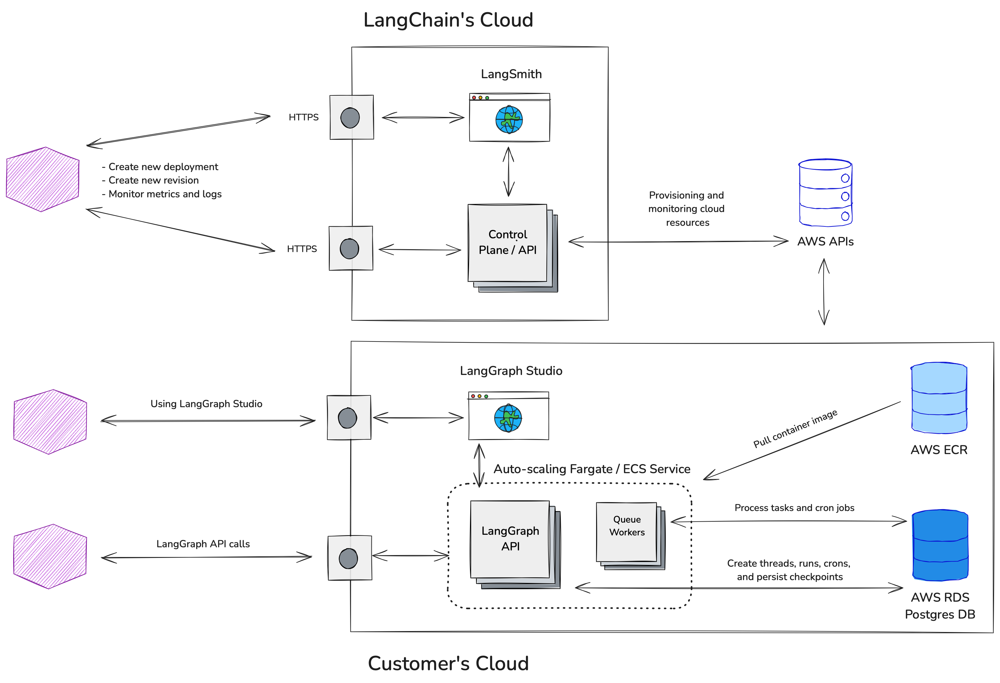

# 自带云 (BYOC)

:::note 先决条件

    - [LangGraph Platform](./langgraph_platform.md)
    - [部署选项](./deployment_options.md)

## 架构

分离控制平面（由我们托管）和数据平面（由你托管，由我们管理）。

|                             | 控制平面                   | 数据平面                                    |
|-----------------------------|---------------------------------|-----------------------------------------------|
| 它的功能是什么                | 管理部署、修订版本。 | 运行你的 LangGraph 图，存储你的数据。 |
| 托管位置          | LangChain Cloud 账户         | 你的云账户                            |
| 谁配置和监控 | LangChain                       | LangChain                                     |

LangChain 无法直接访问在你的云账户中创建的资源，只能通过 AWS API 与它们交互。你的数据在静态或传输过程中永远不会离开你的云账户 / VPC。

## 要求

- 你已经在使用 AWS。
- 你使用 `langgraph-cli` 和/或 [LangGraph Studio](./langgraph_studio.md) 应用程序在本地测试图。
- 你使用 `langgraph build` 命令构建镜像，然后将其推送到你的 AWS ECR 仓库 (`docker push`)。

## 工作原理

- 我们为你提供一个 [Terraform 模块](https://github.com/langchain-ai/terraform/tree/main/modules/langgraph_cloud_setup)，你运行它来设置我们的要求
    1. 创建一个 AWS 角色（我们的控制平面稍后将承担该角色以配置和监控资源）
        - https://docs.aws.amazon.com/aws-managed-policy/latest/reference/AmazonVPCReadOnlyAccess.html
            - 读取 VPC 以查找子网
        - https://docs.aws.amazon.com/aws-managed-policy/latest/reference/AmazonECS_FullAccess.html
            - 用于为你的 LangGraph Cloud 实例创建/删除 ECS 资源
        - https://docs.aws.amazon.com/aws-managed-policy/latest/reference/SecretsManagerReadWrite.html
            - 为你的 ECS 资源创建密钥
        - https://docs.aws.amazon.com/aws-managed-policy/latest/reference/CloudWatchReadOnlyAccess.html
            - 读取 CloudWatch 指标/日志以监控你的实例/推送部署日志
        - https://docs.aws.amazon.com/aws-managed-policy/latest/reference/AmazonRDSFullAccess.html
            - 为你的 LangGraph Cloud 实例配置 `RDS`
    2. 要么
        - 将现有的 vpc / 子网标记为 `langgraph-cloud-enabled`
        - 创建新的 vpc 和子网并将它们标记为 `langgraph-cloud-enabled`
- 你在 `smith.langchain.com` 中创建 LangGraph Cloud 项目，提供
    - 在上面步骤中创建的 AWS 角色的 ID
    - 用于拉取服务镜像的 AWS ECR 仓库
- 我们使用上面的角色在你的云账户中配置资源
- 我们监控这些资源以确保正常运行时间并从错误中恢复

使用[自托管 LangSmith](https://docs.smith.langchain.com/self_hosting)的客户的注意事项：

- 目前需要在 smith.langchain.com 上创建新的 LangGraph Cloud 项目和修订版本。
- 但是，如果你愿意，你可以将项目设置为追踪到你自托管的 LangSmith 实例
