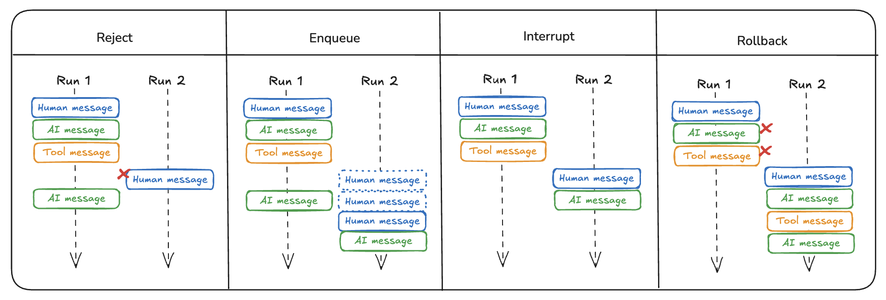

# 双重发送

:::info[先决条件]
    - [LangGraph Server](./langgraph_server.md)

很多时候，用户可能会以非预期的方式与你的图交互。
例如，用户可能发送一条消息，然后在图完成运行之前发送第二条消息。
更一般地说，用户可能在第一次运行完成之前第二次调用图。
我们称之为"双重发送"。

目前，LangGraph 仅在 [LangGraph Platform](langgraph_platform.md) 中解决此问题，而不是在开源版本中。
这是因为为了处理这个问题，我们需要知道图是如何部署的，由于 LangGraph Platform 处理部署，所以逻辑需要放在那里。
如果你不想使用 LangGraph Platform，我们会在下面详细描述我们实现的选项。

## 拒绝

这是最简单的选项，它只是拒绝任何后续运行，不允许双重发送。
请参阅[操作指南](/langgraphjs/cloud/how-tos/reject_concurrent)以配置拒绝双重发送选项。

## 排队

这是一个相对简单的选项，它继续第一次运行直到完成整个运行，然后将新输入作为单独的运行发送。
请参阅[操作指南](/langgraphjs/cloud/how-tos/enqueue_concurrent)以配置排队双重发送选项。

## 中断

此选项会中断当前执行，但会保存到目前为止所做的所有工作。
然后插入用户输入并从那里继续。

如果你启用此选项，你的图应该能够处理可能出现的奇怪边缘情况。
例如，你可能已经调用了工具，但尚未获得运行该工具的结果。
你可能需要删除该工具调用以避免出现悬空工具调用。

请参阅[操作指南](/langgraphjs/cloud/how-tos/interrupt_concurrent)以配置中断双重发送选项。

## 回滚

此选项会回滚到目前为止所做的所有工作。
然后发送用户输入，基本上就像它只是跟随原始运行输入一样。

这可能会创建一些奇怪的状态 —— 例如，你可能有两个连续的 `User` 消息，中间没有 `Assistant` 消息。

你需要确保你调用的 LLM 能够处理这种情况，或将它们合并为单个 `User` 消息。

请参阅[操作指南](/langgraphjs/cloud/how-tos/rollback_concurrent)以配置回滚双重发送选项。
