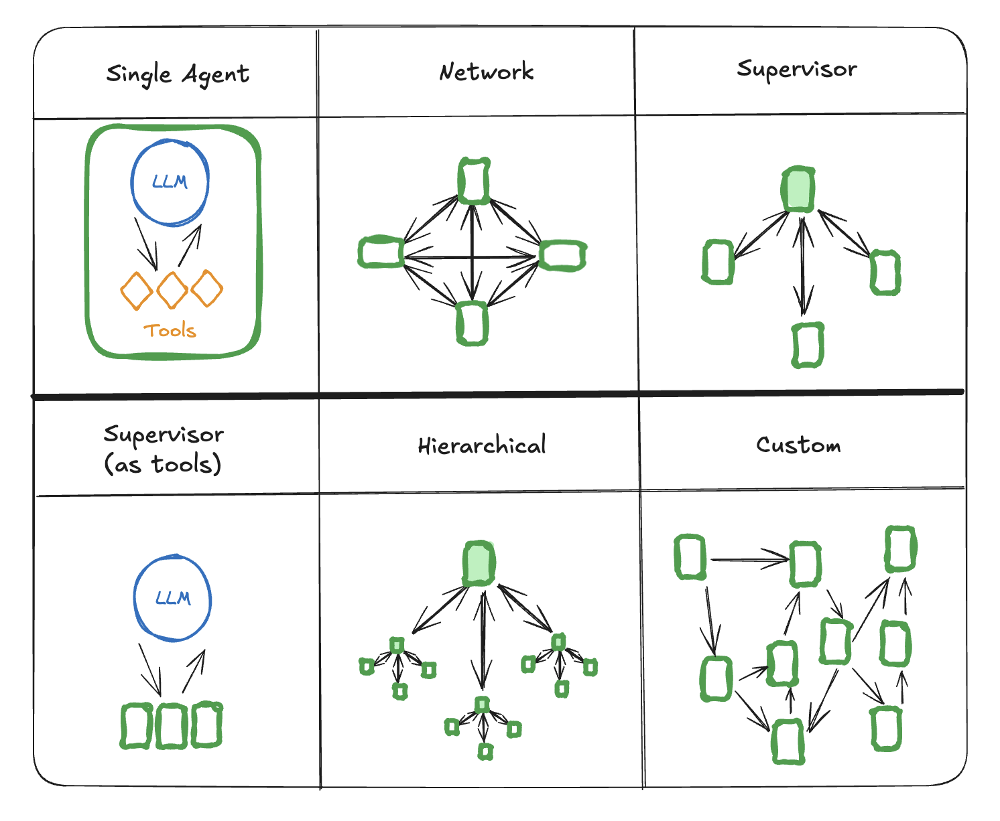
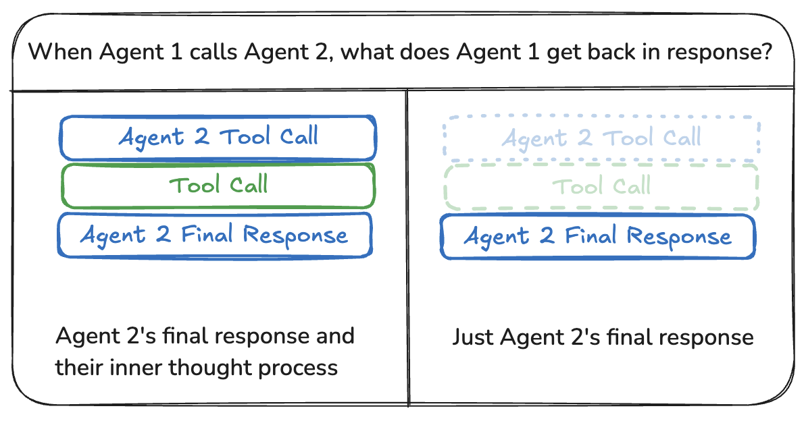

# 多 Agent 系统

[Agent](./agentic_concepts.md#agent-architectures) 是_使用 LLM 来决定应用程序控制流的系统_。随着你开发这些系统，它们可能会随着时间变得更加复杂，使它们更难管理和扩展。例如，你可能会遇到以下问题：

- agent 有太多工具可供使用，对接下来调用哪个工具做出糟糕的决策
- 上下文对于单个 agent 来说变得太复杂而无法跟踪
- 系统中需要多个专业领域（例如，规划器、研究员、数学专家等）

为了解决这些问题，你可以考虑将应用程序分解为多个较小的独立 agent，并将它们组合成一个**多 agent 系统**。这些独立 agent 可以像提示和 LLM 调用一样简单，也可以像 [ReAct](./agentic_concepts.md#react-implementation) agent（以及更多！）一样复杂。

使用多 agent 系统的主要好处是：

- **模块化**：独立的 agent 使开发、测试和维护 agentic 系统更容易。
- **专业化**：你可以创建专注于特定领域的专家 agent，这有助于整体系统性能。
- **控制**：你可以明确控制 agent 如何通信（而不是依赖函数调用）。

## 多 agent 架构



有几种方法可以连接多 agent 系统中的 agent：

- **网络**：每个 agent 都可以与其他每个 agent 通信。任何 agent 都可以决定接下来调用哪个其他 agent。
- **监督者**：每个 agent 都与单个[监督者](https://langchain-ai.github.io/langgraphjs/tutorials/multi_agent/agent_supervisor/) agent 通信。监督者 agent 决定接下来应该调用哪个 agent。
- **分层**：你可以定义一个具有监督者监督者的多 agent 系统。这是监督者架构的泛化，允许更复杂的控制流。
- **自定义多 agent 工作流**：每个 agent 只与一部分 agent 通信。部分流程是确定性的，只有某些 agent 可以决定接下来调用哪些其他 agent。

### 交接

在多 agent 架构中，agent 可以表示为图节点。每个 agent 节点执行其步骤，然后决定是完成执行还是路由到另一个 agent，包括可能路由到自身（例如，在循环中运行）。多 agent 交互中的常见模式是交接，其中一个 agent 将控制权交给另一个。交接允许你指定：

- __目标__：要导航到的目标 agent（例如，节点名称）
- __负载__：[传递给该 agent 的信息](#communication-between-agents)（例如，状态更新）

要在 LangGraph 中实现交接，agent 节点可以返回允许你结合控制流和状态更新的 [`Command`](./low_level.md#command) 对象：

```ts
const agent = (state: typeof StateAnnotation.State) => {
  const goto = getNextAgent(...)  // 'agent' / 'another_agent'
  return new Command({
    // 指定接下来调用哪个 agent
    goto: goto,
    // 更新图状态
    update: {
      foo: "bar",
    }
  });
};
```

在更复杂的场景中，每个 agent 节点本身是一个图（即，一个 [子图](./low_level.md#subgraphs)），其中一个 agent 子图中的节点可能希望导航到不同的 agent。例如，如果你有两个 agent，`alice` 和 `bob`（父图中的子图节点），并且 `alice` 需要导航到 `bob`，你可以在 `Command` 对象中设置 `graph=Command.PARENT`：

```ts
const some_node_inside_alice = (state) => {
    return new Command({
      goto: "bob",
      update: {
          foo: "bar",
      },
      // 指定要导航到哪个图（默认为当前图）
      graph: Command.PARENT,
    })
}
```

### 网络

在此架构中，agent 被定义为图节点。每个 agent 都可以与其他每个 agent 通信（多对多连接），并且可以决定接下来调用哪个 agent。此架构适用于没有明确 agent 层次结构或应该调用 agent 的特定顺序的问题。

```ts
import {
  StateGraph,
  Annotation,
  MessagesAnnotation,
  Command
} from "@langchain/langgraph";
import { ChatOpenAI } from "@langchain/openai";

const model = new ChatOpenAI({
  model: "gpt-4o-mini",
});

const agent1 = async (state: typeof MessagesAnnotation.State) => {
  // 你可以将状态的相关部分传递给 LLM（例如，state.messages）
  // 以确定接下来调用哪个 agent。常见模式是使用结构化输出调用模型
  //（例如，强制它返回带有 "next_agent" 字段的输出）
  const response = await model.withStructuredOutput(...).invoke(...);
  return new Command({
    update: {
      messages: [response.content],
    },
    goto: response.next_agent,
  });
};

const agent2 = async (state: typeof MessagesAnnotation.State) => {
  const response = await model.withStructuredOutput(...).invoke(...);
  return new Command({
    update: {
      messages: [response.content],
    },
    goto: response.next_agent,
  });
};

const agent3 = async (state: typeof MessagesAnnotation.State) => {
  ...
  return new Command({
    update: {
      messages: [response.content],
    },
    goto: response.next_agent,
  });
};

const graph = new StateGraph(MessagesAnnotation)
  .addNode("agent1", agent1, {
    ends: ["agent2", "agent3" "__end__"],
  })
  .addNode("agent2", agent2, {
    ends: ["agent1", "agent3", "__end__"],
  })
  .addNode("agent3", agent3, {
    ends: ["agent1", "agent2", "__end__"],
  })
  .addEdge("__start__", "agent1")
  .compile();
```

### 监督者

在此架构中，我们将 agent 定义为节点，并添加一个监督者节点（LLM），该节点决定接下来应该调用哪些 agent 节点。我们使用 [`Command`](./low_level.md#command) 根据监督者的决策路由执行到适当的 agent 节点。此架构还适合并行运行多个 agent 或使用 [map-reduce](../how-tos/map-reduce.ipynb) 模式。

```ts
import {
  StateGraph,
  MessagesAnnotation,
  Command,
} from "@langchain/langgraph";
import { ChatOpenAI } from "@langchain/openai";

const model = new ChatOpenAI({
  model: "gpt-4o-mini",
});

const supervisor = async (state: typeof MessagesAnnotation.State) => {
  // 你可以将状态的相关部分传递给 LLM（例如，state.messages）
  // 以确定接下来调用哪个 agent。常见模式是使用结构化输出调用模型
  //（例如，强制它返回带有 "next_agent" 字段的输出）
  const response = await model.withStructuredOutput(...).invoke(...);
  // 根据监督者的决策路由到一个 agent 或退出
  // 如果监督者返回 "__end__"，图将完成执行
  return new Command({
    goto: response.next_agent,
  });
};

const agent1 = async (state: typeof MessagesAnnotation.State) => {
  // 你可以将状态的相关部分传递给 LLM（例如，state.messages）
  // 并添加任何额外的逻辑（不同的模型、自定义提示、结构化输出等）
  const response = await model.invoke(...);
  return new Command({
    goto: "supervisor",
    update: {
      messages: [response],
    },
  });
};

const agent2 = async (state: typeof MessagesAnnotation.State) => {
  const response = await model.invoke(...);
  return new Command({
    goto: "supervisor",
    update: {
      messages: [response],
    },
  });
};

const graph = new StateGraph(MessagesAnnotation)
  .addNode("supervisor", supervisor, {
    ends: ["agent1", "agent2", "__end__"],
  })
  .addNode("agent1", agent1, {
    ends: ["supervisor"],
  })
  .addNode("agent2", agent2, {
    ends: ["supervisor"],
  })
  .addEdge("__start__", "supervisor")
  .compile();
```

查看此[教程](https://langchain-ai.github.io/langgraphjs/tutorials/multi_agent/agent_supervisor/)以获取监督者多 agent 架构的示例。

### 自定义多 agent 工作流

在此架构中，我们将单个 agent 添加为图节点，并以自定义工作流提前定义调用 agent 的顺序。在 LangGraph 中，可以通过两种方式定义工作流：

- **显式控制流（普通边）**：LangGraph 允许你通过[普通图边](./low_level.md#normal-edges)显式定义应用程序的控制流（即 agent 通信的序列）。这是上述架构中最确定性的变体 —— 我们总是提前知道接下来将调用哪个 agent。

- **动态控制流（条件边）**：在 LangGraph 中，你可以允许 LLM 决定应用程序控制流的部分。这可以通过使用 [`Command`](./low_level.md#command) 来实现。

```ts
import {
  StateGraph,
  MessagesAnnotation,
} from "@langchain/langgraph";
import { ChatOpenAI } from "@langchain/openai";

const model = new ChatOpenAI({
  model: "gpt-4o-mini",
});

const agent1 = async (state: typeof MessagesAnnotation.State) => {
  const response = await model.invoke(...);
  return { messages: [response] };
};

const agent2 = async (state: typeof MessagesAnnotation.State) => {
  const response = await model.invoke(...);
  return { messages: [response] };
};

const graph = new StateGraph(MessagesAnnotation)
  .addNode("agent1", agent1)
  .addNode("agent2", agent2)
  // 显式定义流程
  .addEdge("__start__", "agent1")
  .addEdge("agent1", "agent2")
  .compile();
```

## Agent 之间的通信

构建多 agent 系统时，最重要的是弄清楚 agent 如何通信。有不同的考虑因素：

- 如果两个 agent 有[**不同的状态模式**](#different-state-schemas)怎么办？
- 如何通过[**共享消息列表**](#shared-message-list)进行通信？

#### 图状态

要通过图状态进行通信，单个 agent 需要被定义为[图节点](./low_level.md#nodes)。这些可以作为函数或整个[子图](./low_level.md#subgraphs)添加。在图执行的每个步骤，agent 节点接收图的当前状态，执行 agent 代码，然后将更新的状态传递给下一个节点。

通常 agent 节点共享单个[状态模式](./low_level.md#state)。但是，你可能希望设计具有[不同状态模式](#different-state-schemas)的 agent 节点。

### 不同的状态模式

一个 agent 可能需要具有与其余 agent 不同的状态模式。例如，搜索 agent 可能只需要跟踪查询和检索的文档。在 LangGraph 中，有两种方法可以实现这一点：

- 定义具有单独状态模式的[子图](./low_level.md#subgraphs) agent。如果子图和父图之间没有共享状态键（通道），重要的是[添加输入/输出转换](https://langchain-ai.github.io/langgraphjs/how-tos/subgraph-transform-state/)，以便父图知道如何与子图通信。
- 定义具有[私有输入状态模式](https://langchain-ai.github.io/langgraphjs/how-tos/pass_private_state/)的 agent 节点函数，该模式与整体图状态模式不同。这允许传递仅执行该特定 agent 所需的信息。

### 共享消息列表

agent 通信的最常见方式是通过共享状态通道，通常是消息列表。这假设状态中始终至少有一个通道（键）被 agent 共享。通过共享消息列表进行通信时，有一个额外的考虑因素：agent 应该[共享其思维过程的完整历史](#share-full-history)还是仅[最终结果](#share-final-result)？



#### 共享完整历史

agent 可以与其他所有 agent **共享其思维过程的完整历史**（即"草稿"）。此"草稿"通常看起来像[消息列表](./low_level.md#why-use-messages)。共享完整思维过程的好处是它可能有助于其他 agent 做出更好的决策并提高系统整体推理能力。缺点是，随着 agent 数量及其复杂性的增长，"草稿"将快速增长，可能需要额外的[记忆管理](./memory.md#managing-long-conversation-history)策略。

#### 共享最终结果

agent 可以拥有自己的私有"草稿"，并且仅与其他 agent **共享最终结果**。这种方法可能更适合具有许多 agent 或 agent 更复杂的系统。在这种情况下，你需要使用[不同的状态模式](#different-state-schemas)定义 agent

对于作为工具调用的 agent，监督者根据工具模式确定输入。此外，LangGraph 允许[在运行时将状态](https://langchain-ai.github.io/langgraphjs/how-tos/pass-run-time-values-to-tools/)传递给单个工具，因此从属 agent 可以根据需要访问父状态。
