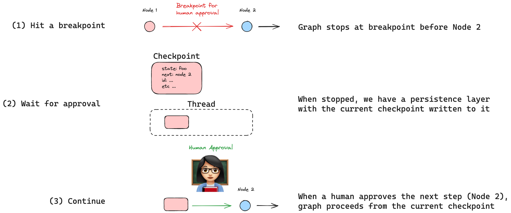
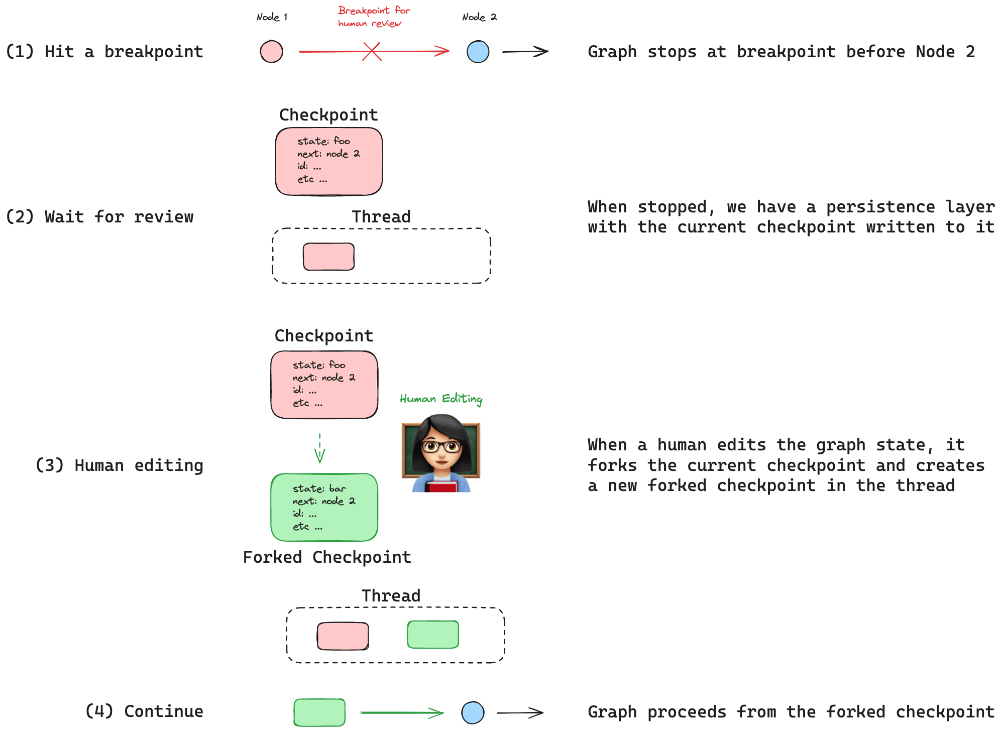
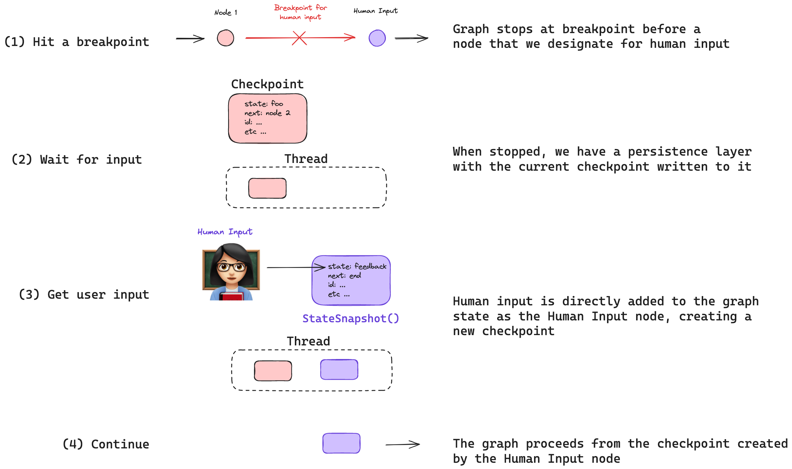
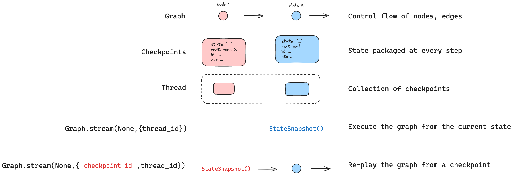

# 人机协同

人机协同（或 "人在回路中"）通过几种常见的用户交互模式增强 agent 能力。

常见交互模式包括：

(1) `Approval` - 我们可以中断我们的 agent，将当前状态呈现给用户，并允许用户接受操作。

(2) `Editing` - 我们可以中断我们的 agent，将当前状态呈现给用户，并允许用户编辑 agent 状态。

(3) `Input` - 我们可以显式创建一个图节点来收集人工输入并将其直接传递给 agent 状态。

这些交互模式的用例包括：

(1) `Reviewing tool calls` - 我们可以中断 agent 以审查和编辑工具调用的结果。

(2) `Time Travel` - 我们可以手动重放和/或分叉 agent 的过去操作。

## 持久化

所有这些交互模式都由 LangGraph 内置的[持久化](/langgraphjs/concepts/persistence)层启用，该层将在每个步骤写入图状态的检查点。持久化允许图停止，以便人工可以审查和/或编辑图的当前状态，然后在人工进行任何更新后恢复执行。

### 断点

在图流程中的特定位置添加[断点](/langgraphjs/concepts/low_level#breakpoints)是实现人机协同的一种方法。在这种情况下，开发人员知道工作流中*哪里*需要人工输入，只需在该特定图节点之前或之后放置一个断点。

在这里，我们使用 checkpointer 编译图，并在要中断的节点之前设置断点 `step_for_human_in_the_loop`。然后我们执行上述交互模式之一，如果人工编辑图状态，这将创建一个新的检查点。新的检查点被保存到线程，我们可以通过传入 `null` 作为输入从那里恢复图执行。

```typescript
// 使用 checkpointer 和 "step_for_human_in_the_loop" 之前的断点编译我们的图
const graph = builder.compile({ checkpointer, interruptBefore: ["step_for_human_in_the_loop"] });

// 运行图直到断点
const threadConfig = { configurable: { thread_id: "1" }, streamMode: "values" as const };
for await (const event of await graph.stream(inputs, threadConfig)) {
    console.log(event);
}
    
// 执行一些需要人机协同的操作

// 从当前检查点继续图执行
for await (const event of await graph.stream(null, threadConfig)) {
    console.log(event);
}
```

### 动态断点

或者，开发人员可以定义触发断点必须满足的*条件*。当开发人员希望在*特定条件*下停止图时，这种[动态断点](/langgraphjs/concepts/low_level#dynamic-breakpoints)的概念非常有用。这使用 [`NodeInterrupt`](/langgraphjs/reference/classes/langgraph.NodeInterrupt.html)，这是一种特殊类型的错误，可以根据某个条件从节点内部引发。例如，我们可以定义一个当 `input` 长度大于 5 个字符时触发的动态断点。

```typescript
function myNode(state: typeof GraphAnnotation.State): typeof GraphAnnotation.State {
    if (state.input.length > 5) {
        throw new NodeInterrupt(`Received input that is longer than 5 characters: ${state['input']}`);
    }
    return state;
}
```

假设我们使用触发动态断点的输入运行图，然后尝试通过为输入传递 `null` 来简单地恢复图执行。

```typescript
// 在触及动态断点后尝试继续图执行，不改变状态
for await (const event of await graph.stream(null, threadConfig)) {
    console.log(event);
}
```

图将*中断*，因为这个节点将使用相同的图状态*重新运行*。我们需要更改图状态，使其不再满足触发动态断点的条件。因此，我们可以简单地将图状态编辑为满足动态断点条件的输入（< 5 个字符）并重新运行节点。

```typescript 
// 更新状态以通过动态断点
await graph.updateState(threadConfig, { input: "foo" });
for await (const event of await graph.stream(null, threadConfig)) {
    console.log(event);
}
```

或者，如果我们想保留当前输入并跳过执行检查的节点 (`myNode`) 怎么办？为此，我们可以简单地使用 `"myNode"`（节点名称）作为第三个位置参数执行图更新，并为值传递 `null`。这不会对图状态进行任何更新，但会作为 `myNode` 运行更新，有效地跳过该节点并绕过动态断点。

```typescript
// 此更新将完全跳过节点 `myNode`
await graph.updateState(threadConfig, null, "myNode");
for await (const event of await graph.stream(null, threadConfig)) {
    console.log(event);
}
```

有关如何执行此操作的详细操作指南，请参阅[我们的指南](/langgraphjs/how-tos/dynamic_breakpoints)！

## 交互模式

### 批准



有时我们希望批准 agent 执行中的某些步骤。
 
我们可以在要批准的步骤之前的[断点](/langgraphjs/concepts/low_level#breakpoints)处中断我们的 agent。

这通常建议用于敏感操作（例如，使用外部 API 或写入数据库）。
 
通过持久化，我们可以将当前 agent 状态以及下一步呈现给用户以供审查和批准。
 
如果批准，图将从上次保存的检查点恢复执行，该检查点保存到线程：

```typescript
// 使用 checkpointer 和要批准的步骤之前的断点编译我们的图
const graph = builder.compile({ checkpointer, interruptBefore: ["node_2"] });

// 运行图直到断点
for await (const event of await graph.stream(inputs, threadConfig)) {
    console.log(event);
}
    
// ... 获取人工批准 ...

// 如果批准，从上次保存的检查点继续图执行
for await (const event of await graph.stream(null, threadConfig)) {
    console.log(event);
}
```

有关如何执行此操作的详细操作指南，请参阅[我们的指南](/langgraphjs/how-tos/breakpoints)！

### 编辑



有时我们希望审查和编辑 agent 的状态。
 
与批准一样，我们可以在要检查的步骤之前的[断点](/langgraphjs/concepts/low_level#breakpoints)处中断我们的 agent。
 
我们可以将当前状态呈现给用户，并允许用户编辑 agent 状态。
 
这可以例如用于纠正 agent 是否犯了错误（例如，参见下面的工具调用部分）。

我们可以通过分叉当前检查点来编辑图状态，该检查点保存到线程。

然后我们可以像以前一样从我们的分叉检查点继续执行图。

```typescript
// 使用 checkpointer 和要审查的步骤之前的断点编译我们的图
const graph = builder.compile({ checkpointer, interruptBefore: ["node_2"] });

// 运行图直到断点
for await (const event of await graph.stream(inputs, threadConfig)) {
    console.log(event);
}
    
// 审查状态，决定编辑它，并使用新状态创建分叉检查点
await graph.updateState(threadConfig, { state: "new state" });

// 从分叉检查点继续图执行
for await (const event of await graph.stream(null, threadConfig)) {
    console.log(event);
}
```

有关如何执行此操作的详细操作指南，请参阅[此指南](/langgraphjs/how-tos/edit-graph-state)！

### 输入



有时我们希望在图中的特定步骤明确获取人工输入。
 
我们可以为此创建一个指定的图节点（例如，我们示例图中的 `human_input`）。
 
与批准和编辑一样，我们可以在该节点之前的[断点](/langgraphjs/concepts/low_level#breakpoints)处中断我们的 agent。
 
然后我们可以执行一个包含人工输入的状态更新，就像我们对编辑状态所做的那样。

但是，我们添加了一件事：

我们可以使用 `"human_input"` 作为状态更新的节点来指定状态更新*应该被视为一个节点*。

这很微妙，但很重要：

对于编辑，用户决定是否要编辑图状态。

对于输入，我们在图中显式定义一个用于收集人工输入的节点！

包含人工输入的状态更新然后*作为此节点*运行。

```typescript
// 使用 checkpointer 和收集人工输入步骤之前的断点编译我们的图
const graph = builder.compile({ checkpointer, interruptBefore: ["human_input"] });

// 运行图直到断点
for await (const event of await graph.stream(inputs, threadConfig)) {
    console.log(event);
}
    
// 使用用户输入更新状态，就像它是 human_input 节点一样
await graph.updateState(threadConfig, { user_input: userInput }, "human_input");

// 从 human_input 节点创建的检查点继续图执行
for await (const event of await graph.stream(null, threadConfig)) {
    console.log(event);
}
```

有关如何执行此操作的详细操作指南，请参阅[此指南](/langgraphjs/how-tos/wait-user-input)！

## 用例

### 审查工具调用

一些用户交互模式结合了上述想法。

例如，许多 agent 使用[工具调用](https://js.langchain.com/docs/modules/agents/tools/)来做出决策。

工具调用带来一个挑战，因为 agent 必须做好两件事：

(1) 要调用的工具名称

(2) 传递给工具的参数

即使工具调用是正确的，我们也可能希望应用自由裁量权：

(3) 工具调用可能是我们想要批准的敏感操作

考虑到这些点，我们可以结合上述想法来创建对工具调用的人机协同审查。

```typescript
// 使用 checkpointer 和审查 LLM 工具调用步骤之前的断点编译我们的图
const graph = builder.compile({ checkpointer, interruptBefore: ["human_review"] });

// 运行图直到断点
for await (const event of await graph.stream(inputs, threadConfig)) {
    console.log(event);
}
    
// 审查工具调用并根据需要更新它，作为 human_review 节点
await graph.updateState(threadConfig, { tool_call: "updated tool call" }, "human_review");

// 否则，批准工具调用并使用原始工具调用时保存的检查点继续图执行

// 从以下任一位置继续图执行：
// (1) human_review 创建的分叉检查点或
// (2) 最初进行工具调用时保存的检查点（在 human_review 中没有编辑）
for await (const event of await graph.stream(null, threadConfig)) {
    console.log(event);
}
```

有关如何执行此操作的详细操作指南，请参阅[此指南](/langgraphjs/how-tos/review-tool-calls)！

### 时间旅行

在使用 agent 时，我们通常希望仔细检查它们的决策过程：

(1) 即使它们达到预期的最终结果，导致该结果的推理通常也很重要。

(2) 当 agent 犯错时，通常很有价值了解原因。

(3) 在上述任何一种情况下，手动探索替代决策路径都很有用。

我们将这些调试概念统称为 `time-travel`，它们由 `replaying` 和 `forking` 组成。

#### 重放



有时我们只想简单地重放 agent 的过去操作。
 
上面，我们展示了从图的当前状态（或检查点）执行 agent 的情况。

我们通过简单地使用 `threadConfig` 传入 `null` 来做到这一点。

```typescript
const threadConfig = { configurable: { thread_id: "1" } };
for await (const event of await graph.stream(null, threadConfig)) {
    console.log(event);
}
```

现在，我们可以修改此设置以重放*特定*检查点的过去操作，方法是传入检查点 ID。

要获取特定的检查点 ID，我们可以轻松获取线程中的所有检查点并筛选到我们想要的那个。

```typescript
const allCheckpoints = [];
for await (const state of app.getStateHistory(threadConfig)) {
    allCheckpoints.push(state);
}
```

每个检查点都有一个唯一的 ID，我们可以使用它来从特定的检查点重放。

假设从审查检查点中我们想要从重放一个，`xxx`。

我们在运行图时传入检查点 ID。

```typescript
const config = { configurable: { thread_id: '1', checkpoint_id: 'xxx' }, streamMode: "values" as const };
for await (const event of await graph.stream(null, config)) {
    console.log(event);
}
```
 
重要的是，图知道哪些检查点已先前执行过。

因此，它将重放任何先前执行的节点，而不是重新执行它们。

有关重放的相关上下文，请参阅[此附加概念指南](https://langchain-ai.github.io/langgraph/concepts/persistence/#replay)。

有关如何进行时间旅行的详细操作指南，请参阅[此指南](/langgraphjs/how-tos/time-travel)！

#### 分叉


有时我们想要分叉 agent 的过去操作，并在图中探索不同的路径。

`Editing`，如上所述，正是我们如何对图的*当前*状态执行此操作的方法！

但是，如果我们想要分叉图的*过去*状态怎么办？

例如，假设我们想要编辑特定的检查点，`xxx`。

我们在更新图状态时传入此 `checkpoint_id`。

```typescript
const config = { configurable: { thread_id: "1", checkpoint_id: "xxx" } };
await graph.updateState(config, { state: "updated state" });
```

这将创建一个新的分叉检查点，`xxx-fork`，我们可以从中运行图。

```typescript
const config = { configurable: { thread_id: '1', checkpoint_id: 'xxx-fork' }, streamMode: "values" as const };
for await (const event of await graph.stream(null, config)) {
    console.log(event);
}
```

有关分叉的相关上下文，请参阅[此附加概念指南](/langgraphjs/concepts/persistence/#update-state)。

有关如何进行时间旅行的详细操作指南，请参阅[此指南](/langgraphjs/how-tos/time-travel)！
