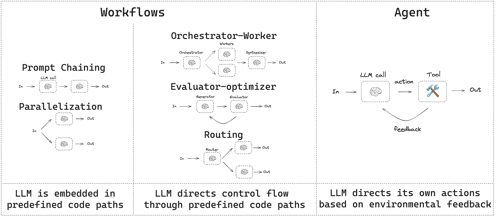
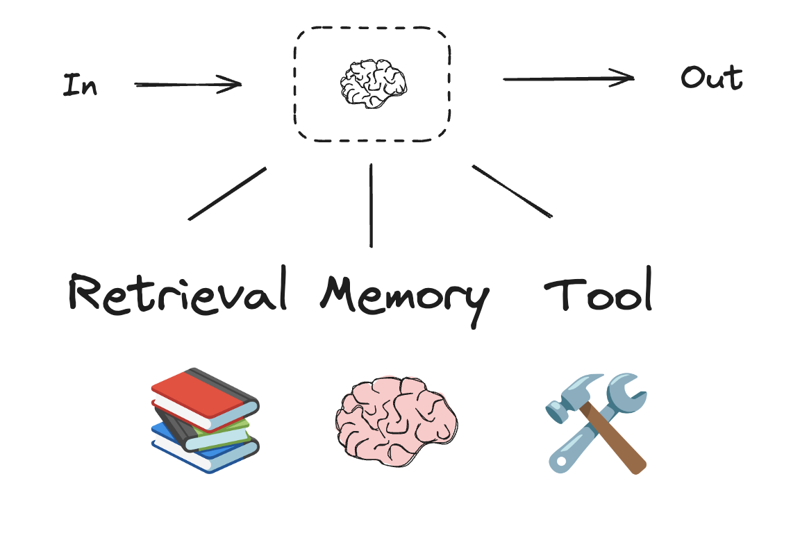
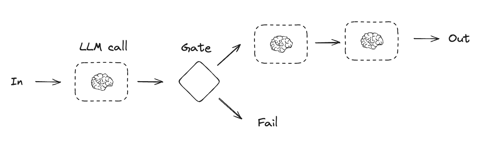
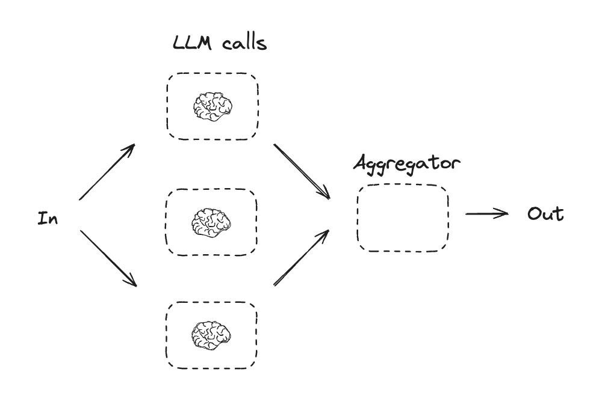
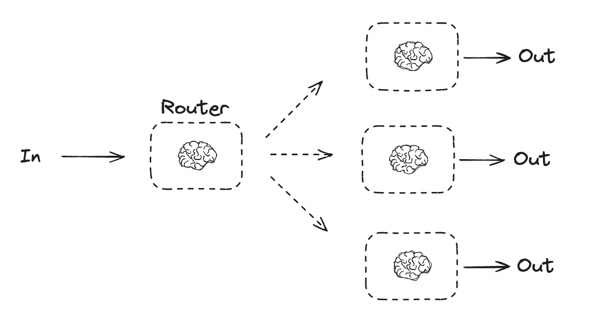
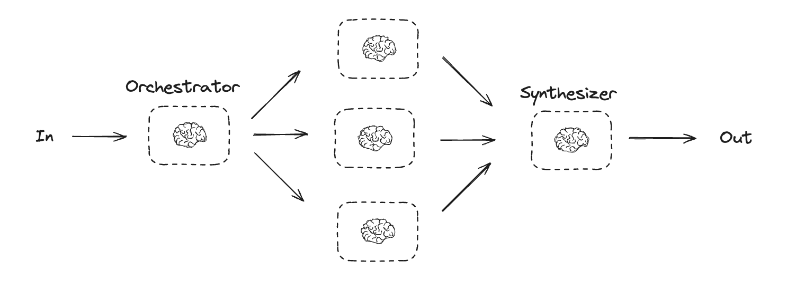
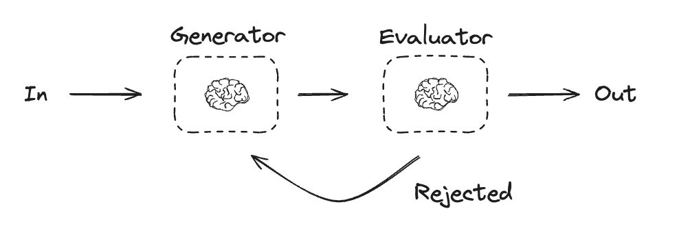
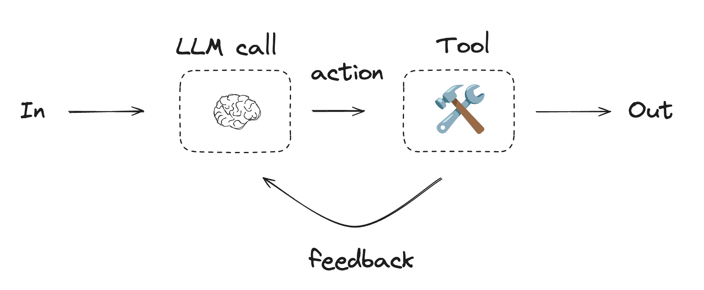

# 工作流和代理

本指南回顾了代理系统的常见模式。在描述这些系统时，区分"工作流"和"代理"是有用的。Anthropic 在[这里](https://www.anthropic.com/research/building-effective-agents)很好地解释了这种差异：

> 工作流是 LLM 和工具通过预定义代码路径进行编排的系统。
> 而代理则是 LLM 动态指导其自身过程和工具使用，保持对如何完成任务的控制权的系统。

以下是可视化这些差异的简单方法：



在构建代理和工作流时，LangGraph [提供了许多好处](https://langchain-ai.github.io/langgraphjs/concepts/high_level/)，包括持久化、流式传输以及对调试和部署的支持。

## 设置

:::note 兼容性

    Functional API 需要 `@langchain/langgraph>=0.2.24`。

你可以使用[任何支持结构化输出和工具调用的聊天模型](https://js.langchain.com/docs/integrations/chat/)。下面，我们展示了安装包、设置 API 密钥以及为 Anthropic 测试结构化输出/工具调用的过程。

??? "安装依赖"

    ```bash
    yarn add @langchain/langgraph @langchain/anthropic @langchain/core
    ```

初始化 LLM

```ts
import { ChatAnthropic } from "@langchain/anthropic";

process.env.ANTHROPIC_API_KEY = "<your_anthropic_key>";

const llm = new ChatAnthropic({
  model: "claude-3-5-sonnet-latest",
});
```

## 构建块：增强型 LLM

LLM 具有支持构建工作流和代理的[增强功能](https://www.anthropic.com/research/building-effective-agents)。这些包括[结构化输出](https://js.langchain.com/docs/concepts/structured_outputs/)和[工具调用](https://js.langchain.com/docs/concepts/tool_calling/)，如下面的 Anthropic [博客](https://www.anthropic.com/research/building-effective-agents)图片所示：



```ts
import { tool } from "@langchain/core/tools";
import { z } from "zod";

const searchQuerySchema = z.object({
  searchQuery: z.string().describe("Query that is optimized web search."),
  justification: z.string("Why this query is relevant to the user's request."),
});

// 使用结构化输出模式增强 LLM
const structuredLlm = llm.withStructuredOutput(searchQuerySchema, {
  name: "searchQuery",
});

// 调用增强型 LLM
const output = await structuredLlm.invoke(
  "How does Calcium CT score relate to high cholesterol?"
);

const multiply = tool(
  async ({ a, b }) => {
    return a * b;
  },
  {
    name: "multiply",
    description: "multiplies two numbers together",
    schema: z.object({
      a: z.number("the first number"),
      b: z.number("the second number"),
    }),
  }
);

// 使用工具增强 LLM
const llmWithTools = llm.bindTools([multiply]);

// 使用触发工具调用的输入调用 LLM
const message = await llmWithTools.invoke("What is 2 times 3?");

console.log(message.tool_calls);
```

## 提示链

在提示链中，每个 LLM 调用处理前一个调用的输出。

如 [Anthropic 博客](https://www.anthropic.com/research/building-effective-agents)所述：

> 提示链将任务分解为一系列步骤，其中每个 LLM 调用处理前一个调用的输出。你可以在任何中间步骤添加程序化检查（参见下图中的"gate"）以确保过程仍在正轨上。

> 何时使用此工作流：此工作流适用于可以轻松清晰地分解为固定子任务的情况。主要目标是通过使每个 LLM 调用成为更简单的任务来权衡延迟以换取更高的准确性。



=== Graph API

    ```ts
    import { StateGraph, Annotation } from "@langchain/langgraph";

    // 图状态
    const StateAnnotation = Annotation.Root({
      topic: Annotation<string>,
      joke: Annotation<string>,
      improvedJoke: Annotation<string>,
      finalJoke: Annotation<string>,
    });

    // 定义节点函数

    // 第一次 LLM 调用生成初始笑话
    async function generateJoke(state: typeof StateAnnotation.State) {
      const msg = await llm.invoke(`Write a short joke about ${state.topic}`);
      return { joke: msg.content };
    }

    // 门函数检查笑话是否有笑点
    function checkPunchline(state: typeof StateAnnotation.State) {
      // 简单检查 - 笑话是否包含 "?" 或 "!"
      if (state.joke?.includes("?") || state.joke?.includes("!")) {
        return "Pass";
      }
      return "Fail";
    }

      // 第二次 LLM 调用改进笑话
    async function improveJoke(state: typeof StateAnnotation.State) {
      const msg = await llm.invoke(
        `Make this joke funnier by adding wordplay: ${state.joke}`
      );
      return { improvedJoke: msg.content };
    }

    // 第三次 LLM 调用进行最终润色
    async function polishJoke(state: typeof StateAnnotation.State) {
      const msg = await llm.invoke(
        `Add a surprising twist to this joke: ${state.improvedJoke}`
      );
      return { finalJoke: msg.content };
    }

    // 构建工作流
    const chain = new StateGraph(StateAnnotation)
      .addNode("generateJoke", generateJoke)
      .addNode("improveJoke", improveJoke)
      .addNode("polishJoke", polishJoke)
      .addEdge("__start__", "generateJoke")
      .addConditionalEdges("generateJoke", checkPunchline, {
        Pass: "improveJoke",
        Fail: "__end__"
      })
      .addEdge("improveJoke", "polishJoke")
      .addEdge("polishJoke", "__end__")
      .compile();

    // 调用
    const state = await chain.invoke({ topic: "cats" });
    console.log("Initial joke:");
    console.log(state.joke);
    console.log("\n--- --- ---\n");
    if (state.improvedJoke !== undefined) {
      console.log("Improved joke:");
      console.log(state.improvedJoke);
      console.log("\n--- --- ---\n");

      console.log("Final joke:");
      console.log(state.finalJoke);
    } else {
      console.log("Joke failed quality gate - no punchline detected!");
    }
    ```

    **LangSmith Trace**

    https://smith.langchain.com/public/a0281fca-3a71-46de-beee-791468607b75/r

=== Functional API

    ```ts
    import { task, entrypoint } from "@langchain/langgraph";

    // 任务

    // 第一次 LLM 调用生成初始笑话
    const generateJoke = task("generateJoke", async (topic: string) => {
      const msg = await llm.invoke(`Write a short joke about ${topic}`);
      return msg.content;
    });

    // 门函数检查笑话是否有笑点
    function checkPunchline(joke: string) {
      // 简单检查 - 笑话是否包含 "?" 或 "!"
      if (joke.includes("?") || joke.includes("!")) {
        return "Pass";
      }
      return "Fail";
    }

      // 第二次 LLM 调用改进笑话
    const improveJoke = task("improveJoke", async (joke: string) => {
      const msg = await llm.invoke(
        `Make this joke funnier by adding wordplay: ${joke}`
      );
      return msg.content;
    });

    // 第三次 LLM 调用进行最终润色
    const polishJoke = task("polishJoke", async (joke: string) => {
      const msg = await llm.invoke(
        `Add a surprising twist to this joke: ${joke}`
      );
      return msg.content;
    });

    const workflow = entrypoint(
      "jokeMaker",
      async (topic: string) => {
        const originalJoke = await generateJoke(topic);
        if (checkPunchline(originalJoke) === Pass) {
          return originalJoke;
        }
        const improvedJoke = await improveJoke(originalJoke);
        const polishedJoke = await polishJoke(improvedJoke);
        return polishedJoke;
      }
    );

    const stream = await workflow.stream("cats", {
      streamMode: "updates",
    });

    for await (const step of stream) {
      console.log(step);
    }
    ```

    **LangSmith Trace**

    https://smith.langchain.com/public/332fa4fc-b6ca-416e-baa3-161625e69163/r

## 并行化

通过并行化，LLM 同时处理任务：

> LLM 有时可以同时处理任务，并通过编程方式聚合它们的输出。这种工作流，即并行化，表现为两种关键变体：分段：将任务分解为独立运行的并行子任务。投票：多次运行相同任务以获得多样化的输出。

> 何时使用此工作流：当分解的子任务可以并行化以提高速度，或者需要多个视角或尝试以获得更高置信度的结果时，并行化是有效的。对于具有多个考虑的复杂任务，当每个考虑由单独的 LLM 调用处理时，LLM 通常表现更好，允许专注于每个特定方面。



=== Graph API

    ```typescript
    import { StateGraph, Annotation } from "@langchain/langgraph";

    // 图状态
    const StateAnnotation = Annotation.Root({
      topic: Annotation<string>,
      joke: Annotation<string>,
      story: Annotation<string>,
      poem: Annotation<string>,
      combinedOutput: Annotation<string>,
    });

    // 节点
    // 第一次 LLM 调用生成初始笑话
    async function callLlm1(state: typeof StateAnnotation.State) {
      const msg = await llm.invoke(`Write a joke about ${state.topic}`);
      return { joke: msg.content };
    }

    // 第二次 LLM 调用生成故事
    async function callLlm2(state: typeof StateAnnotation.State) {
      const msg = await llm.invoke(`Write a story about ${state.topic}`);
      return { story: msg.content };
    }

    // 第三次 LLM 调用生成诗歌
    async function callLlm3(state: typeof StateAnnotation.State) {
      const msg = await llm.invoke(`Write a poem about ${state.topic}`);
      return { poem: msg.content };
    }

    // 将笑话、故事和诗歌组合成单个输出
    async function aggregator(state: typeof StateAnnotation.State) {
      const combined = `Here's a story, joke, and poem about ${state.topic}!\n\n` +
        `STORY:\n${state.story}\n\n` +
        `JOKE:\n${state.joke}\n\n` +
        `POEM:\n${state.poem}`;
      return { combinedOutput: combined };
    }

    // 构建工作流
    const parallelWorkflow = new StateGraph(StateAnnotation)
      .addNode("callLlm1", callLlm1)
      .addNode("callLlm2", callLlm2)
      .addNode("callLlm3", callLlm3)
      .addNode("aggregator", aggregator)
      .addEdge("__start__", "callLlm1")
      .addEdge("__start__", "callLlm2")
      .addEdge("__start__", "callLlm3")
      .addEdge("callLlm1", "aggregator")
      .addEdge("callLlm2", "aggregator")
      .addEdge("callLlm3", "aggregator")
      .addEdge("aggregator", "__end__")
      .compile();

    // 调用
    const result = await parallelWorkflow.invoke({ topic: "cats" });
    console.log(result.combinedOutput);
    ```

    **LangSmith Trace**

    https://smith.langchain.com/public/3be2e53c-ca94-40dd-934f-82ff87fac277/r

    **资源：**

    **文档**

    请参阅我们关于并行化的文档[此处](https://langchain-ai.github.io/langgraphjs/how-tos/branching/)。

=== Functional API

    ```ts
    import { task, entrypoint } from "@langchain/langgraph";

    // 任务

    // 第一次 LLM 调用生成初始笑话
    const callLlm1 = task("generateJoke", async (topic: string) => {
      const msg = await llm.invoke(`Write a joke about ${topic}`);
      return msg.content;
    });

    // 第二次 LLM 调用生成故事
    const callLlm2 = task("generateStory", async (topic: string) => {
      const msg = await llm.invoke(`Write a story about ${topic}`);
      return msg.content;
    });

    // 第三次 LLM 调用生成诗歌
    const callLlm3 = task("generatePoem", async (topic: string) => {
      const msg = await llm.invoke(`Write a poem about ${topic}`);
      return msg.content;
    });

    // 组合输出
    const aggregator = task("aggregator", async (params: {
      topic: string;
      joke: string;
      story: string;
      poem: string;
    }) => {
      const { topic, joke, story, poem } = params;
      return `Here's a story, joke, and poem about ${topic}!\n\n` +
        `STORY:\n${story}\n\n` +
        `JOKE:\n${joke}\n\n` +
        `POEM:\n${poem}`;
    });

    // 构建工作流
    const workflow = entrypoint(
      "parallelWorkflow",
      async (topic: string) => {
        const [joke, story, poem] = await Promise.all([
          callLlm1(topic),
          callLlm2(topic),
          callLlm3(topic),
        ]);

        return aggregator({ topic, joke, story, poem });
      }
    );

    // 调用
    const stream = await workflow.stream("cats", {
      streamMode: "updates",
    });

    for await (const step of stream) {
      console.log(step);
    }
    ```

    **LangSmith Trace**

    https://smith.langchain.com/public/623d033f-e814-41e9-80b1-75e6abb67801/r

## 路由

路由对输入进行分类并将其引导至后续任务。如 [Anthropic 博客](https://www.anthropic.com/research/building-effective-agents)所述：

> 路由对输入进行分类并将其引导至专门的后续任务。此工作流允许关注点分离，并构建更专业的提示。没有此工作流，针对一种输入进行优化可能会损害其他输入的性能。

> 何时使用此工作流：路由适用于复杂任务，其中存在不同的类别，最好分别处理，并且分类可以由 LLM 或更传统的分类模型/算法准确处理。



=== Graph API

    ```ts
    import { StateGraph, Annotation } from "@langchain/langgraph";
    import { z } from "zod";

    // 用于结构化输出作为路由逻辑的模式
    const routeSchema = z.object({
      step: z.enum(["poem", "story", "joke"]).describe(
        "The next step in the routing process"
      ),
    });

    // 使用结构化输出模式增强 LLM
    const router = llm.withStructuredOutput(routeSchema);

    // 图状态
    const StateAnnotation = Annotation.Root({
      input: Annotation<string>,
      decision: Annotation<string>,
      output: Annotation<string>,
    });

    // 节点
    // 写故事
    async function llmCall1(state: typeof StateAnnotation.State) {
      const result = await llm.invoke([{
        role: "system",
        content: "You are an expert storyteller.",
      }, {
        role: "user",
        content: state.input
      }]);
      return { output: result.content };
    }

    // 写笑话
    async function llmCall2(state: typeof StateAnnotation.State) {
      const result = await llm.invoke([{
        role: "system",
        content: "You are an expert comedian.",
      }, {
        role: "user",
        content: state.input
      }]);
      return { output: result.content };
    }

    // 写诗歌
    async function llmCall3(state: typeof StateAnnotation.State) {
      const result = await llm.invoke([{
        role: "system",
        content: "You are an expert poet.",
      }, {
        role: "user",
        content: state.input
      }]);
      return { output: result.content };
    }

    async function llmCallRouter(state: typeof StateAnnotation.State) {
      // 将输入路由到适当的节点
      const decision = await router.invoke([
        {
          role: "system",
          content: "Route the input to story, joke, or poem based on the user's request."
        },
        {
          role: "user",
          content: state.input
        },
      ]);

      return { decision: decision.step };
    }

    // 条件边函数以路由到适当的节点
    function routeDecision(state: typeof StateAnnotation.State) {
      // 返回要访问的下一个节点名称
      if (state.decision === story) {
        return "llmCall1";
      } else if (state.decision === joke) {
        return "llmCall2";
      } else if (state.decision === poem) {
        return "llmCall3";
      }
    }

    // 构建工作流
    const routerWorkflow = new StateGraph(StateAnnotation)
      .addNode("llmCall1", llmCall1)
      .addNode("llmCall2", llmCall2)
      .addNode("llmCall3", llmCall3)
      .addNode("llmCallRouter", llmCallRouter)
      .addEdge("__start__", "llmCallRouter")
      .addConditionalEdges(
        "llmCallRouter",
        routeDecision,
        ["llmCall1", "llmCall2", "llmCall3"],
      )
      .addEdge("llmCall1", "__end__")
      .addEdge("llmCall2", "__end__")
      .addEdge("llmCall3", "__end__")
      .compile();

    // 调用
    const state = await routerWorkflow.invoke({
      input: "Write me a joke about cats"
    });
    console.log(state.output);
    ```

    **LangSmith Trace**

    https://smith.langchain.com/public/c4580b74-fe91-47e4-96fe-7fac598d509c/r

    **示例**

    [这里](https://langchain-ai.github.io/langgraphjs/tutorials/rag/langgraph_adaptive_rag_local/)是一个路由问题的 RAG 工作流。请观看我们的视频[此处](https://www.youtube.com/watch?v=bq1Plo2RhYI)。

=== Functional API

    ```ts
    import { z } from "zod";
    import { task, entrypoint } from "@langchain/langgraph";

    // 用于结构化输出作为路由逻辑的模式
    const routeSchema = z.object({
      step: z.enum(["poem", "story", "joke"]).describe(
        "The next step in the routing process"
      ),
    });

    // 使用结构化输出模式增强 LLM
    const router = llm.withStructuredOutput(routeSchema);

    // 任务
    // 写故事
    const llmCall1 = task("generateStory", async (input: string) => {
      const result = await llm.invoke([{
        role: "system",
        content: "You are an expert storyteller.",
      }, {
        role: "user",
        content: input
      }]);
      return result.content;
    });

    // 写笑话
    const llmCall2 = task("generateJoke", async (input: string) => {
      const result = await llm.invoke([{
        role: "system",
        content: "You are an expert comedian.",
      }, {
        role: "user",
        content: input
      }]);
      return result.content;
    });

    // 写诗歌
    const llmCall3 = task("generatePoem", async (input: string) => {
      const result = await llm.invoke([{
        role: "system",
        content: "You are an expert poet.",
      }, {
        role: "user",
        content: input
      }]);
      return result.content;
    });

    // 将输入路由到适当的节点
    const llmCallRouter = task("router", async (input: string) => {
      const decision = await router.invoke([
        {
          role: "system",
          content: "Route the input to story, joke, or poem based on the user's request."
        },
        {
          role: "user",
          content: input
        },
      ]);
      return decision.step;
    });

    // 构建工作流
    const workflow = entrypoint(
      "routerWorkflow",
      async (input: string) => {
        const nextStep = await llmCallRouter(input);

        let llmCall;
        if (nextStep === story) {
          llmCall = llmCall1;
        } else if (nextStep === joke) {
          llmCall = llmCall2;
        } else if (nextStep === poem) {
          llmCall = llmCall3;
        }

        const finalResult = await llmCall(input);
        return finalResult;
      }
    );

    // 调用
    const stream = await workflow.stream("Write me a joke about cats", {
      streamMode: "updates",
    });

    for await (const step of stream) {
      console.log(step);
    }
    ```

    **LangSmith Trace**

    https://smith.langchain.com/public/5e2eb979-82dd-402c-b1a0-a8cceaf2a28a/r

## Orchestrator-Worker

使用 orchestrator-worker，编排器分解任务并将每个子任务委派给工作者。如 [Anthropic 博客](https://www.anthropic.com/research/building-effective-agents)所述：

> 在 orchestrator-workers 工作流中，中央 LLM 动态分解任务，将它们委派给 worker LLM，并综合它们的结果。

> 何时使用此工作流：此工作流非常适合无法预测所需子任务的复杂任务（例如，在编码中，需要更改的文件数量和每个文件中的更改性质可能取决于任务）。虽然拓扑结构相似，但与并行化的关键区别在于其灵活性——子任务不是预定义的，而是由编排器根据特定输入确定的。



=== Graph API

    ```ts
    import { z } from "zod";

    // 用于规划中结构化输出的模式
    const sectionSchema = z.object({
      name: z.string().describe("Name for this section of the report."),
      description: z.string().describe(
        "Brief overview of the main topics and concepts to be covered in this section."
      ),
    });

    const sectionsSchema = z.object({
      sections: z.array(sectionSchema).describe("Sections of the report."),
    });

    // 使用结构化输出模式增强 LLM
    const planner = llm.withStructuredOutput(sectionsSchema);
    ```

    **在 LangGraph 中创建工作者**

    由于 orchestrator-worker 工作流很常见，LangGraph **具有 `Send` API 来支持此功能**。它允许你动态创建工作者节点并向每个节点发送特定输入。每个工作者都有自己的状态，所有工作者输出都写入编排器图可访问的*共享状态键*。这使编排器可以访问所有工作者输出，并允许将它们综合成最终输出。如下所示，我们遍历一个部分列表，并使用 `Send` 将每个部分发送给工作者节点。更多文档请参见[此处](https://langchain-ai.github.io/langgraphjs/how-tos/map-reduce/)和[此处](https://langchain-ai.github.io/langgraphjs/concepts/low_level/#send)。

    ```ts
    import { Annotation, StateGraph, Send } from "@langchain/langgraph";

    // 图状态
    const StateAnnotation = Annotation.Root({
      topic: Annotation<string>,
      sections: Annotation<Array<z.infer<typeof sectionSchema>>>,
      completedSections: Annotation<string[]>({
        default: () => [],
        reducer: (a, b) => a.concat(b),
      }),
      finalReport: Annotation<string>,
    });

    // 工作者状态
    const WorkerStateAnnotation = Annotation.Root({
      section: Annotation<z.infer<typeof sectionSchema>>,
      completedSections: Annotation<string[]>({
        default: () => [],
        reducer: (a, b) => a.concat(b),
      }),
    });

    // 节点
    async function orchestrator(state: typeof StateAnnotation.State) {
      // 生成查询
      const reportSections = await planner.invoke([
        { role: "system", content: "Generate a plan for the report." },
        { role: "user", content: `Here is the report topic: ${state.topic}` },
      ]);

      return { sections: reportSections.sections };
    }

    async function llmCall(state: typeof WorkerStateAnnotation.State) {
      // 生成部分
      const section = await llm.invoke([
        {
          role: "system",
          content: "Write a report section following the provided name and description. Include no preamble for each section. Use markdown formatting.",
        },
        {
          role: "user",
          content: `Here is the section name: ${state.section.name} and description: ${state.section.description}`,
        },
      ]);

      // 将更新的部分写入已完成的部分
      return { completedSections: [section.content] };
    }

    async function synthesizer(state: typeof StateAnnotation.State) {
      // 已完成的部分列表
      const completedSections = state.completedSections;

      // 将已完成的部分格式化为字符串以用作最终部分的上下文
      const completedReportSections = completedSections.join("\n\n---\n\n");

      return { finalReport: completedReportSections };
    }

    // 条件边函数以创建 llm_call 工作者，每个工作者撰写报告的一个部分
    function assignWorkers(state: typeof StateAnnotation.State) {
      // 通过 Send() API 并行启动部分撰写
      return state.sections.map((section) =>
        new Send("llmCall", { section })
      );
    }

    // 构建工作流
    const orchestratorWorker = new StateGraph(StateAnnotation)
      .addNode("orchestrator", orchestrator)
      .addNode("llmCall", llmCall)
      .addNode("synthesizer", synthesizer)
      .addEdge("__start__", "orchestrator")
      .addConditionalEdges(
        "orchestrator",
        assignWorkers,
        ["llmCall"]
      )
      .addEdge("llmCall", "synthesizer")
      .addEdge("synthesizer", "__end__")
      .compile();

    // 调用
    const state = await orchestratorWorker.invoke({
      topic: "Create a report on LLM scaling laws"
    });
    console.log(state.finalReport);
    ```

    **LangSmith Trace**

    https://smith.langchain.com/public/78cbcfc3-38bf-471d-b62a-b299b144237d/r

    **资源：**

    **示例**

    [这里](https://github.com/langchain-ai/report-mAIstro)是一个使用 orchestrator-worker 进行报告规划和撰写的项目。请观看我们的视频[此处](https://www.youtube.com/watch?v=wSxZ7yFbbas)。

=== Functional API

    ```ts
    import { z } from "zod";
    import { task, entrypoint } from "@langchain/langgraph";

    // 用于规划中结构化输出的模式
    const sectionSchema = z.object({
      name: z.string().describe("Name for this section of the report."),
      description: z.string().describe(
        "Brief overview of the main topics and concepts to be covered in this section."
      ),
    });

    const sectionsSchema = z.object({
      sections: z.array(sectionSchema).describe("Sections of the report."),
    });

    // 使用结构化输出模式增强 LLM
    const planner = llm.withStructuredOutput(sectionsSchema);

    // 任务
    const orchestrator = task("orchestrator", async (topic: string) => {
      // 生成查询
      const reportSections = await planner.invoke([
        { role: "system", content: "Generate a plan for the report." },
        { role: "user", content: `Here is the report topic: ${topic}` },
      ]);

      return reportSections.sections;
    });

    const llmCall = task("sectionWriter", async (section: z.infer<typeof sectionSchema>) => {
      // 生成部分
      const result = await llm.invoke([
        {
          role: "system",
          content: "Write a report section.",
        },
        {
          role: "user",
          content: `Here is the section name: ${section.name} and description: ${section.description}`,
        },
      ]);

      return result.content;
    });

    const synthesizer = task("synthesizer", async (completedSections: string[]) => {
      // 从部分综合完整报告
      return completedSections.join("\n\n---\n\n");
    });

    // 构建工作流
    const workflow = entrypoint(
      "orchestratorWorker",
      async (topic: string) => {
        const sections = await orchestrator(topic);
        const completedSections = await Promise.all(
          sections.map((section) => llmCall(section))
        );
        return synthesizer(completedSections);
      }
    );

    // 调用
    const stream = await workflow.stream("Create a report on LLM scaling laws", {
      streamMode: "updates",
    });

    for await (const step of stream) {
      console.log(step);
    }
    ```

    **LangSmith Trace**

    https://smith.langchain.com/public/75a636d0-6179-4a12-9836-e0aa571e87c5/r

## Evaluator-optimizer

在 evaluator-optimizer 工作流中，一个 LLM 调用生成响应，而另一个在循环中提供评估和反馈：

> 在 evaluator-optimizer 工作流中，一个 LLM 调用生成响应，而另一个在循环中提供评估和反馈。

> 何时使用此工作流：当我们有明确的评估标准，并且迭代改进提供可衡量的价值时，此工作流特别有效。两个适合的迹象是：第一，当人类表达反馈时，LLM 响应可以明显改进；第二，LLM 可以提供此类反馈。这类似于人类作家在制作精良文档时可能经历的迭代写作过程。



=== Graph API

    ```ts
    import { z } from "zod";
    import { Annotation, StateGraph } from "@langchain/langgraph";

    // 图状态
    const StateAnnotation = Annotation.Root({
      joke: Annotation<string>,
      topic: Annotation<string>,
      feedback: Annotation<string>,
      funnyOrNot: Annotation<string>,
    });

    // 用于评估中结构化输出的模式
    const feedbackSchema = z.object({
      grade: z.enum(["funny", "not funny"]).describe(
        "Decide if the joke is funny or not."
      ),
      feedback: z.string().describe(
        "If the joke is not funny, provide feedback on how to improve it."
      ),
    });

    // 使用结构化输出模式增强 LLM
    const evaluator = llm.withStructuredOutput(feedbackSchema);

    // 节点
    async function llmCallGenerator(state: typeof StateAnnotation.State) {
      // LLM 生成笑话
      let msg;
      if (state.feedback) {
        msg = await llm.invoke(
          `Write a joke about ${state.topic} but take into account the feedback: ${state.feedback}`
        );
      } else {
        msg = await llm.invoke(`Write a joke about ${state.topic}`);
      }
      return { joke: msg.content };
    }

    async function llmCallEvaluator(state: typeof StateAnnotation.State) {
      // LLM 评估笑话
      const grade = await evaluator.invoke(`Grade the joke ${state.joke}`);
      return { funnyOrNot: grade.grade, feedback: grade.feedback };
    }

    // 条件边函数，根据评估器的反馈路由回笑话生成器或结束
    function routeJoke(state: typeof StateAnnotation.State) {
      // 根据评估器的反馈路由回笑话生成器或结束
      if (state.funnyOrNot === funny) {
        return "Accepted";
      } else if (state.funnyOrNot === not funny) {
        return "Rejected + Feedback";
      }
    }

    // 构建工作流
    const optimizerWorkflow = new StateGraph(StateAnnotation)
      .addNode("llmCallGenerator", llmCallGenerator)
      .addNode("llmCallEvaluator", llmCallEvaluator)
      .addEdge("__start__", "llmCallGenerator")
      .addEdge("llmCallGenerator", "llmCallEvaluator")
      .addConditionalEdges(
        "llmCallEvaluator",
        routeJoke,
        {
          // routeJoke 返回的名称：要访问的下一个节点名称
          "Accepted": "__end__",
          "Rejected + Feedback": "llmCallGenerator",
        }
      )
      .compile();

    // 调用
    const state = await optimizerWorkflow.invoke({ topic: "Cats" });
    console.log(state.joke);
    ```

    **LangSmith Trace**

    https://smith.langchain.com/public/86ab3e60-2000-4bff-b988-9b89a3269789/r

    **资源：**

    **示例**

    [这里](https://github.com/langchain-ai/research-rabbit)是一个使用 evaluator-optimizer 来改进报告的助手。请观看我们的视频[此处](https://www.youtube.com/watch?v=XGuTzHoqlj8)。

    [这里](https://langchain-ai.github.io/langgraphjs/tutorials/rag/langgraph_adaptive_rag_local/)是一个对答案进行幻觉或错误评分的 RAG 工作流。请观看我们的视频[此处](https://www.youtube.com/watch?v=bq1Plo2RhYI)。

=== Functional API

    ```ts
    import { z } from "zod";
    import { task, entrypoint } from "@langchain/langgraph";

    // 用于评估中结构化输出的模式
    const feedbackSchema = z.object({
      grade: z.enum(["funny", "not funny"]).describe(
        "Decide if the joke is funny or not."
      ),
      feedback: z.string().describe(
        "If the joke is not funny, provide feedback on how to improve it."
      ),
    });

    // 使用结构化输出模式增强 LLM
    const evaluator = llm.withStructuredOutput(feedbackSchema);

    // 任务
    const llmCallGenerator = task("jokeGenerator", async (params: {
      topic: string;
      feedback?: z.infer<typeof feedbackSchema>;
    }) => {
      // LLM 生成笑话
      const msg = params.feedback
        ? await llm.invoke(
            `Write a joke about ${params.topic} but take into account the feedback: ${params.feedback.feedback}`
          )
        : await llm.invoke(`Write a joke about ${params.topic}`);
      return msg.content;
    });

    const llmCallEvaluator = task("jokeEvaluator", async (joke: string) => {
      // LLM 评估笑话
      return evaluator.invoke(`Grade the joke ${joke}`);
    });

    // 构建工作流
    const workflow = entrypoint(
      "optimizerWorkflow",
      async (topic: string) => {
        let feedback: z.infer<typeof feedbackSchema> | undefined;
        let joke: string;

        while (true) {
          joke = await llmCallGenerator({ topic, feedback });
          feedback = await llmCallEvaluator(joke);

          if (feedback.grade === funny) {
            break;
          }
        }

        return joke;
      }
    );

    // 调用
    const stream = await workflow.stream("Cats", {
      streamMode: "updates",
    });

    for await (const step of stream) {
      console.log(step);
      console.log("\n");
    }
    ```

    **LangSmith Trace**

    https://smith.langchain.com/public/f66830be-4339-4a6b-8a93-389ce5ae27b4/r

## Agent

代理通常被实现为基于环境反馈在循环中执行操作（通过工具调用）的 LLM。如 [Anthropic 博客](https://www.anthropic.com/research/building-effective-agents)所述：

> 代理可以处理复杂的任务，但其实现通常很简单。它们通常只是基于环境反馈在循环中使用工具的 LLM。因此，清晰周到地设计工具集及其文档至关重要。

> 何时使用代理：代理可用于开放式问题，其中难以或无法预测所需的步骤数，并且你无法硬编码固定路径。LLM 可能会运行很多回合，你必须对其决策有一定程度的信任。代理的自主性使其成为在受信任环境中扩展任务的理想选择。



```ts
import { tool } from "@langchain/core/tools";
import { z } from "zod";

// 定义工具
const multiply = tool(
  async ({ a, b }: { a: number; b: number }) => {
    return a * b;
  },
  {
    name: "multiply",
    description: "Multiply two numbers together",
    schema: z.object({
      a: z.number().describe("first number"),
      b: z.number().describe("second number"),
    }),
  }
);

const add = tool(
  async ({ a, b }: { a: number; b: number }) => {
    return a + b;
  },
  {
    name: "add",
    description: "Add two numbers together",
    schema: z.object({
      a: z.number().describe("first number"),
      b: z.number().describe("second number"),
    }),
  }
);

const divide = tool(
  async ({ a, b }: { a: number; b: number }) => {
    return a / b;
  },
  {
    name: "divide",
    description: "Divide two numbers",
    schema: z.object({
      a: z.number().describe("first number"),
      b: z.number().describe("second number"),
    }),
  }
);

// 使用工具增强 LLM
const tools = [add, multiply, divide];
const toolsByName = Object.fromEntries(tools.map((tool) => [tool.name, tool]));
const llmWithTools = llm.bindTools(tools);
```

=== Graph API

    ```ts
    import { MessagesAnnotation, StateGraph } from "@langchain/langgraph";
    import { ToolNode } from "@langchain/langgraph/prebuilt";
    import {
      SystemMessage,
      ToolMessage
    } from "@langchain/core/messages";

    // 节点
    async function llmCall(state: typeof MessagesAnnotation.State) {
      // LLM 决定是否调用工具
      const result = await llmWithTools.invoke([
        {
          role: "system",
          content: "You are a helpful assistant tasked with performing arithmetic on a set of inputs."
        },
        ...state.messages
      ]);

      return {
        messages: [result]
      };
    }

    const toolNode = new ToolNode(tools);

    // 条件边函数以路由到工具节点或结束
    function shouldContinue(state: typeof MessagesAnnotation.State) {
      const messages = state.messages;
      const lastMessage = messages.at(-1);

      // 如果 LLM 进行工具调用，则执行操作
      if (lastMessage?.tool_calls?.length) {
        return "Action";
      }
      // 否则，我们停止（回复用户）
      return "__end__";
    }

    // 构建工作流
    const agentBuilder = new StateGraph(MessagesAnnotation)
      .addNode("llmCall", llmCall)
      .addNode("tools", toolNode)
      // 添加边以连接节点
      .addEdge("__start__", "llmCall")
      .addConditionalEdges(
        "llmCall",
        shouldContinue,
        {
          // shouldContinue 返回的名称：要访问的下一个节点名称
          "Action": "tools",
          "__end__": "__end__",
        }
      )
      .addEdge("tools", "llmCall")
      .compile();

    // 调用
    const messages = [{
      role: "user",
      content: "Add 3 and 4."
    }];
    const result = await agentBuilder.invoke({ messages });
    console.log(result.messages);
    ```

    **LangSmith Trace**

    https://smith.langchain.com/public/051f0391-6761-4f8c-a53b-22231b016690/r

    **示例**

    [这里](https://github.com/langchain-ai/memory-agent)是一个使用工具调用代理来创建/存储长期记忆的项目。

=== Functional API

    ```ts
    import { task, entrypoint, addMessages } from "@langchain/langgraph";
    import { BaseMessageLike, ToolCall } from "@langchain/core/messages";

    const callLlm = task("llmCall", async (messages: BaseMessageLike[]) => {
      // LLM 决定是否调用工具
      return llmWithTools.invoke([
        {
          role: "system",
          content: "You are a helpful assistant tasked with performing arithmetic on a set of inputs."
        },
        ...messages
      ]);
    });

    const callTool = task("toolCall", async (toolCall: ToolCall) => {
      // 执行工具调用
      const tool = toolsByName[toolCall.name];
      return tool.invoke(toolCall.args);
    });

    const agent = entrypoint(
      "agent",
      async (messages: BaseMessageLike[]) => {
        let llmResponse = await callLlm(messages);

        while (true) {
          if (!llmResponse.tool_calls?.length) {
            break;
          }

          // 执行工具
          const toolResults = await Promise.all(
            llmResponse.tool_calls.map((toolCall) => callTool(toolCall))
          );

          messages = addMessages(messages, [llmResponse, ...toolResults]);
          llmResponse = await callLlm(messages);
        }

        messages = addMessages(messages, [llmResponse]);
        return messages;
      }
    );

    // 调用
    const messages = [{
      role: "user",
      content: "Add 3 and 4."
    }];

    const stream = await agent.stream([messages], {
      streamMode: "updates",
    });

    for await (const step of stream) {
      console.log(step);
    }
    ```

    **LangSmith Trace**

    https://smith.langchain.com/public/42ae8bf9-3935-4504-a081-8ddbcbfc8b2e/r

#### 预构建

LangGraph 还提供了**预构建方法**来使用上述 [`createReactAgent`](/langgraphjs/reference/functions/langgraph_prebuilt.createReactAgent.html) 函数创建代理：

https://langchain-ai.github.io/langgraphjs/how-tos/create-react-agent/

```ts
import { createReactAgent } from "@langchain/langgraph/prebuilt";

// 传入：
// (1) LLM 实例
// (2) 工具列表（用于创建工具节点）
const prebuiltAgent = createReactAgent({
  llm: llmWithTools,
  tools,
});

// 调用
const result = await prebuiltAgent.invoke({
  messages: [
    {
      role: "user",
      content: "Add 3 and 4.",
    },
  ],
});
console.log(result.messages);
```

**LangSmith Trace**

https://smith.langchain.com/public/abab6a44-29f6-4b97-8164-af77413e494d/r

## LangGraph 提供的功能

通过在 LangGraph 中构建上述每个功能，我们可以获得一些东西：

### 持久化：人机协同

LangGraph 持久层支持中断和批准操作（例如，人机协同）。请参阅 [LangChain Academy 的第 3 模块](https://github.com/langchain-ai/langchain-academy/tree/main/module-3)。

### 持久化：记忆

LangGraph 持久层支持对话（短期）记忆和长期记忆。请参阅 [LangChain Academy 的第 2 模块](https://github.com/langchain-ai/langchain-academy/tree/main/module-2) [和第 5 模块](https://github.com/langchain-ai/langchain-academy/tree/main/module-5)：

### 流式传输

LangGraph 提供了多种流式传输工作流/代理输出或中间状态的方法。请参阅 [LangChain Academy 的第 3 模块](https://github.com/langchain-ai/langchain-academy/blob/main/module-3/streaming-interruption.ipynb)。

### 部署

LangGraph 为部署、可观测性和评估提供了简单的入口。请参阅 [LangChain Academy 的第 6 模块](https://github.com/langchain-ai/langchain-academy/tree/main/module-6)。
